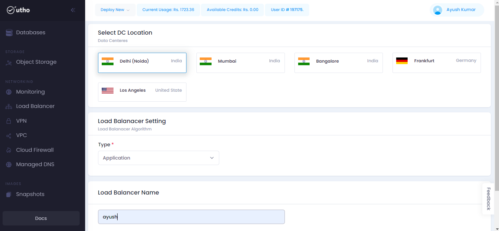
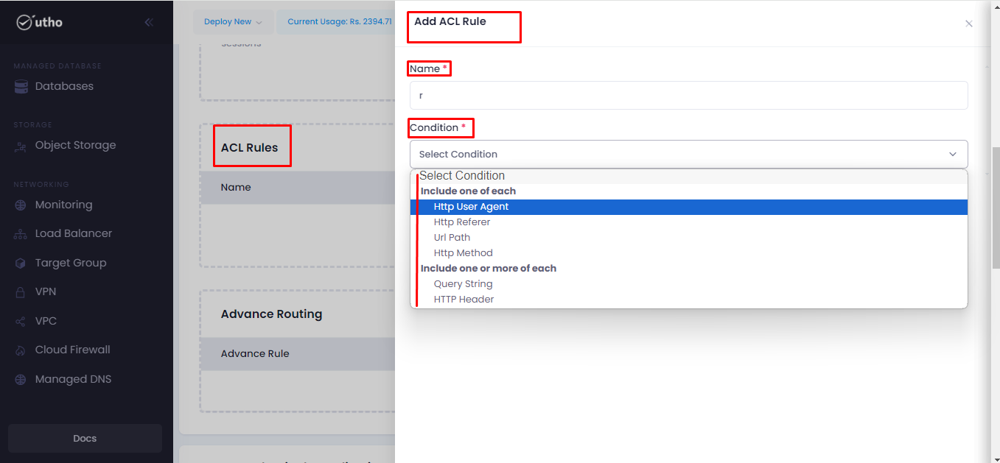
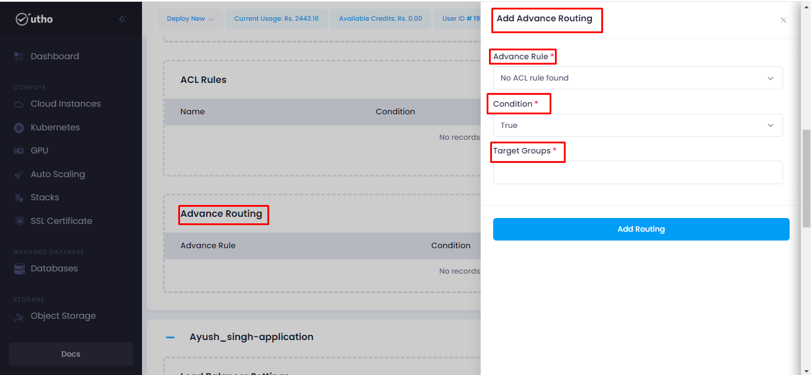

# LoadBalancer
--- 
Load balancing means spreading out incoming network traffic across a bunch of backend servers or resources.

Load Balancer works at layer 4 of the OSI model. Think of it as the middleman between clients and servers. When traffic comes in, the load balancer sends it to different backend servers based on rules you set up, like how healthy each server is. These backend servers could be Utho Virtual Machines or part of a Virtual Machine Scale Set.

### Why use Load Balancer?

With Load Balancer, you can easily scale your applications and ensure they stay available. It supports both inbound and outbound traffic scenarios, offering fast response times and high data transfer rates. Plus, it can handle millions of connections for all TCP and UDP applications.

Here are some key things you can do with Load Balancer:
- Balance both internal and external traffic to Utho virtual machines.
- Improve reliability by spreading resources across different zones.
- Set up outbound connections for virtual machines.
- Monitor the health of your balanced resources using health probes.
- Access virtual machines in your network through public IP addresses and ports using port forwarding.
- Support IPv6 for load balancing.
- Balance services across multiple ports, IP addresses or both.

### Types of Load Balancers – Based on Functions
Various load-balancing techniques exist to tackle specific network issues.

1. **Network Load Balancer (Layer 4 - L4):**

    Network Load Balancers distribute traffic based on network variables like IP addresses and destination ports. They operate at the transport layer (TCP - level 4), making routing decisions without considering application-level parameters such as content type, cookies, or headers. These balancers focus solely on network layer information to direct traffic.

2. **Application Load Balancer (Layer 7 - L7):**

    Application Load Balancers, at the highest level of the OSI model, distribute requests based on various application-level parameters. They analyze a broader range of data, including HTTP headers and SSL sessions, to distribute server load based on multiple variables. This enables them to manage server traffic based on individual usage and behavior.

3. **Global Server Load Balancer (Multi-site Load Balancer)**

    Global Server Load Balancers (GSLBs) extend the capabilities of L4 and L7 load balancers across multiple data centers, especially in cloud environments. They efficiently distribute load globally, ensuring optimal performance for end users across different geographical locations. Additionally, they facilitate quick recovery and seamless business operations in case of server disasters by redirecting traffic to alternative data centers.
**Understanding Load Balancing Algorithms**

    Load balancing algorithms consist of rules guiding a load balancer in selecting the optimal server for various client requests. These algorithms are broadly categorized into two main types.

**Dynamic Load Balancing Algorithms Explained:**
1. **Least Connection**

    Routes traffic to servers with the fewest open connections, assuming similar processing power for all connections.

2. **Weighted Least Connection**

    Allows assigning different weights to servers, accommodating varying connection-handling capacities.

3. **Weighted Response Time**

    Considers both server response time and active connections to direct traffic to servers with the quickest responses, ensuring faster service.

4. **Resource-Based**

    Distributes load based on available server resources like CPU and memory. A specialized software agent on each server measures resource availability, guiding the load balancer in traffic distribution.

**Static load balancing Algorithms Explained:**

Static Load Balancing Algorithms Explained:

1. **Round Robin:**

    - Distributes traffic to servers in rotation using the Domain Name System (DNS). Each DNS query receives a different server address.

2. **Weighted Round Robin:**

    - Lets administrators assign different weights to servers, allocating more traffic to those with higher capacity. Weighting is configurable within DNS records.

## Steps for approaching the LoadBalancer:
---
Steps to Interact with the Load Balancer for Better Performance and Resource Management in Your Organization.

**Step 1:** Click on the provided link [Console](https://console.utho.com/) URL.Upon logging in to the platform, This link will redirect you to the Dashboard.

**Step 2:** Click on the left-hand sidebar and navigate through the dropdown menu to access the Load Balancer options.

**Step 3:** Select "Load Balancer" to proceed, which will redirect you to the Load Balancer homepage.

**Step 4:** Click on the "Create LoadBalancer" button as indicated.

**Step 5:** After clicking, you'll be directed to a page where you'll need to select the required details for your Load Balancer.

**Step 6:** Choose the DC Location according to your requirements.

**Step 7:** Select the load balancer setting/type from the dropdown menu.

**Step 8:** Provide an appropriate name for the load balancer.

**Step 9:** Click on the "Load Balancer" button to create the load balancer.

**Step 10:** Once the load balancer is created, you'll be redirected to the homepage where all load balancers will be displayed.

**Step 11:** Click on the "Manage" section to delve into the details and functionality of the Load Balancer.

Upon clicking "Manage," you'll be redirected to the next page.

To add a frontend, click on the "Add Frontend" button. This action will prompt a new page where you must provide various details:
- Frontend Name
- Protocol
- Port
- Algorithm
- Redirect to HTTPS: Selecting this option ensures that only HTTPS links will access your website.

On selecting this only https links will hit our website not others.
**Sticky Sessions:** This feature preserves user data in the form of cookies.
It keeps the  data of user in the form of cookies.

After completing the necessary details, click on "Add Frontend." You'll observe a pop-up indicating the successful addition process.

Once the frontend is added, navigate to the "(+)" sign as shown in the snippet.

Clicking on the "(+)" sign leads to a new page containing user details. Here, you can update frontend details by clicking on "Update Setting."

ACL (Access Control List) rules in cloud computing control access to resources. To add a new ACL rule, click on "Add New Rule." A sidebar will appear where you can input the necessary details/conditions for the new rule.

Advanced routing in cloud computing efficiently manages and directs network traffic within a cloud environment.

Additionally, users can delete created frontends by clicking on "Delete Frontend."

### How Can Utho Help

Utho is a leading choice for load balancing, trusted by many high-traffic websites. With numerous websites worldwide relying on Utho, it ensures fast, reliable, and secure content delivery. Unlike hardware-based options, Utho is a software-based load balancer, offering significant cost savings while providing similar capabilities. Its wide range of load-balancing features allows you to create a finely-tuned application delivery network.

When you use Utho as your load balancer in front of your application and web server farms, it improves your website's efficiency, performance, and reliability. By using Utho, you can boost customer satisfaction and maximize returns on your IT investments.

