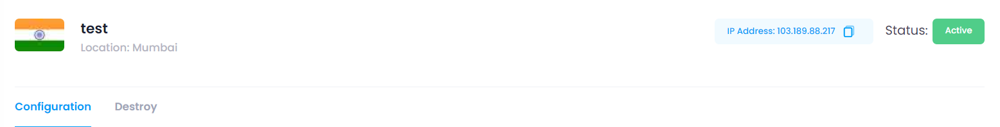
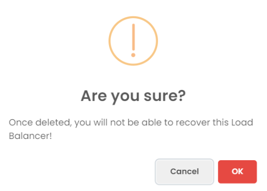

## Load Balancer Configuration Info

At the top of the Manage section, users can view the configuration information of the selected Load Balancer. This includes:

* **Load Balancer Name:** The unique name assigned to the Load Balancer.
* **Datacenter Location:** The chosen datacenter location.
* **Status:** The current status of the Load Balancer (e.g., active, inactive, pending).

## Manage Load Balancer

In the Manage Load Balancer section, users have the ability to create frontend. This section provides the following functionalities:

* **Create Frontend:** Click the **Create Frontend** button to open a form where you can enter the user details such as name, protocal, port, algorithm, Redirect to HTTPS and Sticky Sessions.
* **Add Frontend:** Click the **Add Frontend** button to create frontend into load balancer.
<!-- * **Add Frontend:** Click the **Add Frontend** button.
* **Send Message:** Select a user from the list, click the **Download** button, which will download your vpn user into your brows. -->

## Destroy

In the Destroy section, users can terminate the Load Balancer. This action is irreversible and will permanently delete the Load Balancer and all associated data. To destroy a Load Balancer

Click the **Destroy Load Balancer** button.

##### **Confirmation:**

A confirmation dialog will appear. Confirm the action to proceed with destroying the Load Balancer.

When you provide the confirmation then your Load Balancer Instance will destroy.
