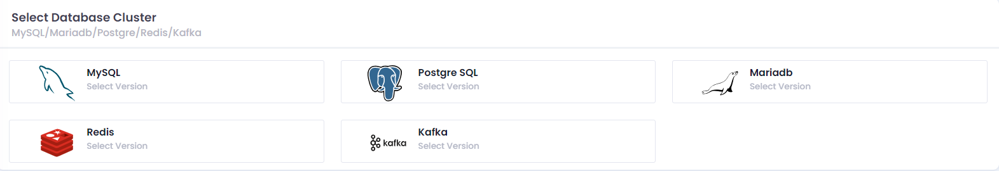
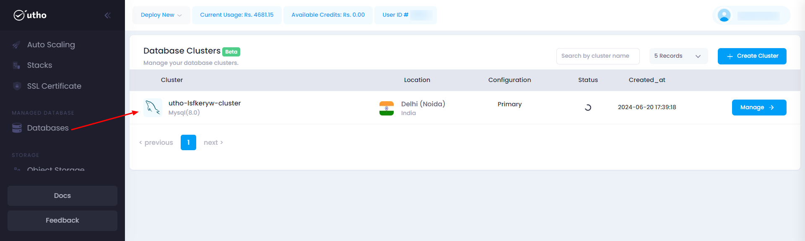

## Initial Start

* **Log in** to your account on our platform.
* **Navigate** to the top toolbar and locate the **Deploy** dropdown menu.
* **Select** the **DataBase** option from the dropdown.

## Quick Start

#### Open the DataBase Page:

Click on the **Deploy** dropdown in the top toolbar and select  **DataBase** .

After click on the above DataBase button a database-deploy page will open.

#### Configure DataBase Settings:

here you can configure your database deployment details .

 1. ##### Choose Create Database Cluster:

   Select a Create Database cluster or Deploy cluster then configure page is open.

2. ##### Choose Datacenter Location:

   Select a datacenter location from the available options to optimize performance and comply with regional data regulations.
3. ##### Select DataBase Version:

   Choose database cluster and its version such as MariaDb,MySQL,PostgreSQL,Redis,Kafka*

4. **Configure Billing Cycle:**

   Select the billing cycle that best fits your budget and usage patterns (e.g., hourly, monthly).

5. ****Select Plan** :**

   Choose a plan that matches your performance requirements, including CPU, RAM, and storage options.

5. ****Adjust Number of Replica**:**

   Adjust the number of replica according to you.

6. ****Additional Configurations**:**

   * **VPC Network** : Select a Virtual Private Cloud (VPC) network available at your chosen location to isolate and secure your cloud environment.And also add subnet with public and private as per your preferences.
   * **Firewall** : Enable or disable firewall protection to control incoming and outgoing traffic.
   <!-- * **Backup** : Enable or disable the backup option (note that enabling backups will incur an additional cost of 20% of the cloud cost). -->
   * **Cluster Name** : Provide a descriptive name for your database to easily identify it in your dashboard.
   <!-- * **Number of Servers** : Specify the number of cloud servers to deploy simultaneously with the same configuration. -->
<!-- 8. **Cost Summary:**

   Review the cost summary on the right side of the interface to see a detailed breakdown of the costs associated with your selected configuration.
9. **Apply Coupon:**

   If you have a coupon code, apply it to receive a discount on your deployment. -->
8. ****Deploy DataBase**:**

    Click the 'Create Cluster' button to initiate the deployment process. The system will start provisioning your database based on the specified configuration.

#### Verify Deployment:

Your Database should now be active and visible in the list of deployed Databases.

here you can see your deployed Database with configuration details your provided during the deployment process and you can manage your database by clicking on mange button, for detailed info check for the manage database section in the Utho docs.
