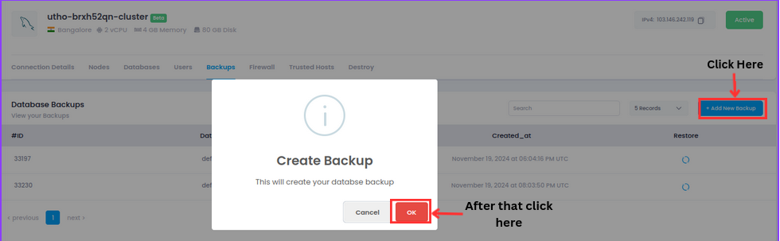
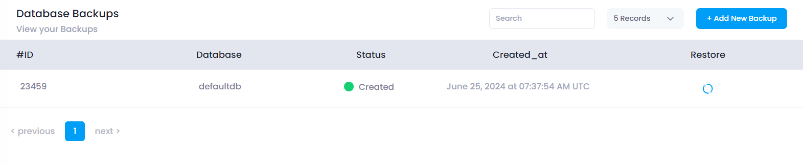

# Database Management: Backup and Restore

## Overview

This document provides instructions on how to use the backup and restore functionalities in the Database Management section.

## **How to create a backup of Database**

### Deployement Steps

To create a backup of your database, follow these steps:

1. **Navigate to the Backup Section**

   - Open the Database Management section.
   - Select the **Backup** tab.

2. **Initiate Backup**

   - Click on the **Add Backup** button.
     
     - A confirmation dialog box will appear.
     - The dialog box will have two options: `OK` and `Cancel`.

3. **Confirm Backup Creation**

   
     
      You can verify that backups have been created for all databases listed under Manage Database.

4. **Backup Confirmation**
   - **Click `OK`:** The backup process will begin. A notification will be displayed once the backup is successfully created.
   - **Click `Cancel`:** The backup process will be aborted.

## Restore

### Restoring a Backup

Once a backup is created, you can restore it by following these steps:

1. **Navigate to the Backup Section**

   - Open the Database Management section.
   - Select the  **Backup** tab.

2. **Select Backup to Restore**

   - A list of available backups will be displayed.
   - Choose the backup you want to restore from the list.

3. **Initiate Restore**
   

   - Click on the `Restore` button next to the selected backup.

4. **Confirm Restore**

   - A confirmation dialog box will appear.
   - Confirm the restoration by clicking `OK`.

5. **Restoration Process**
   - The restoration process will begin.
   - A notification will be displayed once the restoration is successfully completed.

## Notes

- Ensure you have sufficient storage space before creating a backup.
- Only users with appropriate permissions can create or restore backups.
- Regular backups are recommended to prevent data loss.

<!-- ## Troubleshooting

- If you encounter any issues during the backup or restore process, check the system logs for more details.
- For further assistance, contact the IT support team. -->

---

**End of Document**
