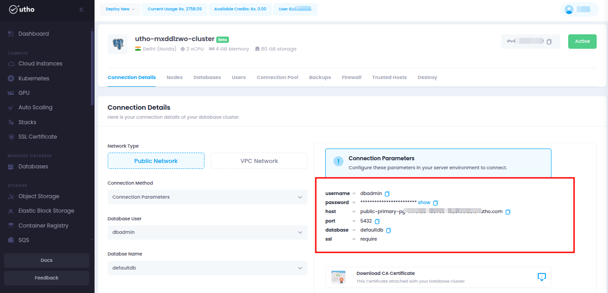
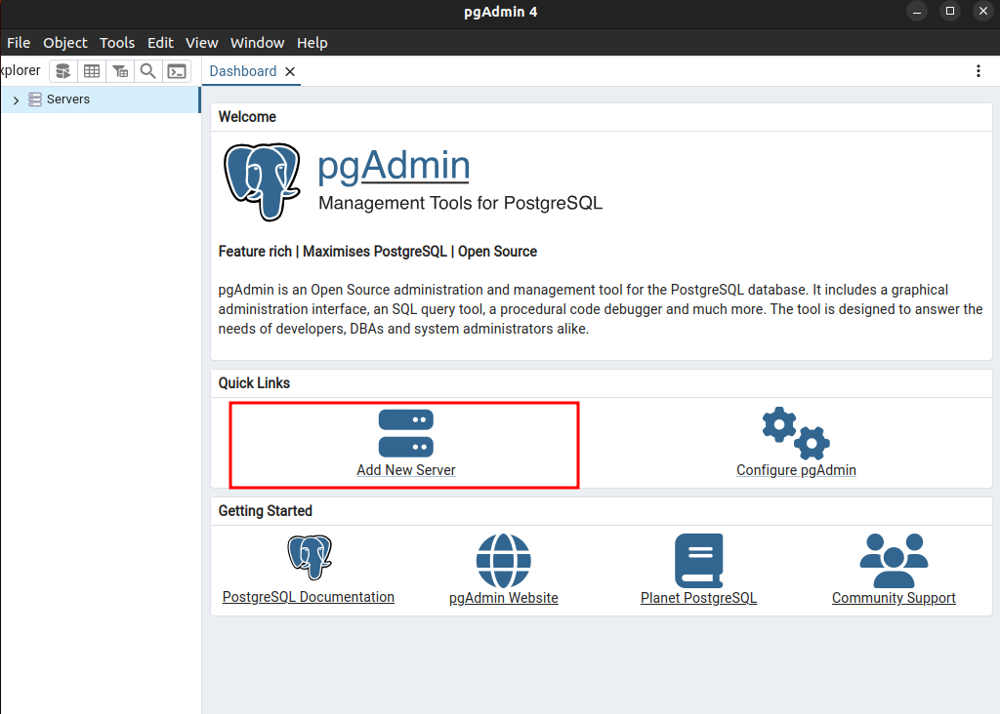
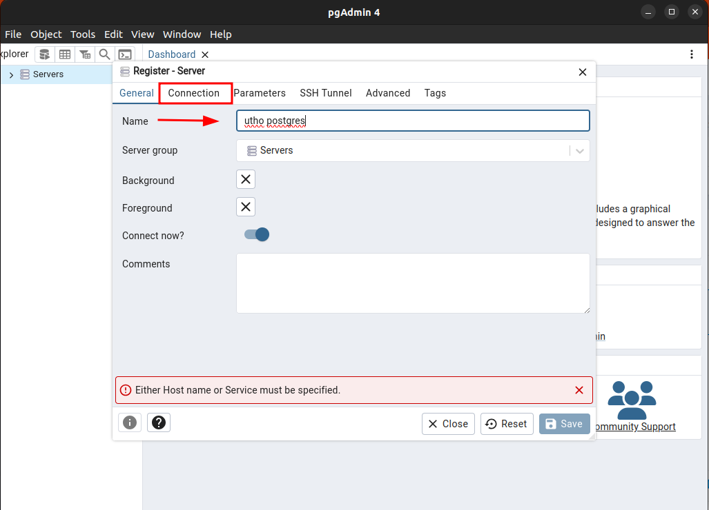
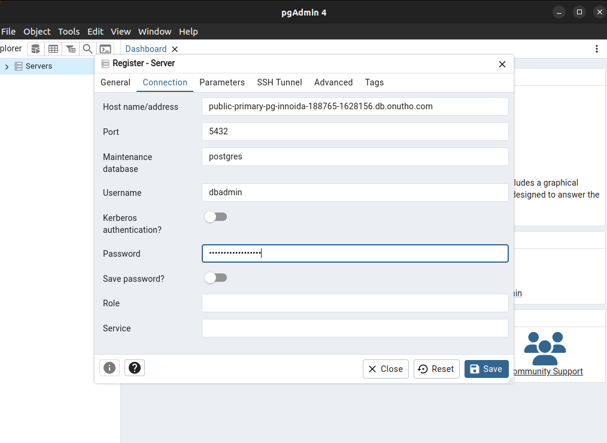
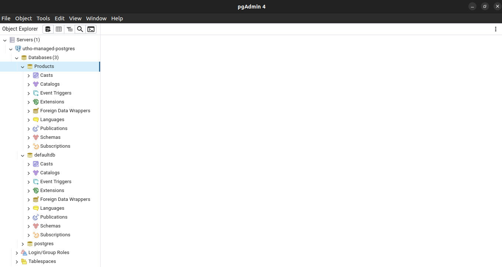

# Connect Utho's Postgres Managed Database with PgAdmin

Postgres is one of the most powerful and versatile databases available today, making it an essential tool for modern application development. However, managing a database can often be a hassle, involving tasks such as initialization, replication, and backups. With Utho's Managed Database Cluster, customers can offload these responsibilities, seamlessly connect to our managed database, and start using it with ease, without the complexities of setup and maintenance.

## Initial Start

- Login to Utho's Dashboard/console.
- Navigate to the Managed Database section.
- Ensure you have deployed a PostgreSQL database already to proceed.

## Quick Steps

### Step 1: Ensure a Managed Postgres Instance
Make sure you have a running Managed Postgres Instance already before proceeding with the steps below.

### Step 2: Download the pgAdmin Client
Download the pgAdmin Client from the following URL: [https://www.pgadmin.org/download/](https://www.pgadmin.org/download/).

### Step 3: Install and Launch pgAdmin
Install and launch the pgAdmin Client.

### Step 4: Retrieve Connection Details
Navigate to the connection details of your Managed Postgres Database as shown below.

### Step 5: Add Database to pgAdmin
Add the database to the pgAdmin Client using the connection details above. Click on **"Add New Server"** in the dashboard section.

### Step 6: Name Your Connection
Name your connection and click on the **"Connection"** tab to enter the necessary information.

### Step 7: Enter Credentials
Fill in the credentials as mentioned in the connection details of your Managed Database and Click on **"Save"**. Wait for the connection to be established.

### Step 8: Databse Connection Succesfull.
Congratulations! You can now access and manage your database records directly from pgAdmin.

