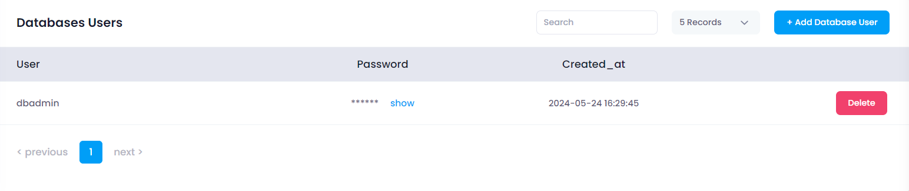
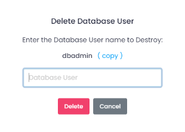

## Manage Redis Users

In the Manage Redis Users section, users can add database user and delete database user. This section provides the following functionalities:

* **Add Database User:** Click the **Add Database User** button to open a drawer where user can enter database user name.

* **Add Database User:** Click the **Add Database User** button to create user.
* **Delete:** Click the **Delete** icon.
##### **Confirmation:**

A confirmation dialog will appear. Confirm the action to proceed with destroying the database user.

When you provide the confirmation then your database user will remove.

