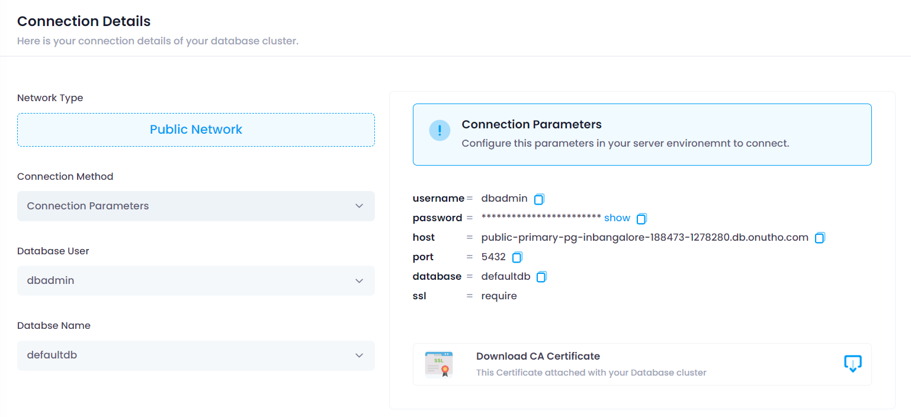
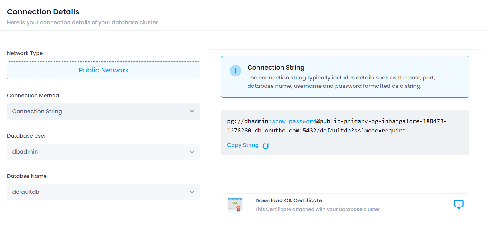
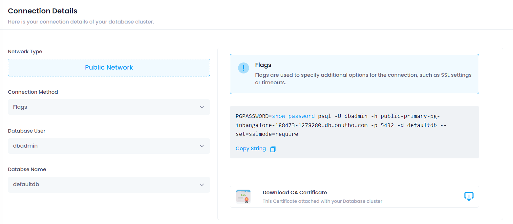

# Connection Details

## Overview

The **Connection Details** tab provides essential information and options for connecting to your database instance. This documentation outlines the details and options available within this tab.

## Connection Methods

### 1. Connection Parameters

This method provides the necessary parameters to establish a connection to your database instance. These parameters typically include:

- **Host:** The hostname or IP address of the database server.
- **Port:** The port number on which the database server is listening.
- **Username:** Your username for authentication.
- **Password:** Your password for authentication.
- **Database:** The name of the specific database to connect to, if applicable.

#### Viewing and Copying Connection Parameters

- **View Details:** The connection parameters are displayed on the Connection Details tab. Review these details to ensure accurate configuration.
- **Copy Details:** Each parameter field has a copy icon next to it. Click on the copy icon to copy the corresponding parameter value to your clipboard.

### 2. Connection String

The connection string is a single string that encapsulates all the necessary connection information in a formatted manner. It includes:

- **Driver/Provider:** Specifies the driver or provider for the database connection.
- **Connection URL:** A formatted string containing details like host, port, database name, and additional parameters.

#### Copying Connection String

- **View Details:** The connection string is displayed on the Connection Details tab. Review this string to ensure accurate configuration.
- **Copy String:** Click on the copy icon next to the connection string to copy it to your clipboard.

### 3. Certificate and Flags

#### Downloading CA Certificate

If your database connection requires SSL/TLS encryption, you may need to download the CA (Certificate Authority) certificate for secure communication. 

- **Download CA Certificate:** Click on the download icon or link provided to download the CA certificate file.

#### Connection Flags

Connection flags are additional options or settings that can be appended to your connection parameters or string to modify the behavior of the connection. These flags may include:

- **SSL/TLS:** Flags to enforce secure connections.
- **Compression:** Flags to enable data compression for improved performance.
- **Timeouts:** Flags to set connection timeout values.

#### Copying Connection Flags

- **View Details:** Connection flags details are displayed on the Connection Details tab. Review these flags to ensure accurate configuration.
- **Copy Flags:** Click on the copy icon next to the flags details to copy them to your clipboard.

## Notes

- Ensure that connection details, strings, and parameters are securely managed and not exposed to unauthorized individuals.
- Always verify and test connections after making changes to ensure proper functionality.

---

This documentation provides a comprehensive guide to understanding and utilizing the Connection Details tab for your database connections.
