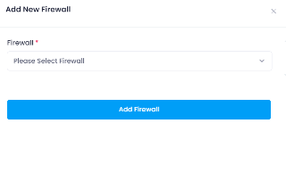

## Manage PostreSql Firewall

The **Manage PostreSql Firewall** section allows users to add and delete firewalls. This section provides the following functionalities:

### Adding and Deleting Firewalls

* **Add Firewall:** Click the **Add Firewall** button to open a drawer where you can select and add a firewall to the list.

  

* **Deattach Firewall:** Click the **Delete** button to remove a firewall.

  

  A confirmation dialog will appear. Confirm the action to proceed with the deletion. Upon confirmation, the firewall will be removed.
