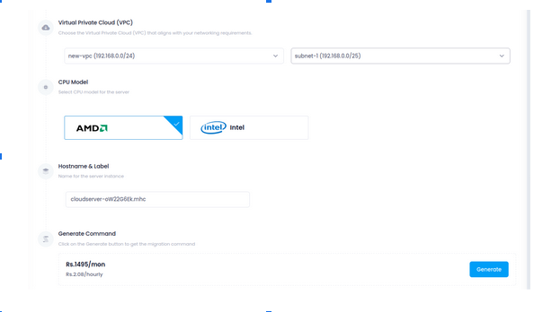

# Migrate Azure to Utho for Ubuntu (22.04.5 LTS)

## Step 1: Initiate the Migration on the Utho Platform

To proceed with the migration, follow the steps below to migrate your Azure instance to Utho successfully.

### Migration Process on UTHO Platform

1. Go to the UTHO console and click on Cloud Migration.
2. Click on New Migration → New Cloud.


3. Choose a data center and storage type based on your requirements.

   
   

4. Select the resources as per your needs.


5. Choose a VPC and Subnet.
6. You can give the hostname to your server.
7. Click on generate.


8. After creating the migration, select AZURE as the provider.


9. Click on Get Migration Command and copy the generated command.

  
## Step 2: Connect to the Azure Server

1. Run the following command to connect to your Azure server via SSH:
   ```bash
   ritss@Utho:~$ ssh Satyajit@4.240.112.159
   ```
```
Satyajit@4.240.112.159's password:
Welcome to Ubuntu 22.04.5 LTS (GNU/Linux 6.8.0-1021-azure x86_64)

 * Documentation:  https://help.ubuntu.com
 * Management: 	https://landscape.canonical.com
 * Support:    	https://ubuntu.com/pro

 System information as of Thu Mar 20 10:32:14 UTC 2025

  System load:  1.0           	Processes:         	141
  Usage of /:   6.1% of 28.89GB   Users logged in:   	1
  Memory usage: 4%            	IPv4 address for eth0: 10.2.0.4
  Swap usage:   0%

 * Strictly confined Kubernetes makes edge and IoT secure. Learn how MicroK8s
   just raised the bar for easy, resilient and secure K8s cluster deployment.

   https://ubuntu.com/engage/secure-kubernetes-at-the-edge

Expanded Security Maintenance for Applications is not enabled.

14 updates can be applied immediately.
8 of these updates are standard security updates.
To see these additional updates run: apt list --upgradable

Enable ESM Apps to receive additional future security updates.
See https://ubuntu.com/esm or run: sudo pro status

New release '24.04.2 LTS' available.
Run 'do-release-upgrade' to upgrade to it.


Last login: Thu Mar 20 06:26:32 2025 from 182.69.228.20
Satyajit@Azure-vm:~$
```
2. Enter the password when prompted. After logging in, switch to the root user:
   ```bash
   Satyajit@Azure-vm:~$ sudo su
   ```

3. **Now, execute the migration command obtained from the Utho console:**
   ```bash
   root@Azure-vm:/home/Satyajit# curl https://api.utho.com/migration.sh | bash -s inZJGOHDbQzukImeaqCsKUywvxgLTNrPFpMBftcRAholXYdWjVES 1637626
   ```
```
 % Total	% Received % Xferd  Average Speed   Time	Time 	Time  Current
                             	Dload  Upload   Total   Spent	Left  Speed
100 22211  100 22211	0 	0  98194  	0 --:--:-- --:--:-- --:--:-- 97845
API token is valid.
Cloud ID  is valid.
2025-03-20 10:56:48 - Migration
2025-03-20 10:56:48 - Detected OS: ubuntu, Version: 22.04
2025-03-20 10:56:48 - Checking for jq installation...
2025-03-20 10:56:48 - jq is already installed.
2025-03-20 10:56:48 - Checking power status from API: https://api.utho.com/v2/cloud/1637626
2025-03-20 10:56:49 - Power status is 'Running'. Proceeding with the next steps.
2025-03-20 10:56:50 - Migration
2025-03-20 10:56:51 - Migration
lsblk: /dev/vda: not a block device
2025-03-20 10:56:52 - Migration
2025-03-20 10:56:54 - Migration
2025-03-20 10:56:54 - Sending configuration to API: https://api.utho.com/v2/cloud/1637626/enablerescue
2025-03-20 10:57:27 - Server rescue mode is enabled
2025-03-20 10:57:28 - Migration
2025-03-20 10:57:30 - Migration
2025-03-20 10:57:30 - Pinging server 150.241.244.23 (Attempt 1/10)...
2025-03-20 10:57:33 - Server 150.241.244.23 is not reachable. Retrying in 20 seconds...
2025-03-20 10:57:53 - Pinging server 150.241.244.23 (Attempt 2/10)...
2025-03-20 10:57:56 - Server 150.241.244.23 is not reachable. Retrying in 20 seconds...
2025-03-20 10:58:16 - Pinging server 150.241.244.23 (Attempt 3/10)...
2025-03-20 10:58:19 - Server 150.241.244.23 is not reachable. Retrying in 20 seconds...
2025-03-20 10:58:39 - Pinging server 150.241.244.23 (Attempt 4/10)...
2025-03-20 10:58:42 - Server 150.241.244.23 is not reachable. Retrying in 20 seconds...
2025-03-20 10:59:02 - Pinging server 150.241.244.23 (Attempt 5/10)...
2025-03-20 10:59:05 - Server 150.241.244.23 is not reachable. Retrying in 20 seconds...
2025-03-20 10:59:25 - Pinging server 150.241.244.23 (Attempt 6/10)...
2025-03-20 10:59:25 - Server 150.241.244.23 is reachable.
2025-03-20 10:59:26 - Migration
2025-03-20 10:59:26 - Checking for lsblk installation...
2025-03-20 10:59:26 - lsblk is already installed.
2025-03-20 10:59:27 - Migration
Select the source disk:
DEBUG: Global OS variable is set to 'ubuntu'
Available disks on Linux:
DEBUG: Available Disks - /dev/sda /dev/sdb
1) /dev/sda
2) /dev/sdb
Choose the source disk (Enter the number): 1
DEBUG: User input was '1'
You selected: /dev/sda
Source Disk Selected: /dev/sda
sshpass is already installed.
2025-03-20 10:59:30 - Source Device: /dev/sda
2025-03-20 10:59:30 - Destination Device: /dev/vdb
pv is already installed.
2025-03-20 10:59:30 - Starting data migration from /dev/sda to /dev/vdb on remote server 150.241.244.23.
Warning: Permanently added '150.241.244.23' (ED25519) to the list of known hosts.
1920+1 records in67.9MiB/s] [                 	<=>                                                                                                               	]
1920+1 records out
32213303296 bytes (32 GB, 30 GiB) copied, 492.633 s, 65.4 MB/s
30.0GiB 0:08:12 [62.4MiB/s] [               	<=>                                                                                                                 	]
0+674464 records in
0+674464 records out
32213303296 bytes (32 GB, 30 GiB) copied, 493.975 s, 65.2 MB/s
2025-03-20 11:07:44 - Data migration completed successfully.
2025-03-20 11:07:49 - Migration
2025-03-20 11:07:49 - Starting detection and removal of cloud provider agents...
2025-03-20 11:07:49 - walinuxagent is not installed, skipping.
2025-03-20 11:07:49 - cloud-init is not installed, skipping.
2025-03-20 11:07:49 - cloud-initramfs-copymods is not installed, skipping.
2025-03-20 11:07:49 - cloud-initramfs-dyn-netconf is not installed, skipping.
2025-03-20 11:07:49 - aws-cli is not installed, skipping.
2025-03-20 11:07:49 - ec2-instance-connect is not installed, skipping.
2025-03-20 11:07:49 - amazon-ssm-agent is not installed, skipping.
2025-03-20 11:07:49 - google-cloud-sdk is not installed, skipping.
2025-03-20 11:07:49 - google-compute-engine-oslogin is not installed, skipping.
2025-03-20 11:07:49 - google-guest-agent is not installed, skipping.
2025-03-20 11:07:49 - openstack-cloud-init is not installed, skipping.
2025-03-20 11:07:49 - Removing cloud agent configuration files...
2025-03-20 11:07:49 - Updating initramfs...
update-initramfs: Generating /boot/initrd.img-6.8.0-1021-azure
2025-03-20 11:07:57 - Blacklisting CD-ROM modules...
blacklist cdrom
blacklist sr_mod
2025-03-20 11:07:57 - Cloud agent removal process completed.
2025-03-20 11:07:57 - Disabling server rescue mode...
parse error: Invalid numeric literal at line 4, column 0
parse error: Invalid numeric literal at line 4, column 0
2025-03-20 11:11:56 - Array
2025-03-20 11:11:56 - Server rescue mode is disabled
2025-03-20 11:11:57 - Migration
2025-03-20 11:11:57 - Migration
root@Azure-vm:/home/Satyajit#
```


## Final Steps

Once the migration process is complete, you can check your server on the Utho platform.


Click on 'Console' and enter your login credentials to access the server.

