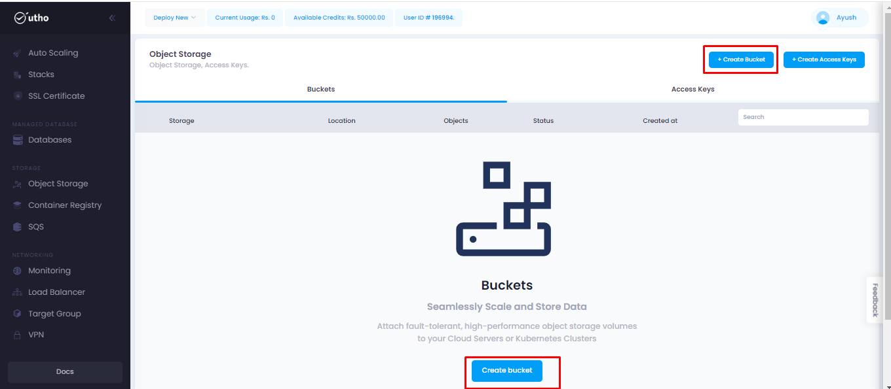
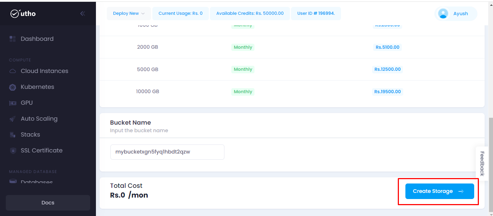
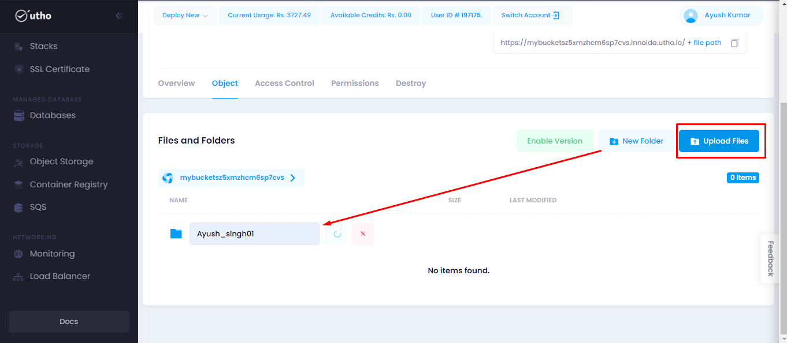
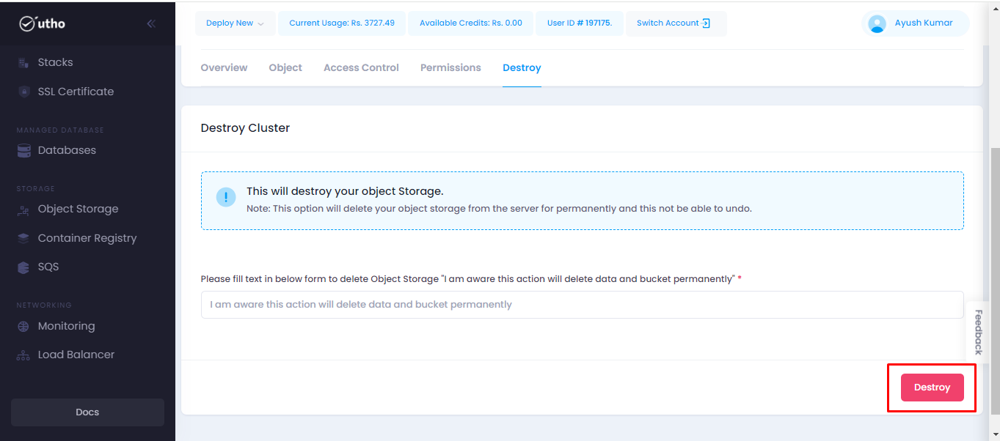
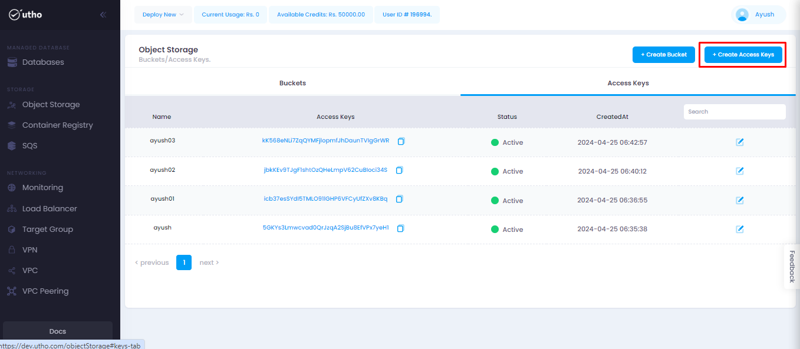
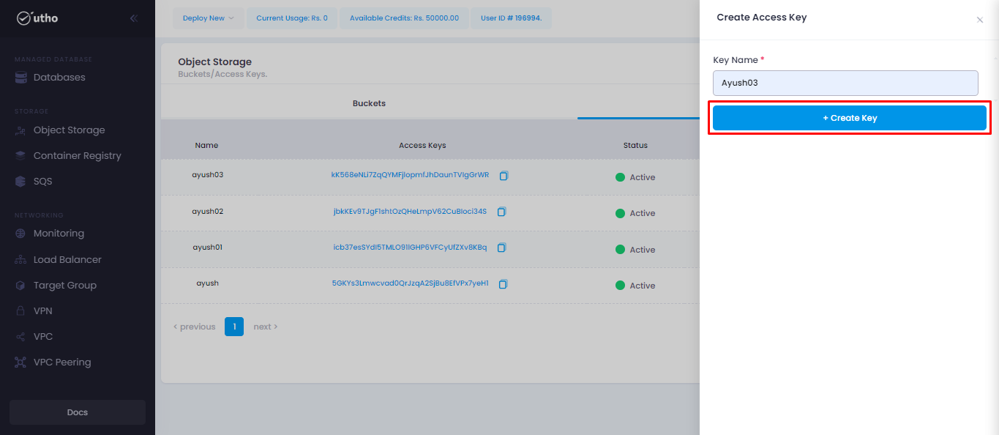
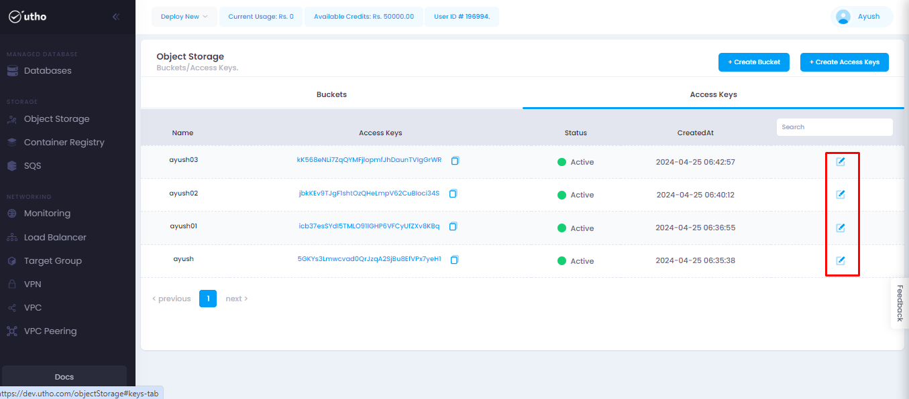
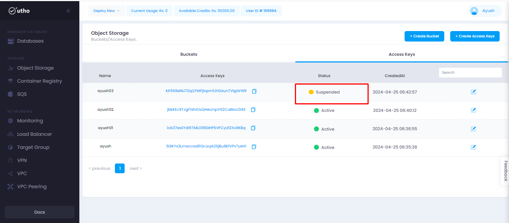

# Object Storage
--- 
Object storage in the cloud refers to a method of storing and managing data in a distributed, scalable, and highly available manner. Instead of organizing data in a hierarchical file system structure like traditional storage systems, object storage systems store data as objects within a flat namespace.
These services are widely used for storing various types of data, including images, videos, documents, backups, and log files, among others.

### Object Storage offer several benefits:

-   Cost-effectiveness
-   Access via APIs
-   Durability
-   Scalability

### Steps for approaching the Object Storage:
---
#### Visit on the link given below:
>
[Console url](https://console.utho.com/)
1. First, login to your Utho profile using the link mentioned above. This link will redirect you to the Dashboard of your profile.

2. Here we will get  the options to reach the Object Storage tab.

-   Deploy new (Dropdown)- To deploy a Object storage.
-   Left side menu option Object Storage- To view and manage your object storage.

    

3. After clicking on the option from the left side menu, it will redirect user to the **Object Storage** homepage.

4. Here user will have two options:
- Create Buckets
- Create Access Keys
Here moving forward with creating Bucket.
On homepage user will have two ways to create bucket as shown below in the snippet, On clicking it will redirect user to the requirement page.

5. Now user will choose the location from DC Location.

6. Here user will select the storage Plan Type according to the requirements.

7. If user want then he/she can provide the bucket name or else it will be generated automatically.

8. After that user will click on create storage as shown below.

9. After clicking on create storage it will redirect user to the next page where all created storage will be seen.

10. Click on manage button for in depth understanding of any specific Object Storage.

11. On clicking the Manage button it will redirect user to the next tab. 

12. Under Object section on clicking on **Upload files -> Attach files** then user can upload his files in the bucket created.
Also on clicking on new folder user can create the folder of his choice.

13. Under Access Control section user can update the access control for there files by choosing the option from dropdown and clicking on save changes button. Once user select there access control there he can see more information about the different permission.

14. Here on clicking on update permissions user can update & manage the permissions given.

15. On clicking on destroy button user can delete the object storage.

#### Now for the process involved in the **Create Access Keys**:

16. Navigate to Access Keys section and click on create access keys as  marked in the snippet below.

17. On click a sidebar will open where we have to provide the access key name and click on create key button.

18. After clicking on the create button a new access key will be created. Here, the user will be prompted with the newly created access and secrent key. Copy this secret key somewhere safe because after this page, user cannot see or generate the same secret key.

    

19. Here on clicking on edit button a new sidebar.

20. Where user can update there access key by choosing te required status and clicking on update access key.

21. After the update the same will be reflected on the homepage of access key.

---
**THE END**

