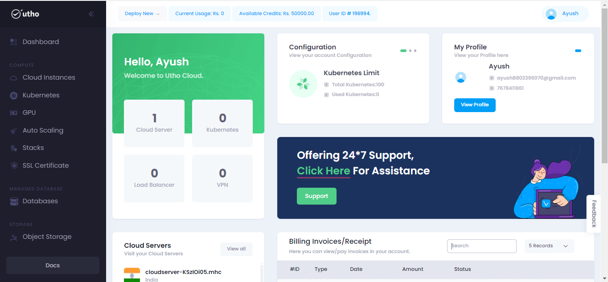
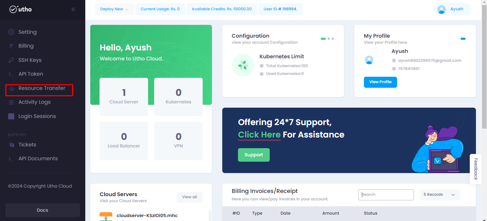
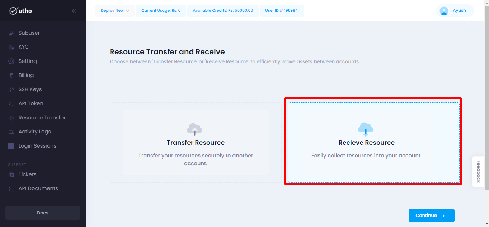
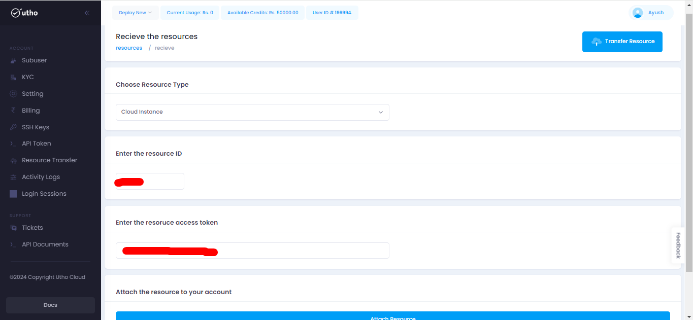
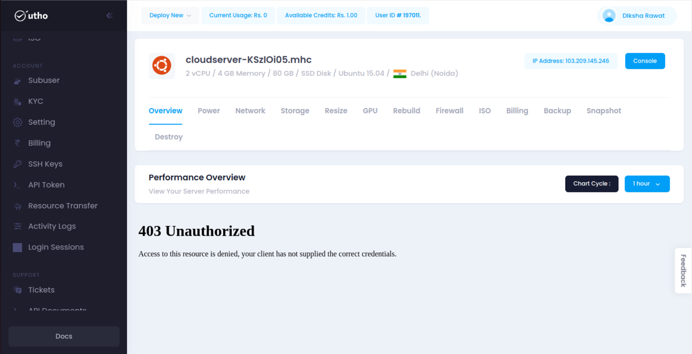

# Resource Transfer
---
Resource Transfer in the cloud computing involves the delivery of computing services over the Internet, which can include storage, databases, networking, software, and more. Resource transfer in the cloud typically refers to the movement of data, files, or other resources between different components or services within a cloud infrastructure.

### Resource Transfer offer several benefits:
- Data Transfer
- Costs
- Optimization
- Security

### Steps for approaching the Resource Transfer:
---
#### Visit on the link given below:
>
[Console url](https://console.utho.com/)
1. This link will redirect you to the Dashboard after Login of the platform.

 

2. Here on L.H.S user will get the option of Resource transfer tab as shown below in the below snippet.

3. On clicking on that it will redirect user on the next tab which is homepage of resource transfer.

Here user will get 2 options:
- Resource Transfer
- Recieve Resource

Now starting with Resource Transfer:
In this we are transfering our resources to any other user.

After choosing user have to click on continue as shown in the snippet.

After clicking on continue user will be navigated to the next page where he have to choose the Resource type.

Once the resource type is selected all the server will be shown below in get token to share your resource tab for that particular resource.

After that on clicking on get token , resource id will be sent on the mail. Aslo a confirmationmessage will be shown on the above screen that resource id sent to email.

Now the further process will take place on Receive Resource.

---
**THE END**
