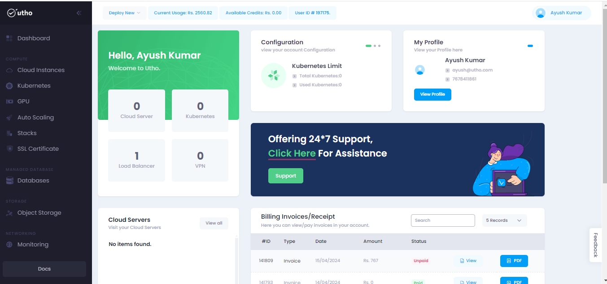
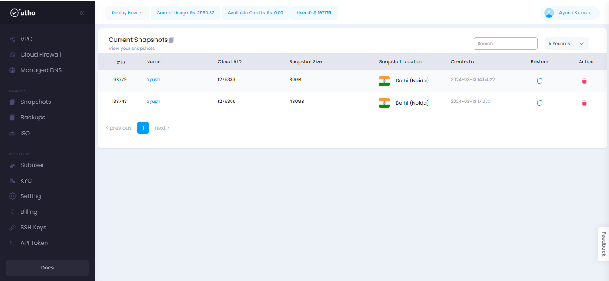

# Snapshots
--- 
A snapshot is a point-in-time copy of a data volume or disk. It captures the entire state of the volume at the moment the snapshot is taken, including the data, configuration, and metadata associated with it.

### Snapshots offer several benefits:
- Cloning
- Cost Optimization
- Disaster Recovery
- Data Backup
- Data Recovery

### Steps for approaching the Snapshots :
---
#### Visit on the link given below:
>
[Console url](https://console.utho.com/)
1. This link will redirect you to the Dashboard after Login of the platform. 

 

2. On L.H.S user will get an option of snapshots when scrolling down as shown in the snippet below.

3. After that a new page will occur where user will get all the detils of the his snapshots he took during the process on different products like on Cloud instances we have option of Snapshots.
 

4. Now on the homepage of Snapshots user wil get option for restoring and deleteing the snapshot as given in the snippet.

---
**THE END**
