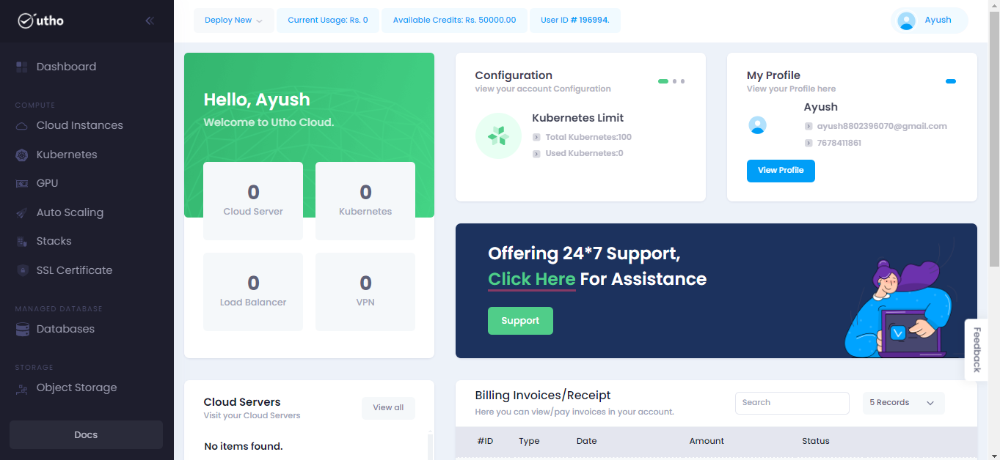
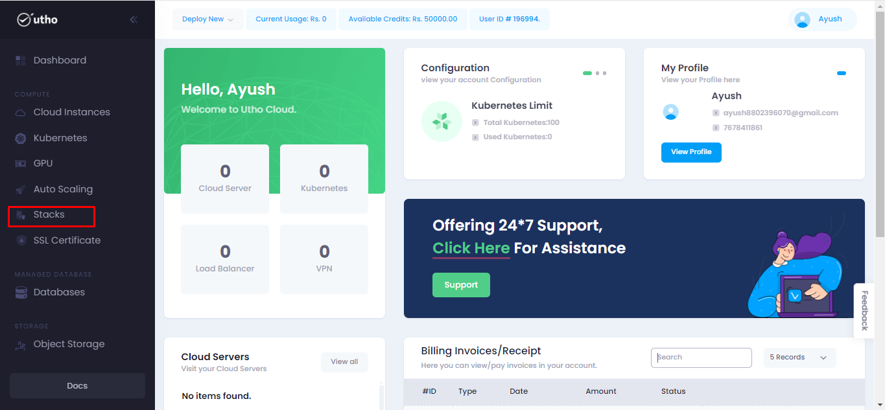
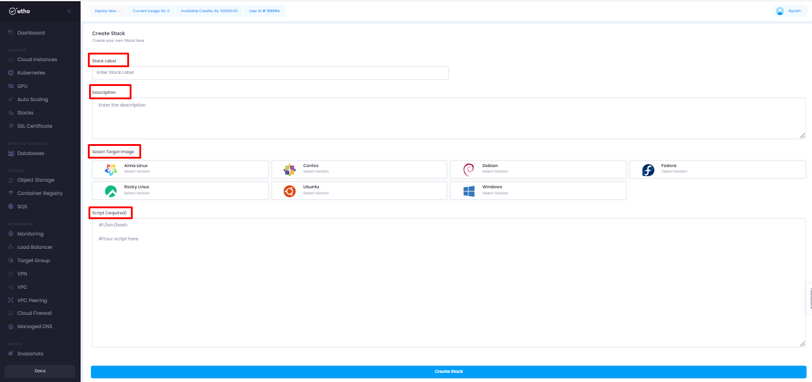
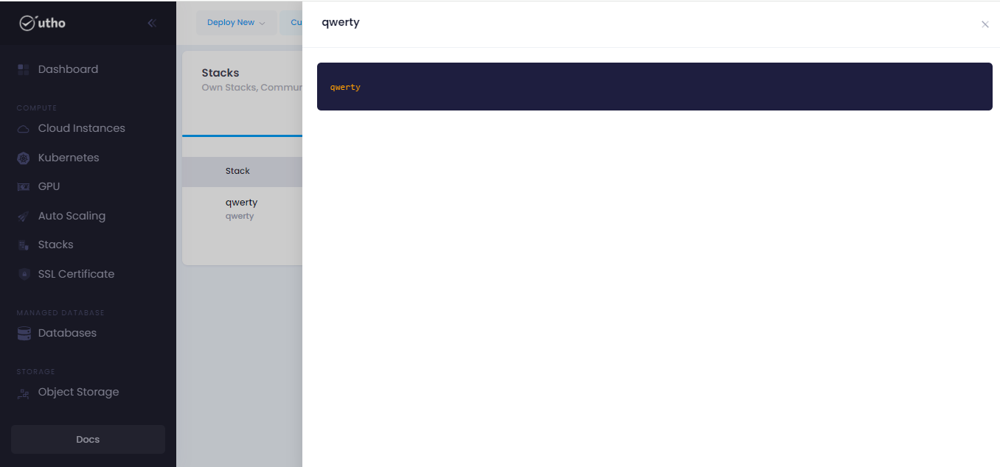
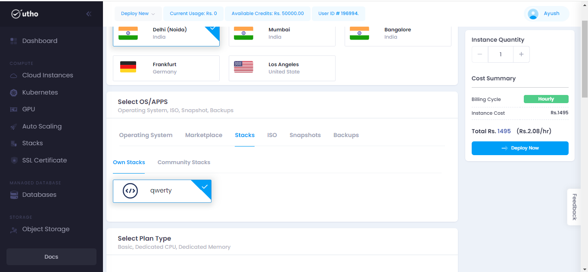
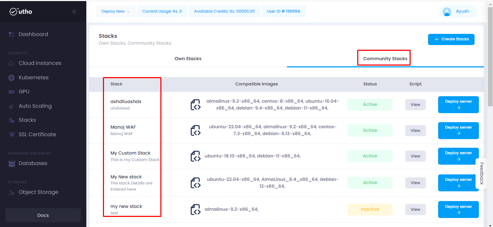

# Stacks
--- 
Stacks generally refer to collections of related services or resources that work together to provide a specific functionality or solution. These stacks can include various components such as virtual machines, databases, networking configurations, security policies, and application code.

### Stacks offer several benefits:
- Application Stacks
- DevOps Stacks
- Serverless Stacks
- Data Stacks

### Steps for approaching the Stacks:
---
#### Visit on the link given below:
>
[Console url](https://console.utho.com/)
1. This link will redirect you to the Dashboard after Login of the platform. 

 

2.  Here we will get 2 options to reach the stacks tab.
- Deploy new (Dropdown)
- L.H.S tab

3. After clicking on this tab it will redirect user to the homepage of stacks.

4. For creating the stack user should click on create stacks as shown in the snippet below.

5. After clicking on create stack it will redirect user to next page where it will ask user for the detils required for creating the stacks.

6. After filling all the details user should click on create stack.

7. Then user will be redirected to homepage of stacks where all created stacks will be available.

8. On clicking  on eye button stack label will be seen.

9. And on clicking on edit button user will be able to edit the stacks created where on clicking on update stack created stack will be updated.

10. And on clicking on the deploy server on the homepage of stack it will redirect user to the cloud instances deploy server page.

11. On deploy server page user will get stack selected automtically and that can be deployed after clicking on the deploy button on the cloud instances product page.

And in community stacks in the context of cloud computing typically refer to pre-configured, community-driven templates or configurations that are shared among users for common use cases or scenarios.

---
**THE END**

