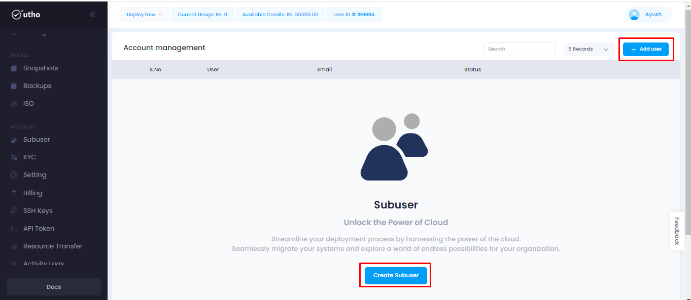
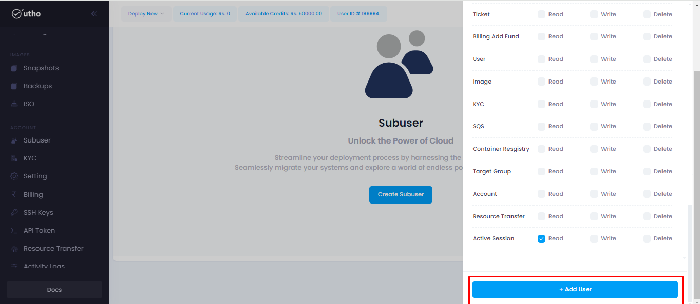
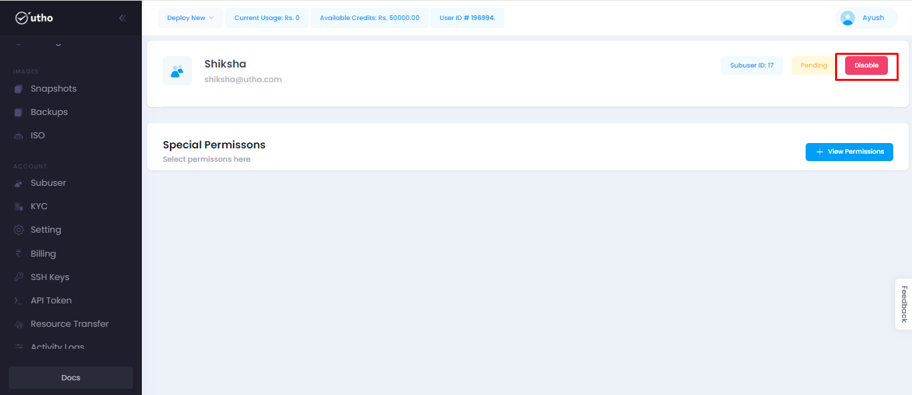

# Subuser
--- 
Subuser refers to a secondary user account or profile created within a primary user account in a cloud service provider's platform. This concept is often used to manage permissions, access, and resources within the cloud environment. 
Overall, subusers provide a flexible and scalable way to manage users, access, and resources within a cloud environment, facilitating collaboration, security, and resource optimization.

### Subuser offer several benefits:

-   Billing and Cost Management
-   Flexibility
-   Resource Management
-   Access Control
-   Team Collaboration

### Steps for approaching the Subuser :
---
#### Visit on the link given below:
>
[Console url](https://console.utho.com/)
1. This link will redirect you to the Dashboard after Login of the platform.

2. Here user will get an option for Subuser on the L.H.S tab after scrolling down. Click on the Subuser button as marked below.

3. After clicking on the subuser button it will redirect user on then next page which is homepage of the Subuser.

4. Here user will get 2 option to create the subuser.
- Create subuser
- Add Subuser 

5. On clicking on create subuser a popup will occur where the information about the subuser will be asked for creation of subuser.

6. Here user have to enter the name, mobile number & email id of the user also the owner(user) have to provide the permission. Like for which products subuser will be having the access. Snippet is attached below for the references.
 

7. After filling all the details click on the Add user button given below.

8. After clicking on add user it will redirect to the account management page where owner can see all the subusers added.

9. Click on the manage button for more functionalities.

10. After clicking on manage button it will redirect user to the next page. Here on clicking on Update permission owner can update the permissions for the subuser.
.

11. Here user can see all the permissions provided to the subuser also owner can update the permissions for the exixting subusers.

12. After selecting all the permissions owner have to click on save permissions given below for updating the permissions.

13. Also on clicking on Disable or Destroy button owner/user can delete the subuser.

---
**THE END**

