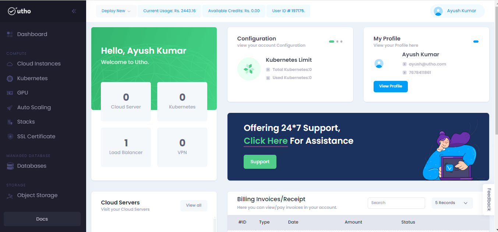
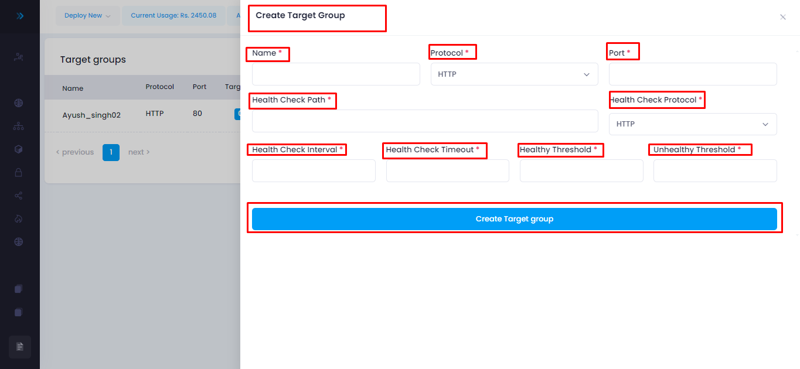
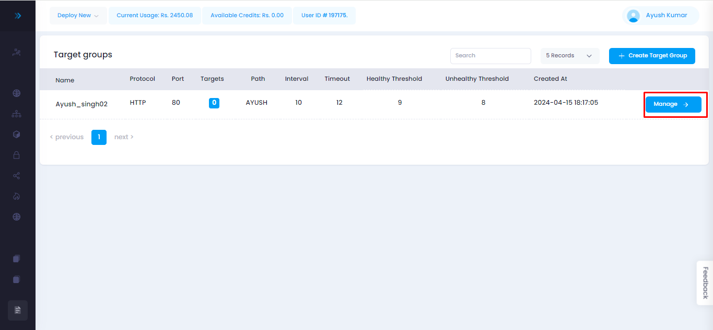
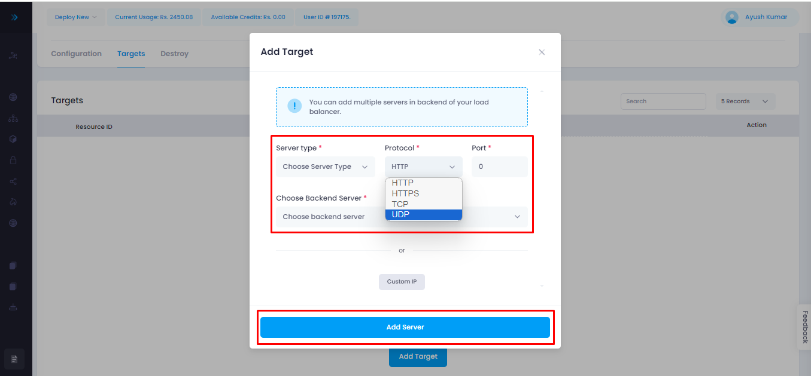

# TARGET GROUP
--- 

A "Target Group" typically refers to a component of a load balancer service, particularly in  **UTHO** . Here's a breakdown of what a target group is and its role in cloud infrastructure.
Also target group is a logical grouping of targets.  It acts as a destination for requests routed by the load balancer based on configured rules.

## Target Group offer several benefits:
- Health Checks
- Routing Policies
- Path-Based Routing
- Integration with Auto Scaling
- Security

## Steps for approaching the Target Group:
---
#### Visit on the link given below:
>
[Console url](https://console.utho.com/)
1. This link will redirect you to the Dashboard after Login of the platform. 

 

2. Here on click on L.H.S bar we will get two options to navigate to Target Group as shown below.

3. Now for creating the target group click on the marked point given on the snippet.

4. After clicking on that button a side bar will open where the user have to fill all the details related to Target Group.

- **NAME:** This is a user-defined name for the target group, which helps identify it within your system. It's usually a descriptive label to indicate the purpose or function of the target group.
-  **PROTOCOL:** This specifies the communication protocol used for routing traffic to the targets in the target group. Common protocols include HTTP, HTTPS, TCP, and SSL.
- **PORT:** This is the port number on which the targets in the target group are listening for incoming traffic. For example, if your application runs on port 80 for HTTP traffic, you would specify port 80 here.
- **HEALTH CHECK PATH:** This is the URL path that the load balancer periodically checks on each target to determine its health status. It's typically a specific endpoint on your application server that returns a health check response (e.g., "/health" or "/status").
- **HEALTH CHECK PROTOCOL:** This specifies the protocol used for health checks. It's often the same as the protocol used for routing traffic to the targets (e.g., HTTP or HTTPS), but it can be different if necessary.
- **Health Check Interval:** This is the time interval at which the load balancer sends health check requests to the targets to verify their health status. It's usually specified in seconds.
- **Health Check Timeout:** This is the maximum amount of time the load balancer waits for a response from a target before considering the health check failed. It's specified in seconds.
- **Healthy Threshold:** This is the number of consecutive successful health checks required for a target to be considered healthy. Once a target reaches this threshold, it's considered healthy and can receive traffic.
- **Unhealthy Threshold:** This is the number of consecutive failed health checks required for a target to be considered unhealthy. Once a target reaches this threshold, it's considered unhealthy and is removed from the pool of available targets until it becomes healthy again.

After filling all the details click on Create Target Group.
5. After clicking on it will redirect to the homepage of target group.

6. Where on clicking on manage it will navigate to new page given below also from there user can upadte his created target group in the Configuration section.

7. After configuration user will move to target section where the user have to click on add target.

8. After clicking on add target a new tab will occur where user have to fill all the required data's like (Server type, Protocol, Port, Choose Backend Server)  and click on Add server.

**OR**
9. By clicking on the custom IP user can add custom server.

10. After clicking on this a new page will occur where user have to fill all the required data's as given in the snippet.

---
**THE END**
