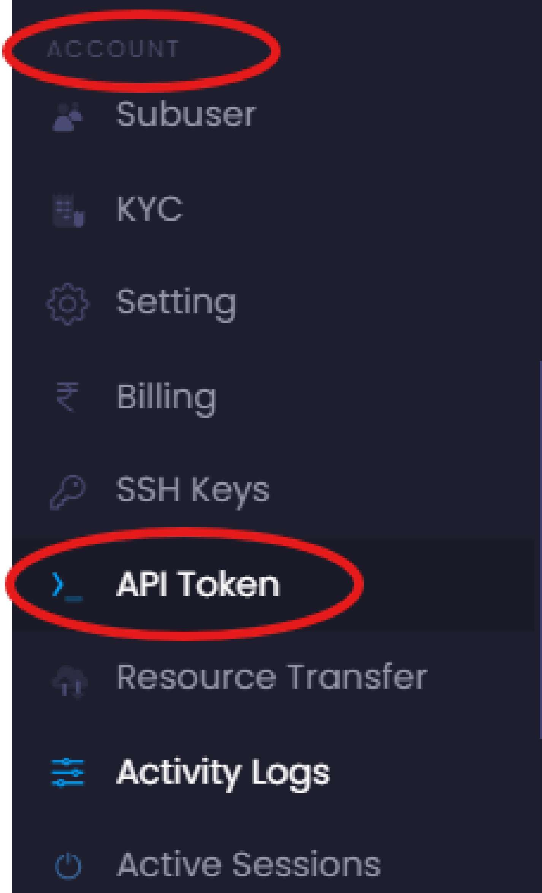
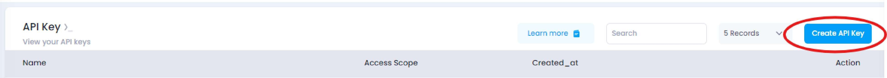
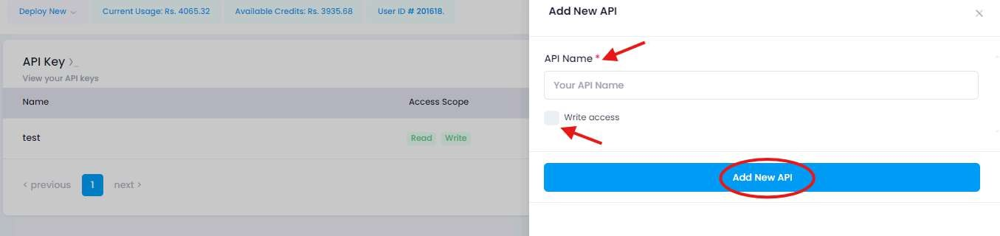
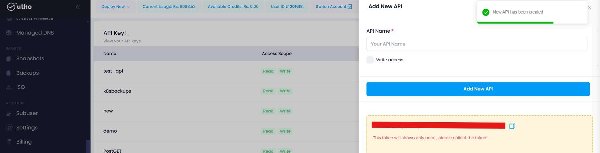
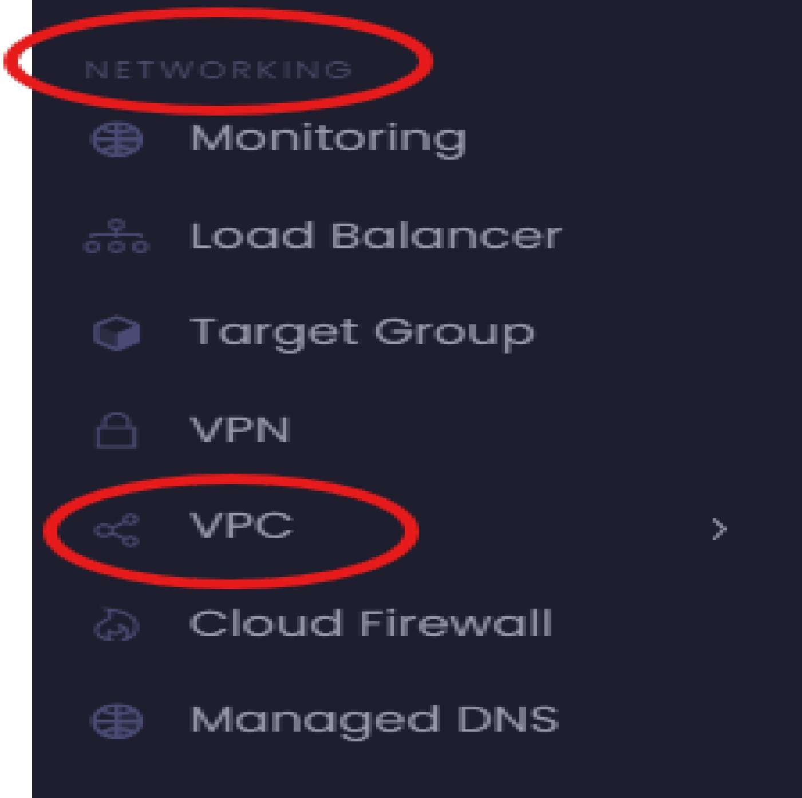
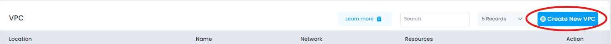
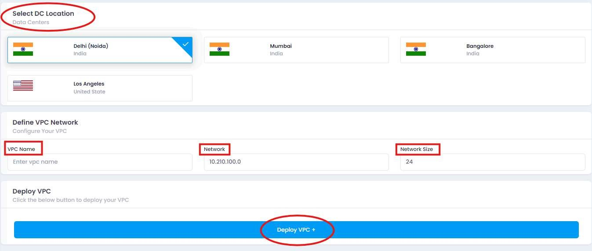
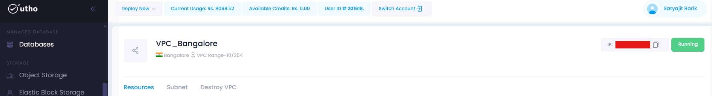
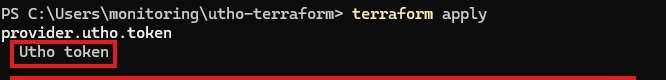

# Getting Started with Terraform on Utho Cloud

## Prerequisites
- **Utho Cloud Account**: You need an active Utho Cloud account. If you don't have one, sign up at the Utho Cloud website.
- **Terraform Installed**: Ensure you have Terraform installed on your local machine. You can download it from terraform.io.
- **Access Token**: Obtain your Utho Cloud access token for authentication.

## Step 1: Obtain Your Access Token
1. **Log in to Utho Cloud**: Go to the Utho Cloud website and log in.
2. **Navigate to the Account Section**: Under the Account Section You can Find "API Token".


3. **Click Create API Key**: Click Create API Key for create API key for your Project.


4. **Add New API**: On the new pop page fill the API Name and Give Access eg. Read/Write and then Click Add New API.


5. **Copy Your API Credentials**



## Step 2: Gather Network Information
1. **Access the Networking Section**: Look for "VPC."


2. **Create New VPC**: On the new page Click Create New VPC.


3. **Fill Necessary Field**: According to you Select your DC Location, Give VPC Name, Network & Network Size and Click Deploy VPC.



4. **Review VPC**: After Deploying VPC You can find the Details of You VPC.



## Step 3: Create Your Terraform Configuration

### Linux
1. Open your terminal.
2. Create a new directory for your Terraform project and navigate into it:
   ```bash
   mkdir my-terraform-project
   cd my-terraform-project
   ```

### Windows (Command Prompt)
1. Open Command Prompt.
2. Create a new directory for your Terraform project and navigate into it:
   ```cmd
   mkdir my-terraform-project
   cd my-terraform-project
   ```

### Windows (PowerShell)
1. Open PowerShell.
2. Create a new directory for your Terraform project and navigate into it:
   ```powershell
   New-Item -ItemType Directory -Path "my-terraform-project"
   Set-Location "my-terraform-project"
   ```

### macOS
1. Open your terminal.
2. Create a new directory for your Terraform project and navigate into it:
   ```bash
   mkdir my-terraform-project
   cd my-terraform-project
   ```

## Step 4: Create the Main Configuration File

### Linux
1. Open your terminal.
2. Navigate to your Terraform project directory (if you're not already there):
   ```bash
   cd my-terraform-project
   ```
3. Create the main.tf file using a text editor (e.g., nano or vim):
   ```bash
   nano main.tf
   ```
4. Add your configuration (e.g., your Utho Cloud configuration) and save the file.

### Windows (Command Prompt)
1. Open Command Prompt.
2. Navigate to your Terraform project directory:
   ```cmd
   cd my-terraform-project
   ```
3. Create the main.tf file using Notepad:
   ```cmd
   notepad main.tf
   ```
   This will open Notepad. You can then add your configuration and save the file.

### Windows (PowerShell)
1. Open PowerShell.
2. Navigate to your Terraform project directory:
   ```powershell
   Set-Location "my-terraform-project"
   ```
3. Create the main.tf file:
   ```powershell
   New-Item -ItemType File -Name "main.tf"
   ```
4. Open the file in Notepad to add your configuration:
   ```powershell
   notepad main.tf
   ```

### macOS
1. Open your terminal.
2. Navigate to your Terraform project directory:
   ```bash
   cd my-terraform-project
   ```
3. Create the main.tf file using a text editor (e.g., nano or vim):
   ```bash
   nano main.tf
   ```

## Final Step: Edit the main.tf File

Open main.tf in a text editor and add the following configuration:

```hcl
terraform {
  required_providers {
    utho = {
      source = "uthoplatforms/utho"
      version = "0.4.0"
    }
  }
}

provider "utho" {
  # Token is retrieved from environment variable
}

# Define your VPC ID (replace with your actual VPC ID)
variable "vpc_id" {
  description = "The VPC ID where the instance will be created"
  type        = string
  default     = "<e.g- 898d6540-f549-426c-84bf-e92015995c64>"  # Use your VPC ID here
}

# Create a Utho Cloud Instance
resource "utho_cloud_instance" "example" {
  name          = "example-name"         # Instance name
  dcslug        = "inbangalore"          # Data center slug
  image         = "rocky-8.8-x86_64"     # Image ID
  planid        = "10045"                # Plan ID
  firewall      = ""                     # Optional: specify if needed
  enablebackup  = false                  # Set to true if backups need
  billingcycle  = "hourly"               # Billing cycle
  backupid      = ""                     # Optional: specify if needed
  sshkeys       = ""                     # Optional: add SSH keys if needed
  vpc_id        = var.vpc_id             # VPC ID for the instance
}

# Output the instance's HA value (since id is not available)
output "instance_ha" {
  value = utho_cloud_instance.example.ha  # Assuming "ha" is the correct attribute to use
}
```

## Test and Go Live

Check your configuration as you work by using a resource's data source and then activate your configuration in the stage environment for end-to-end testing.

### Step 1: Initialize Terraform
```bash
terraform init
```

### Step 2: Plan Your Deployment
```bash
terraform plan
```

In this step you need to provide your API as Utho Token.



### Step 3: Apply the Configuration
```bash
terraform apply
```

### View Output
After the resources are created, Terraform will display the output, including the ID of your newly created instance.

---

