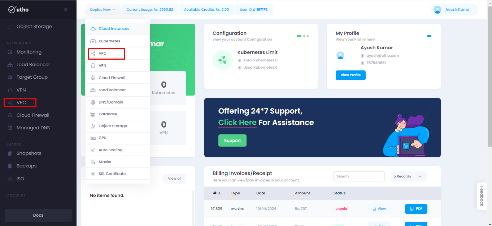
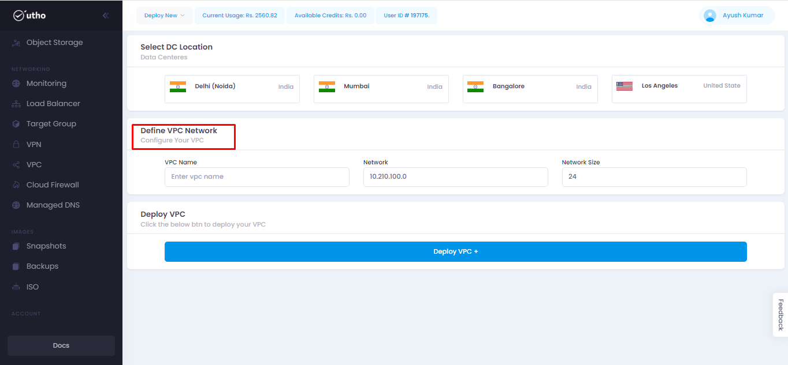
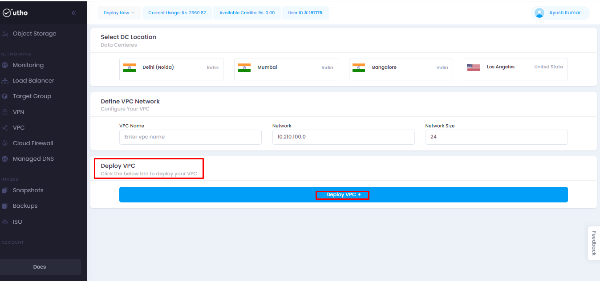
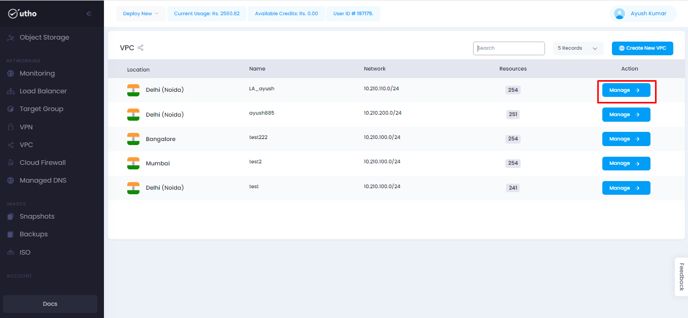
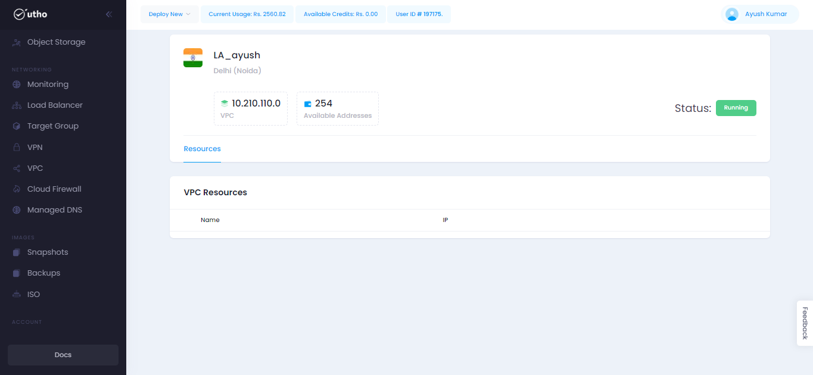

# VPC
--- 
A Virtual Private Cloud (VPC) is a service provided by public cloud providers, enabling enterprises to create their own private cloud-like computing environment within shared public cloud infrastructure.

### Why Choose a Virtual Private Cloud (VPC)?
- **Enhanced Security**

    A VPC offers robust security features, allowing you to safeguard your virtual networking environment, including IP addresses, subnets, and network gateways. This enables you to securely isolate critical resources like databases in private-facing subnets, minimizing exposure to potential internet threats.

- **Data Control**

    With a VPC, your network is isolated from other cloud environments, granting you full control over your data and preventing any intermingling with data from other entities. This segregation mitigates the risk of data compromise often associated with public cloud platforms.

- **Improved Performance**

    VPCs enable you to prioritize network traffic for specific applications, optimizing their performance and minimizing congestion or potential bottlenecks. This ensures consistent and reliable performance for your critical workloads.

- **On-Demand Flexibility**

    You have the flexibility to tailor your cloud architecture according to your company's specific requirements. For instance, you can configure your VPC to facilitate individual direct connections for contractors, bypassing your internal network and providing efficient access to cloud resources.

### Benefits of Using a VPC:
- **Enhanced Security:** VPCs offer isolation within public clouds, enhancing protection for sensitive data and workloads.

- **Customizable Networks:** Organizations can tailor network configurations to meet specific security and operational needs.

- **Improved Performance:** Segmented network resources optimize application performance and user experience.
Cost Efficiency: VPCs leverage pay-as-you-go models and economies of scale for cost savings.

- **Hybrid and Multi-Cloud Support:** VPCs facilitate secure connections between on-premises networks and cloud environments, supporting multi-cloud strategies.

- **Scalability and Flexibility:** VPCs provide scalability and flexibility for resource management and response to demand changes.

### Approach to Setting Up a VPC:
---
**Step 1:** Click on the provided link [Console](https://console.utho.com/) URL.Upon logging in to the platform, this link will redirect you to the Dashboard.

 

**Step 2:** At this stage, you will encounter two options to access the VPC tab:
- "Deploy new" (from the dropdown menu)
- Left-hand side (LHS) tab

**Step 3:** Upon selection, you will be redirected either to the VPC homepage or the VPC deployment page.

**Step 4:** Proceed by selecting the Data Center (DC) Location according to your requirements.

**Step 5:** Provide the necessary values to define the VPC Network and input all details required to configure your VPC.

**Step 6:** Click on "Deploy VPC" to initiate the deployment process for your VPC.

**Step 7:** Once the VPC deployment is completed, you will be redirected to the VPC homepage, where you can view all deployed VPCs.

**Step 8:** To access more information about the functioning of the VPC, click on the "Manage" button.

Upon clicking the "Manage" button, you will be redirected to the next tab, where detailed information about the VPC is provided.

---
**THE END**

