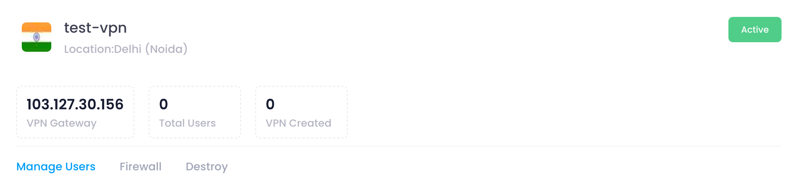
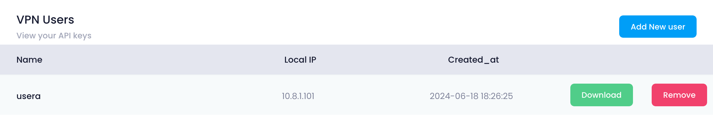

## VPN Configuration Info

At the top of the Manage section, users can view the configuration information of the selected VPN. This includes:

* **VPN Name:** The unique name assigned to the VPN.
* **Datacenter Location:** The chosen datacenter location.
* **Number of Users:** The number of VPN users associated with the VPN.
* **VPN Gateway:** The IP address or hostname of the VPN gateway.
* **Status:** The current status of the VPN (e.g., active, inactive, pending).

## Manage Users

In the Manage Users section, users can add, delete, and download VPN users. This section provides the following functionalities:

* **Add User:** Click the **Add User** button to open a form where you can enter the user details such as username, email, and password.
* **Remove User:** Select a user from the list and click the **Remove** button to remove the user from the VPN.
* **Download User:** Select a user from the list, click the **Download** button, which will download your vpn user into your brows.

## Destroy

In the Destroy section, users can terminate the VPN instance. This action is irreversible and will permanently delete the VPN and all associated data. To destroy a VPN

Click the **Destroy VPN** button.

##### **Confirmation:**

A confirmation dialog will appear. Confirm the action to proceed with destroying the VPN.

When you provide the confirmation then your VPN Instance will destroy.
