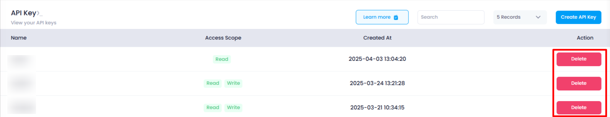
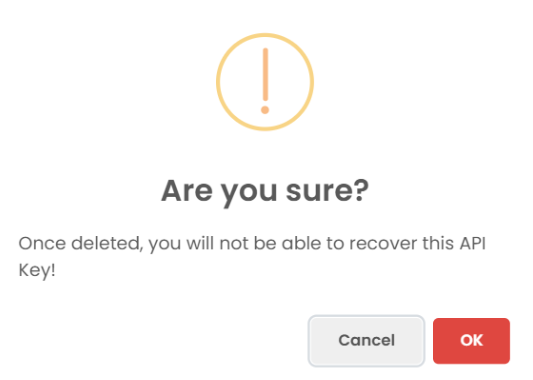

## **API Token Deletion Process in Utho Cloud**

In Utho Cloud, users have the ability to delete API tokens that are no longer needed or if there are security concerns. The deletion process is simple and secure, ensuring that tokens are only removed after proper confirmation.

#### **Steps to Delete an API Token:**

1. **Navigate to the API Token Listing Page** :

* To begin the deletion process, the user must first navigate to the  **API Token Listing Page** , where all previously created API tokens are listed.

 **2. Click on the Delete Button** :

* In the **Action** column next to the API token to be deleted, the user will click on the **Delete** button. This action is available for each API token listed, allowing the user to delete any unwanted or outdated tokens.

3.**Confirmation Popup** :

* Upon clicking the **Delete** button, a **confirmation popup** message will appear on the screen, asking the user to confirm the deletion of the API token. The popup will typically contain the following message:
  * **"Are you sure you want to delete this API token?"**
  * The user is presented with  **two options** :
    * **OK** : To confirm and proceed with the deletion of the API token.
    * **Cancel** : To cancel the deletion process and return to the API token listing page.

4. **Confirm Deletion** :

* After clicking  **OK** , the selected API token will be permanently deleted from the system. The token will no longer be valid, and any attempts to use it for authentication will fail.

5. **API Token Removal from Listing Page** :

* Once the API token is deleted, it will be immediately removed from the  **API Token Listing Page** , ensuring that users have an up-to-date view of their remaining tokens.
