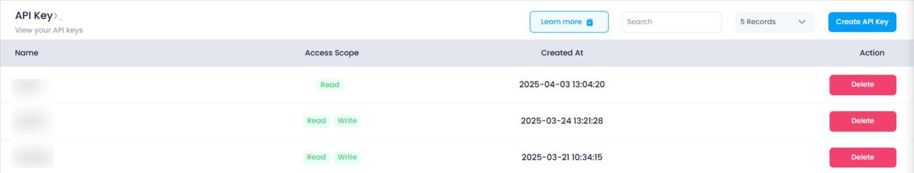

# **How to create Api Token**

## **Login or Sign Up**

1. Visit the **Utho Cloud Platform** [login ](https://console.utho.com/login)page.
2. Enter your credentials and click  **Login**.
3. If you’re not registered, sign up [here](https://console.utho.com/signup).

---

## **Step 1: Access the Api Token**

1. Open the **Utho Cloud Platform** dashboard.
2. Click **"Api Token"** in the sidebar.
3. You’ll be redirected to the  listing page.
4. Navigate to the **listing** of  Api Token and click on **[Create Api Key](https://console.utho.com/api)**.

### Steps to Create Api Token

1. A drawer will open where you need to provide the following details:
   - **Name**: Enter a meaningful name for the API token.
   - **Write Access** (Optional):
     - Check the **checkbox** beside "Write Access" to enable full access (write & delete).
     - If the box is **not checked**, the API token will have **read-only access**.

**Finalizing and Saving the API Token**

1. After filling in all required details, click on **"Add New API"**.
2. The generated **API Token** will appear on the screen.
3. **Copy the token immediately** as it is visible **only once**.

   

### Verify Deployment:

By navigating to the listing page of the API Tokens.

#### **Support**

For additional help with **Api Token** or if you encounter any issues, contact **Utho Support** through:

- The **Support Ticket System**
- Email: 📩 **[support@utho.com
  ](support@utho.com)**

---
