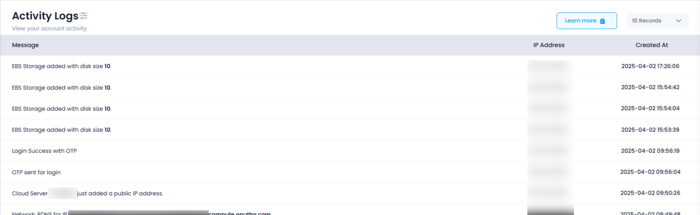

## **Login or Sign Up**

1. Go to the **Utho Cloud Platform** [login](https://console.utho.com/login) page.
2. Enter your credentials and click  **Login** .
3. If you don't have an account, sign up [here](https://console.utho.com/signup).

---

## **Accessing Active Sessions**

1. Open the **Utho Cloud Platform** dashboard.
2. Click on **"[Activity Logs](https://console.utho.com/activity)"** from the  sidebar.
3. You will be redirected to the **Activity Logs** listing page.

Upon navigating to the **Activity Logs Listing Page** in Utho Cloud, users will be presented with a detailed table containing all recorded activities. This page serves as a comprehensive view of user interactions and system events within the cloud platform. The table is organized with the following key headers:

1. **Message** :

* The **Message** column displays a brief description or summary of the action that was performed during the logged activity. The **Message** column on the **Activity Logs Listing Page** is a central component that provides detailed information about the activities performed by users on the Utho Cloud platform. This column captures and displays a brief description of each action or event, offering context and insight into the specific activity that was performed. Each entry in the **Message** column reflects the nature of the action taken by the user, such as creating or modifying resources, initiating specific services, or performing configuration changes. For example, the **Message** column may include entries like:
* **"User logged in"** – Indicates that a user successfully authenticated and accessed the platform.
* **"EBS volume created"** – Shows that a new Elastic Block Storage volume was provisioned.
* **"VM instance started"** – Reflects that a virtual machine instance was launched.
* **"API call executed"** – Documents the use of the platform's API for interaction or automation.
* **"Storage resized"** – Indicates that a storage resource was expanded or contracted.

2. **IP Address** :

* The **IP Address** column shows the IP address from which the action was initiated. This helps track the geographic location or network source of the activity, aiding in security monitoring and identifying unusual or unauthorized access attempts.

3. **Created At** :

* The **Created At** column records the exact timestamp of when the activity occurred. This provides a chronological order of events, allowing users and administrators to trace actions over time, facilitating auditing and investigation.
