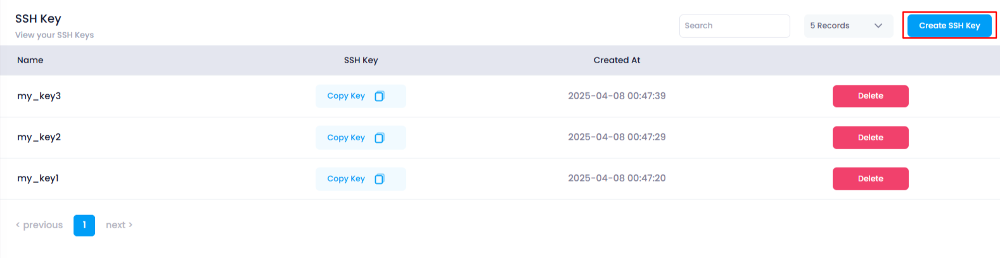
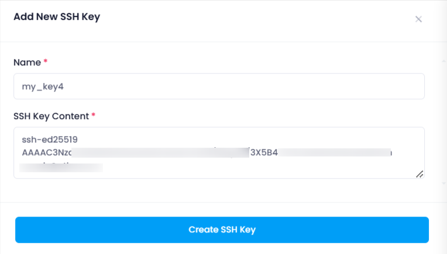
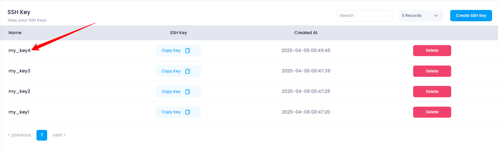

# **How to Create an SSH Key in Utho Cloud**

### **Overview**

An **SSH key** in Utho Cloud is used to authenticate and establish a secure connection to cloud resources, such as virtual machines. SSH keys provide a more secure and efficient method for logging in remotely, without the need for passwords. SSH key-based authentication is widely used for automating tasks and securely managing cloud resources.

### **1. Login to Utho Cloud Platform**

* Visit Utho Cloud Platform's **[ Login](https://console.utho.com/login)** page.
* Enter your credentials and click  **Login** .
* If you don't have an account, sign up  **[here](https://console.utho.com/signup)** .

### **2. Navigate to SSH Key Listing Page**

* After logging in, go to the **SSH Key Listing Page** or you can click [here](https://console.utho.com/ssh "SSH Listing Page").
* This page displays all the SSH keys associated with your account.

### **3. Click on the "Create SSH Key" Button**

* On the  **SSH Key Listing Page** , click on the button labeled **"Create SSH Key"** located at the top of the page.
* This will open the **Create SSH Key** drawer, where you can input details for your new SSH key.

  

### **4. Enter SSH Key Details**

* In the **Create SSH Key** drawer, you will see two input fields:
  **a. Name** :

  * Enter a **unique name** for the SSH key.
  * This name will help you easily identify the key later, especially if you have multiple keys.

  **b. SSH Key Content** :

  * Paste your **public SSH key content** into this field.
  * The SSH key content should be in the format of an SSH public key, which looks like:

    

---

### **5. Click on "Create SSH Key"**

* After filling in both fields, click on the **"Create SSH Key"** button located below the input fields.
* This will initiate the process of creating your new SSH key.

---

### **6. Verify SSH Key Creation Success**

* Once the SSH key is successfully created, you will see a **success toast notification** confirming that the SSH key has been added.
* The page will automatically refresh, and your newly created SSH key will appear in the SSH key listing.

  

---

### **7. Verify SSH Key in the List**

* Return to the **SSH Key Listing Page** to verify if your newly created SSH key has been added to the list.
* Your key will appear with the **name** you provided, and you can use it for secure connections to cloud resources.

  

### **Conclusion**

Creating an SSH key in Utho Cloud is a simple and essential process for securely managing cloud resources. Once your SSH key is created, you can use it for secure, passwordless access to virtual machines and other cloud services. You can manage your SSH keys easily from the  **SSH Key Listing Page** , ensuring secure and efficient cloud operations.
