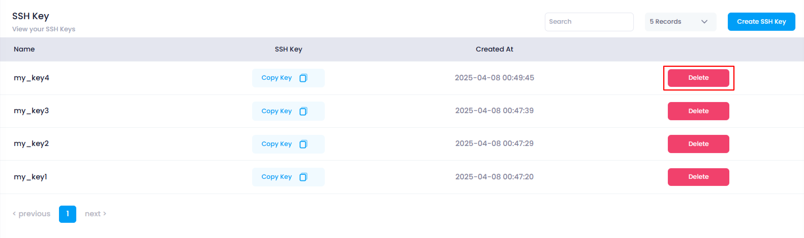
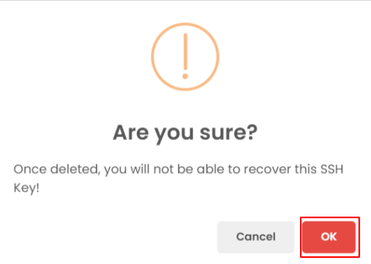
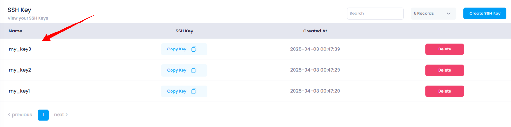

# **How to Delete an SSH Key in Utho Cloud**

### **Overview**

Deleting an **SSH key** in Utho Cloud is a simple process that removes a previously created SSH key from the platform. Once deleted, the key can no longer be used for authentication or access to cloud resources. Deleting unnecessary or unused keys is a good security practice to ensure that only active, authorized keys are associated with your account.

---

### **1. Login to Utho Cloud Platform**

* Visit the Utho Cloud Platform's **[ Login](https://console.utho.com/login "Login")** page.
* Enter your credentials and click  **Login** .
* If you don't have an account, sign up  **[here](https://console.utho.com/signup "Signup")** .

### **2. Navigate to SSH Key Listing Page**

* After logging in, go to the **SSH Key Listing Page** or you can click [here](https://console.utho.com/ssh "SSH Keys Listing Page").
* On this page, you will see a list of all the SSH keys associated with your account.

### **3. Find the SSH Key to Delete**

* In the SSH Key listing, look for the key that you want to delete.
* At the end of each listed SSH key, there will be a **Delete** button.

  

---

### **4. Click on the "Delete" Button**

* Click the **Delete** button next to the SSH key you wish to remove.
* This will open a **confirmation popup** asking you to confirm the deletion of the SSH key.

  

---

### **5. Confirm Deletion**

* In the confirmation popup, click the **"OK"** button to proceed with deleting the SSH key.
* The system will delete the selected SSH key from your account.

---

### **6. Verify SSH Key Deletion**

* After the key is successfully deleted, you will see a **success toast notification** confirming the deletion.
* To verify, return to the  **SSH Key Listing Page** .
* The deleted SSH key will no longer appear in the list.

  

---

### **Conclusion**

Deleting an SSH key in Utho Cloud is quick and easy. It helps you maintain security by ensuring that only the necessary keys are active in your account. After deletion, you can verify the change by checking the SSH key listing to confirm that the key has been successfully removed.
