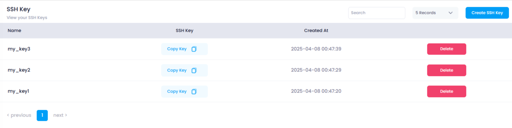

# **How to View SSH Keys in Utho Cloud**

### **Overview**

Viewing **SSH keys** in Utho Cloud allows you to access important information about the keys that have been created in your account. It gives you a comprehensive overview of each key, including its name, content, creation date, and allows you to delete keys if necessary. The SSH key listing page provides a user-friendly interface to manage your SSH keys effectively.

---

### **1. Login to Utho Cloud Platform**

* Visit the Utho Cloud Platform's[ Login](https://console.utho.com/login "Login") page.
* Enter your credentials and click  **Login** .
* If you're not registered yet, sign up  **[here](https://console.utho.com/signup "Signup")** .

### **2. Navigate to SSH Key Listing Page**

* Once logged in, go to the **SSH Key Listing Page** or click [here](https://console.utho.com/ssh "SSH Key Listing Page").
* On this page, you will find a list of all the SSH keys created in your account.

---

### **3. View the SSH Key Information**

* In the SSH Key Listing, you will see the following information for each SSH key:

#### 1. **Name**

* This column displays the **name** of each SSH key. It is used to identify the key within your account.

#### 2. **SSH Key**

* The **SSH Key** column contains a **Copy** button.
  * By clicking the **Copy** button, you can easily copy the SSH key content to your clipboard for use in your applications or for sharing with others.

#### 3. **Created At**

* The **Created At** column shows the **date and time** when the SSH key was created. This helps you track when each key was added to your account.

#### 4. **Action**

* The **Action** column contains a **Delete** button next to each SSH key.
  * Clicking the **Delete** button will open a confirmation popup where you can confirm the deletion of the SSH key.

    

---

### **Conclusion**

The SSH Key Listing Page in Utho Cloud provides a clear and organized way to view all SSH keys associated with your account. By accessing this page, you can easily check key details, copy SSH key content, and manage your keys by deleting them when necessary. This functionality helps you stay organized and secure by managing SSH access to your cloud resources efficiently.
