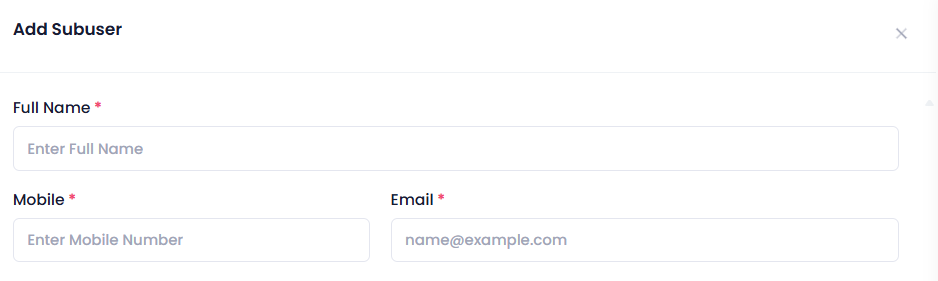
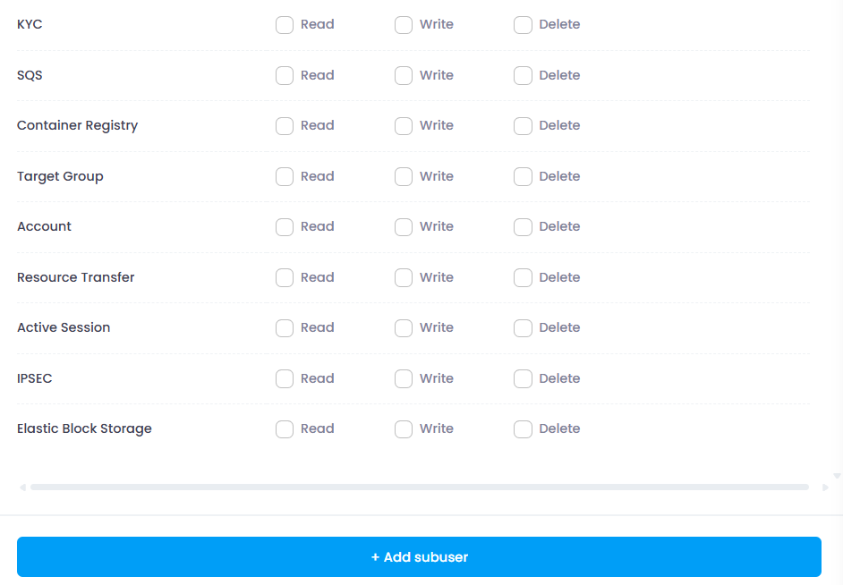
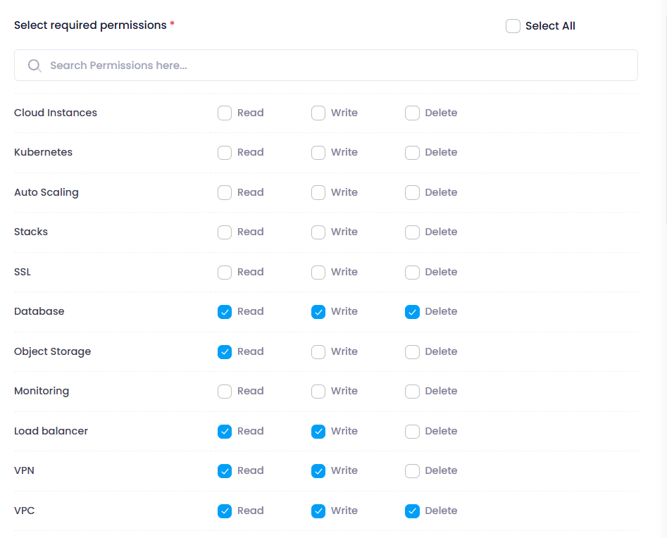

# **How to create Subuser**

## **Login or Sign Up**

1. Go to the **Utho Cloud Platform** [login](https://console.utho.com/login) page.
2. Enter your credentials and click  **Login** .
3. If you don't have an account, sign up [here](https://console.utho.com/signup).

---

## **Accessing Subuser**

1. Open the **Utho Cloud Platform** dashboard.
2. Click on **"Subuser"** in the sidebar.
3. You will be redirected to the **Subuser** listing page.
4. Click on **[Create Subuser](https://console.utho.com/accountManagement ".")** to open the deployment page.
5. **Fill in Subuser Details:**

   - Enter the following details for the subuser:
     
     - **Name:** Provide the full name of the subuser.
     - **Mobile Number:** Enter the contact number of the subuser.
     - **Email:** Input the email address of the subuser.
     - **Search:** It is used for searching the products whom user want to provide the permission.
     - **Choose Product for Permissions:** Select the product(s) for which you want to grant permissions to the subuser.
6. **Add Subuser:**

   - Click on the **Add Subuser** button to save and add the subuser to your account.

   

## **Managing Subuser Permissions**

When creating a **subuser**, you can assign specific **permissions** based on the level of access required. There are **three permission levels**:

### **Permission Levels**

1. **Read**

   - The user can **view** products and their flows.
   - No permission to **edit** or **delete** anything.
2. **Write**

   - The user can **read** and **write** (modify or deploy servers).
   - No permission to **delete** servers.
3. **Delete**

   - The user has **full access**: **read, write, and delete**
     

### **Permission Selection Rules**

- Selecting **Delete** ✅ → **Read** and **Write** are automatically checked.
- Selecting **Write** ✅ → **Read** is automatically checked.
- If **Delete** is checked, the user **cannot uncheck** **Read** or **Write**.
- If **Write** is checked, the user **cannot uncheck** **Read**.

This ensures a **hierarchical permission structure**, preventing accidental misconfigurations.

6. **Verify Subuser Addition:**

   - Once added, the new subuser should appear in the list of subusers with their assigned permissions.

   

# **Managing Subuser Permissions**

When creating a **subuser**, you can assign specific **permissions** based on the level of access required. There are **three permission levels**:

## **Permission Levels**

1. **Read**

   - The user can **view** products and their flows.
   - No permission to **edit** or **delete** anything.
2. **Write**

   - The user can **read** and **write** (modify or deploy servers).
   - No permission to **delete** servers.
3. **Delete**

   - The user has **full access**: **read, write, and delete**.

---

## **Permission Selection Rules**

- Selecting **Delete** ✅ → **Read** and **Write** are automatically checked.
- Selecting **Write** ✅ → **Read** is automatically checked.
- If **Delete** is checked, the user **cannot uncheck** **Read** or **Write**.
- If **Write** is checked, the user **cannot uncheck** **Read**.

This ensures a **hierarchical permission structure**, preventing accidental misconfigurations.

This quick start guide will help you efficiently add and manage subusers within your organization's account, enabling streamlined collaboration and access control.

# System Requirements:

* **Operating System:** Windows, macOS, Linux, or mobile OS (iOS, Android)
* **Web Browser:** Latest versions of Google Chrome, Mozilla Firefox, or Microsoft Edge
* **Network:** Active internet connection

---
