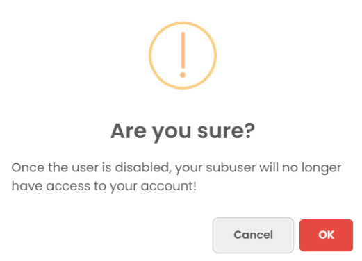

### Deleting a Subuser

To delete a subuser, follow the steps below:

1. **Navigate to the Manage Section** : Go to the **Manage Section** of your platform or application.
2. **Click on the Delete Button** : In the Manage Section, locate the **Delete** button next to the subuser you wish to remove.

   
3. **Confirm Deletion** : A confirmation pop-up will appear. To proceed with the deletion, click on the **OK** button in the pop-up.

   
4. **Subuser Deleted** : Once you confirm, the subuser will be permanently deleted from the system, and their associated permissions will be revoked.

Make sure to verify that the subuser's account is no longer needed before deleting it, as this action cannot be undone.
