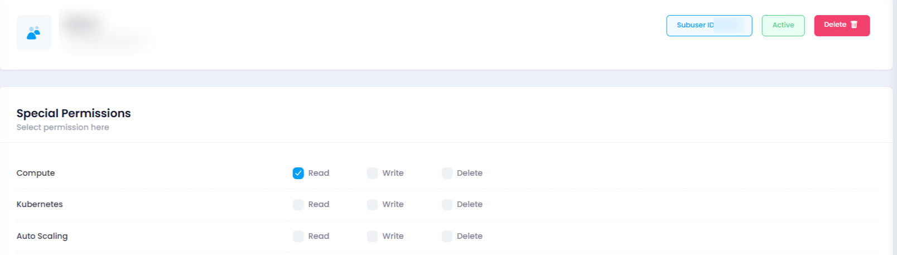
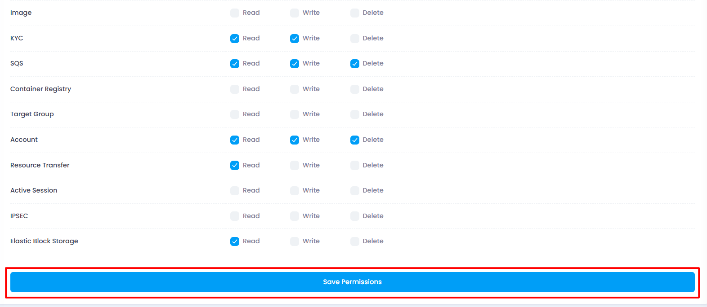

## Manage Subuser

In the Manage Subuser section, admin have the ability to update product permission for subuser. This section provides the following functionalities:

## **Managing Subuser Permissions**

When creating a **subuser**, you can assign specific **permissions** based on the level of access required. There are **three permission levels**:

### **Permission Levels**

1. **Read**

   - The user can **view** products and their flows.
   - No permission to **edit** or **delete** anything.
2. **Write**

   - The user can **read** and **write** (modify or deploy servers).
   - No permission to **delete** servers.
3. **Delete**

   - The user has **full access**: **read, write, and delete**.

## **Permission Selection Rules**

- Selecting **Delete** ✅ → **Read** and **Write** are automatically checked.
- Selecting **Write** ✅ → **Read** is automatically checked.
- If **Delete** is checked, the user **cannot uncheck** **Read** or **Write**.
- If **Write** is checked, the user **cannot uncheck** **Read**.
