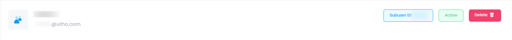

## Overview of manage Section:

    

### Subuser

A **Subuser** is a secondary user account that is created under a primary or root account in a cloud service, platform, or application. Subusers are granted specific roles and permissions that allow them to access and manage certain resources, but they typically do not have full control over the primary account or sensitive settings. The purpose of subusers is to delegate tasks, streamline collaboration, and enforce role-based access control while maintaining security and governance.

### Subuser ID

The **Subuser ID** is a unique identifier assigned to each subuser account in a system or platform. This ID is used to distinguish between different subusers and is often used for tracking, permissions management, and auditing. It ensures that each subuser is uniquely identified within the cloud environment or application, and it helps administrators track the actions and access of subusers.

### Status: Active

The **Active Status** indicates that the subuser account is currently in use and has the necessary permissions to access the resources or services granted to it. An **Active** status means the subuser can log in, perform tasks, and interact with the system or cloud environment according to their defined permissions. If a subuser’s account is inactive or suspended, they will be unable to access the platform or perform any actions until reactivated by the administrator.

### Delete Button Uses

The **Delete Button** in the context of a subuser account allows an administrator to permanently remove or deactivate the subuser account from the system. This is used when a subuser no longer needs access to the platform or cloud resources. Clicking the **Delete Button** will typically:

1. **Remove the Subuser’s Permissions** : The subuser will lose access to all resources and services.
2. **Delete the Subuser’s Account** : The account will be permanently deleted from the system (unless it's just deactivated).
3. **Ensure Security** : It helps maintain security by removing unused accounts or users who no longer require access.
