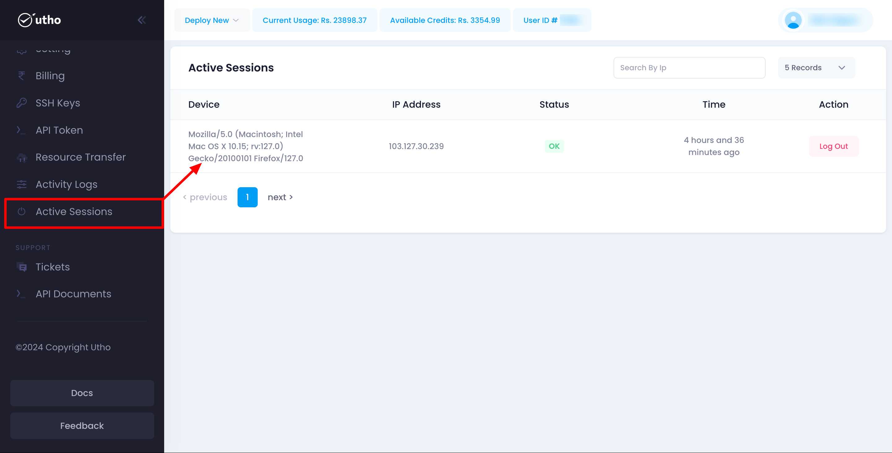

Utho's Active Sessions feature allows users to monitor and manage the devices where their account is currently logged in. This guide provides detailed instructions on how to view active sessions and log out from specific devices.

### Navigating the Active Sessions Page

The Active Sessions page displays a list of all devices currently logged into your account. This helps you keep track of where your account is accessed and ensures your account security.

1. **Accessing Active Sessions:**
   * Navigate to your account settings.
   * Click on the **Active Sessions** tab to view the list of devices.
2. **Understanding the Active Sessions List:**
   The Active Sessions page displays the following information for each device:
   * **Browser/Device:** The name or type of the browser or device where your account is logged in.
   * **IP Address:** The IP address from which the device is accessing your account.
   * **Time:** The date and time when the device logged into your account.
   * **Logout Button:** A button to log out from the specific device.

### Logging Out from a Device

If you notice any unfamiliar devices or simply want to log out from a specific session, you can do so easily:

1. **Identify the Device:**
   * Review the list of active sessions.
   * Identify the device you want to log out from by checking the browser/device type, IP address, and login time.
2. **Log Out:**
   * Click the **Logout** button next to the device entry.
   * Confirm the logout action when prompted. This will immediately terminate the session on the selected device.

### Ensuring Account Security

Regularly reviewing and managing active sessions helps maintain your account security. If you notice any suspicious activity, take the following steps:

1. **Log Out from Unrecognized Devices:**
   * Immediately log out from any devices you do not recognize using the **Logout** button.
2. **Change Your Password:**
   * Navigate to your account settings and change your password to ensure no unauthorized access.
3. **Enable Two-Factor Authentication (2FA):**
   * Consider enabling 2FA for an added layer of security. This can usually be done from the security settings in your account.

### Troubleshooting

#### Common Issues

* **Session Not Logging Out:**
  * If you encounter issues logging out from a device, refresh the page and try again. Ensure you have a stable internet connection.
* **Unrecognized Device:**
  * If you see a device you do not recognize, log out immediately and change your password. Enable 2FA for added security.
