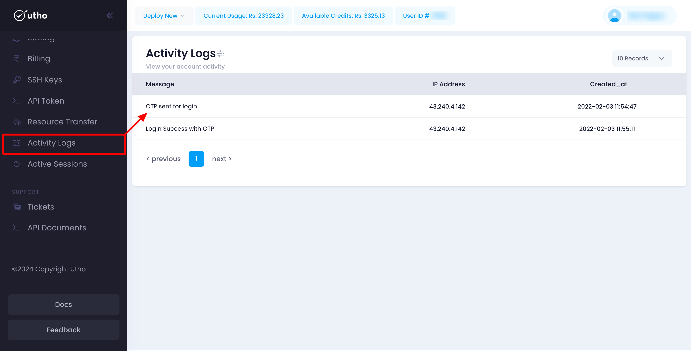

Utho's Activity Logs feature provides a detailed record of actions and events associated with your account. This guide will help you navigate and utilize the Activity Logs feature effectively, ensuring you can monitor account activities and enhance security.

### Accessing Activity Logs

To access the Activity Logs:

1. **Login to Utho Platform:**
   * Go to the Utho login page.
   * Enter your credentials and log in to your account.
2. **Navigate to Activity Logs:**
   * From the dashboard, navigate to the **Activity Logs** section.

### Understanding the Activity Logs Table

The Activity Logs page displays a table with detailed information about each activity. The table includes the following columns:

* **Message:** A description of the activity or event that occurred.
* **IP Address:** The IP address from which the activity was performed.
* **Created_at:** The date and time when the activity occurred.

### Viewing Activity Logs

1. **Log Details:**
   * The **Message** column provides a brief description of the activity, such as login attempts, configuration changes, or resource management actions.
   * The **IP Address** column shows the IP address from which the activity originated. This can help you identify if the activity was performed from a known or unknown location.
   * The **Created_at** column displays the timestamp of when the activity occurred, helping you track the sequence of events.

### Using Activity Logs

#### Monitoring Account Activities

Activity logs are crucial for monitoring account activities and ensuring the security of your resources. Regularly reviewing your activity logs can help you:

* **Detect Unauthorized Access:**
  * Check for any unfamiliar IP addresses or unexpected activities.
  * If you notice any suspicious activities, take immediate action to secure your account.
* **Track Configuration Changes:**
  * Review logs to see any changes made to your configurations.
  * Ensure all changes are authorized and intended.
* **Audit User Actions:**
  * Monitor actions performed by different users in your account.
  * This helps maintain accountability and transparency within your team.

### Troubleshooting

If you encounter any issues with the Activity Logs feature:

* **Logs Not Displaying:**
  * Ensure you are connected to the internet and logged in to the correct account.
  * Refresh the Activity Logs page.
* **Unfamiliar Activities:**
  * If you notice any unfamiliar activities, immediately change your password and review your account security settings.
  * Contact Utho support for further assistance.

### Support

For additional help with Activity Logs or if you encounter any issues, contact Utho support through the support ticket system or via email at [support@utho.com]().
