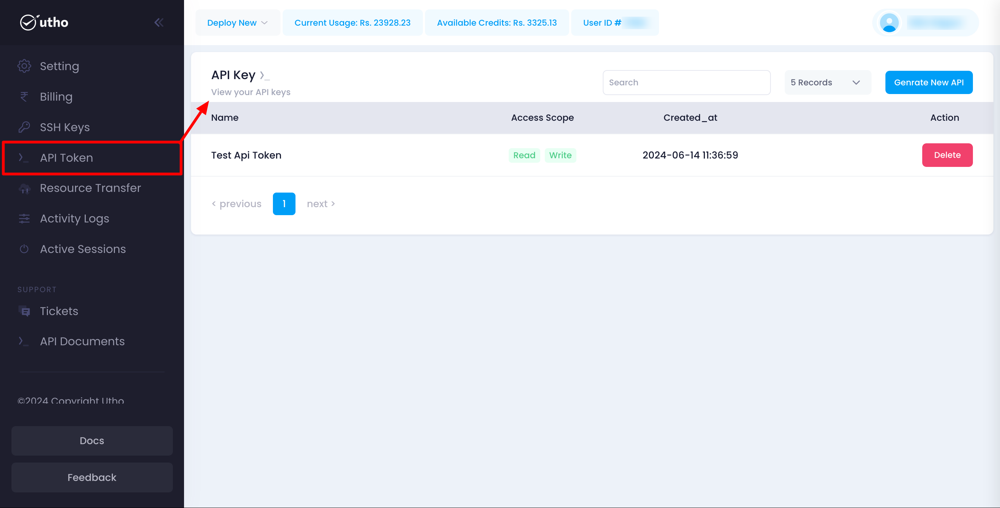
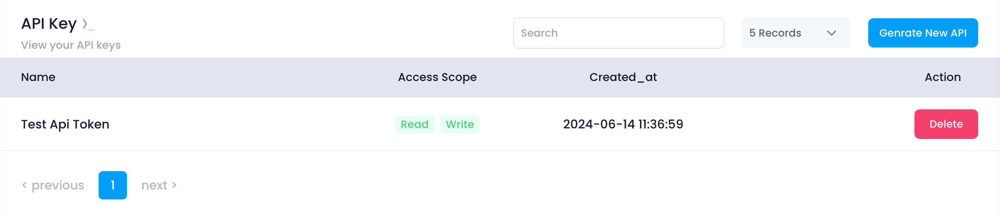
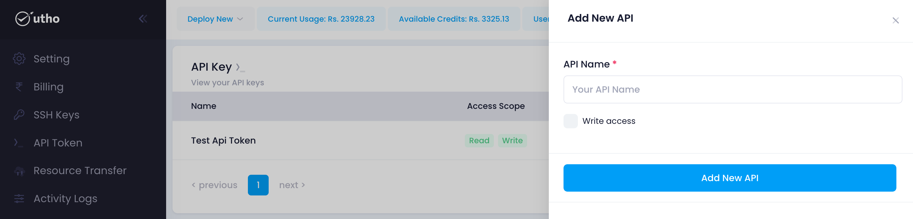

Utho's API Token Management feature allows users to create, view, and manage API tokens, which are essential for authenticating and interacting with the platform's APIs. This guide provides detailed instructions on how to generate and manage API tokens.

### Navigating the API Token Management Page

The API Token Management page displays a list of all API tokens associated with your account. This helps you manage access to the API and ensures your tokens are up to date and secure.

1. **Accessing API Token Management:**

   * Navigate to your account settings.
   * Click on the **API Tokens** tab to view the list of tokens.

### Managing API Tokens

#### Viewing API Tokens

On the API Tokens page, you will see a table listing all the API tokens associated with your account. This table includes:

* **Name:** The name you assigned to the token for easy identification.
* **Access Scope:** The level of access granted by the token (Read, Write).
* **Created At:** The date and time the token was created.
* **Delete Button:** Allows you to delete the specific API token.

#### Generating a New API Token

To create a new API token, follow these steps:

1. **Click Generate New API:**
   At the top of the tokens table, click the **Generate New API** button. A drawer will slide in from the right side of the screen, presenting the token creation form.
2. **Fill Out the Token Form:**
   * **API Name:** Enter a descriptive name for the API token.
   * **Access Scope:** Select the access level for the token (Read or Write).
3. **Create the Token:**
   * Click the **Add New API** button to generate the new API token.
   * A confirmation message will appear, showing the newly created API token with an option to copy it.

**Important:** You can only view and copy the API token at the time of creation. Make sure to copy and store it securely, as it will not be displayed again.

### Deleting an API Token

If an API token is no longer needed or you want to revoke its access, you can delete it easily:

1. **Identify the Token:**
   * Review the list of API tokens in the table.
   * Identify the token you want to delete by its name and access scope.
2. **Delete the Token:**
   * Click the **Delete** button next to the token entry.
   * Confirm the deletion when prompted. This will immediately revoke the token's access and remove it from the list.

### Ensuring API Token Security

Managing your API tokens carefully is crucial for maintaining the security of your API access. Follow these best practices:

1. **Use Descriptive Names:**
   * Assign descriptive names to your tokens to easily identify their purpose.
2. **Limit Access Scope:**
   * Grant the minimum required access scope for each token (Read or Write).
3. **Store Tokens Securely:**
   * Copy and securely store the API token when it is created. It will not be displayed again.
4. **Regularly Review Tokens:**
   * Periodically review your API tokens and delete any that are no longer needed.

### Troubleshooting

#### Common Issues

* **Token Not Created:**
  * Ensure all required fields are filled out correctly before submitting the form.
* **Cannot View Token:**
  * Remember, you can only view the API token at the time of creation. If you lose the token, generate a new one.

### Support

If you need further assistance with managing API tokens or encounter any issues, contact Utho support through the support ticket system or via email at [support@utho.com]().

---
