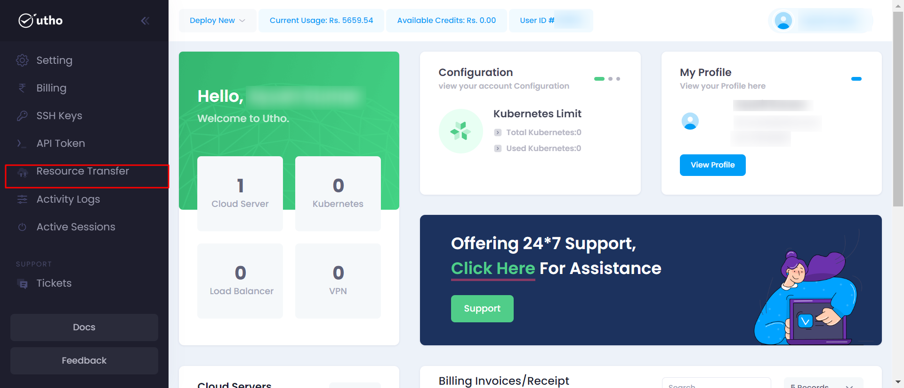
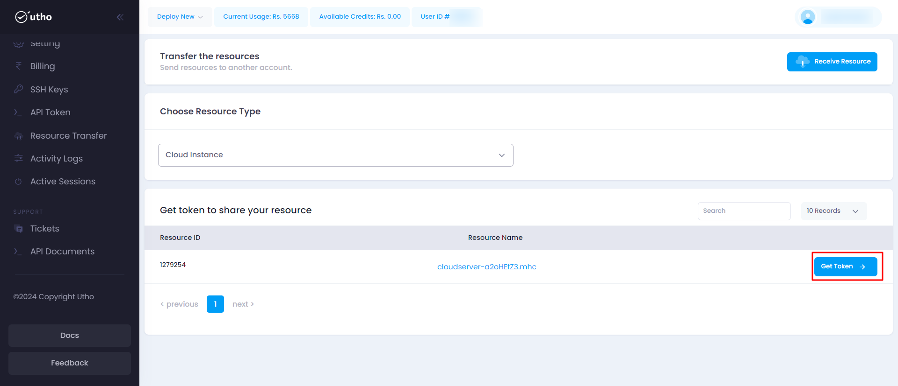
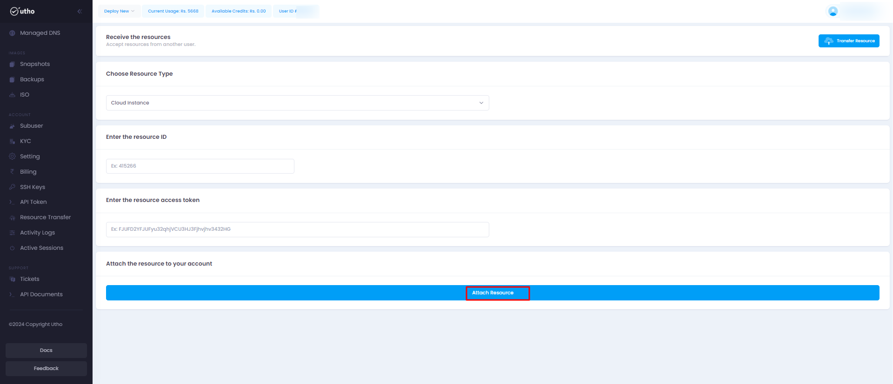

### Initial Start

- Log in to your accout on our platform.
- Navigate to the sidebar here every product is mentioned.
- Select the Resource Transfer option from the sidebar.

### Quick Start

1. **Open the Resource Transfer deployment page:**

- Click on the sidebar and select Resource Transfer.

After clicking on Resource Transfer a new page will open.

2. **Configure Resource Transfer:**

   Here you can configure your Resource Transfer deployment details after selecting  "**Resource Transfer**" and clicking on continue.
   

    Fill all the required details:
    1. **Choose Resource Type** : Choose from Cloud, DNS and ISO.

    2. Click  on **Get Token** then  user will get Resource Id and Token on the email associated with the server.

3. **Configure Receive Resource:**
    Here you can configure your Receive Resource deployment details after selecting  "**Receive Resource**" and clicking on continue.
    

    Fill all the required details:
    1. **Choose Resource Type** : Choose from Cloud, DNS and ISO.
    2. **Enter the resource ID** : Enter resource id provided by the owner of the server.
    3. **Enter the resource access token** :  Enter resource access token provided by the owner of the server.    
    Once receiving all the data click on **ADD Resource** , then the server will be reflected in the particular product.

    ---  

