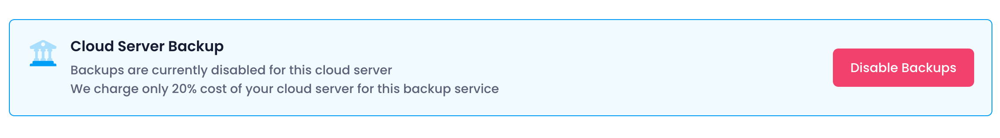
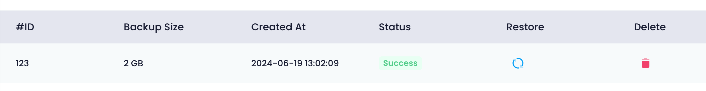

Utho offers a robust backup service to protect your cloud server's data with options to enable, disable, manage, and restore backups as needed.

### Enabling and Disabling Backup

Users can control backup settings for their cloud server:

* **Enable Backup** : Start a weekly backup service for this cloud server, costing an additional 20% of the server's total cost.
* **Disable Backup** : Remove the backup service from the server, ceasing future backups.

#### Backup Actions

Once enabled, users can manage backups:

* **View Backups** : Displays a list of all created backups.
* **Restore** : Restore data from a selected backup.
* **Delete** : Remove unwanted backups to manage storage efficiently.

### Workflow

1. **Enable Backup** : Click "Enable Backup" to activate the weekly backup service. This incurs an additional cost of 20% of your cloud server's total cost.
2. **Manage Backups** : Once enabled, manage backups including restoring data from backups or deleting outdated backups.

Utho's backup management ensures data protection and recovery options are readily available to safeguard your cloud server's information.
