# Getting Started with Auto Scaling

Auto Scaling in Utho Cloud allows users to deploy instances that automatically scale based on predefined conditions. This guide walks you through the step-by-step process of deploying an auto-scaling instance.

---

## Step 1: Navigate to Auto Scaling

1. Find **Auto Scaling** in the sidebar of the Utho Cloud platform.
2. Click on it. You will be redirected to a page listing all existing Auto Scaling instances.
3. Locate and click the **Create New** button.
4. You will be redirected to the Auto Scaling deployment page.

   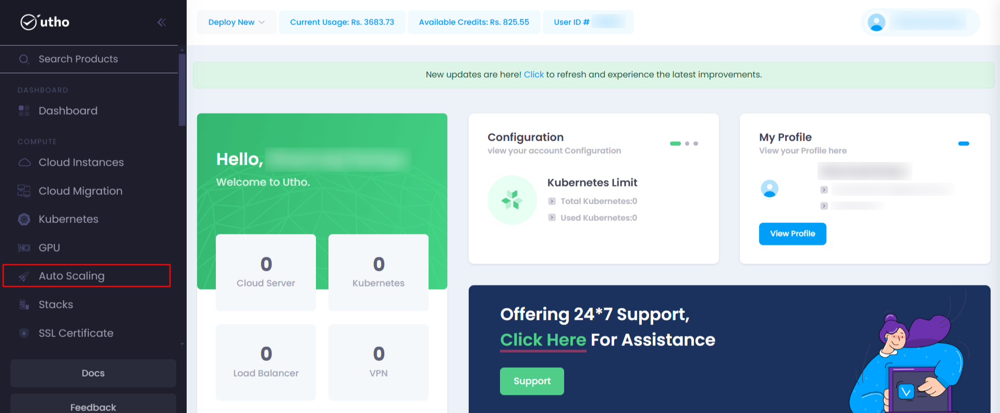

   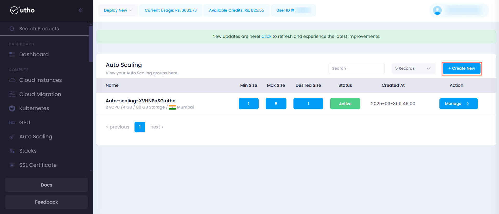

---

## Step 2: Configure Your Auto Scaling Instance

### **1. Choose Data Center Location**

Select the preferred **data center location** where your instance will be deployed. The data center location determines the network latency and availability of your instance. Choosing the nearest data center to your users ensures faster response times and better performance.

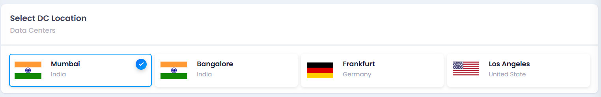

**2. Select a Stack**

You have two options:

* Choose from your own **created stacks**.
* Select from a list of **available community stacks**.

A **stack** defines the runtime environment, including the operating system, software configurations, and pre-installed dependencies. Selecting the correct stack ensures your application runs in the required environment without compatibility issues.

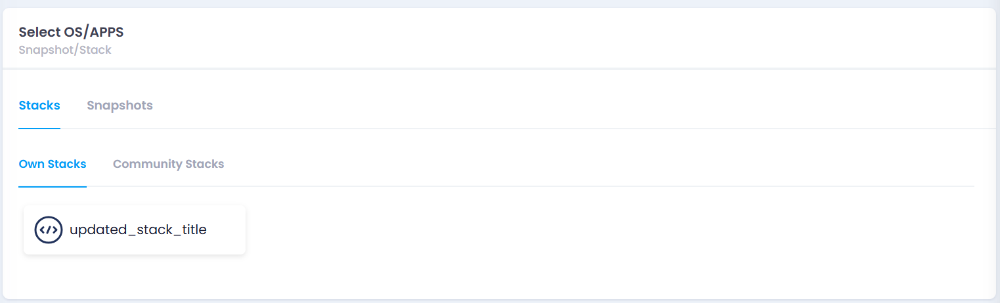

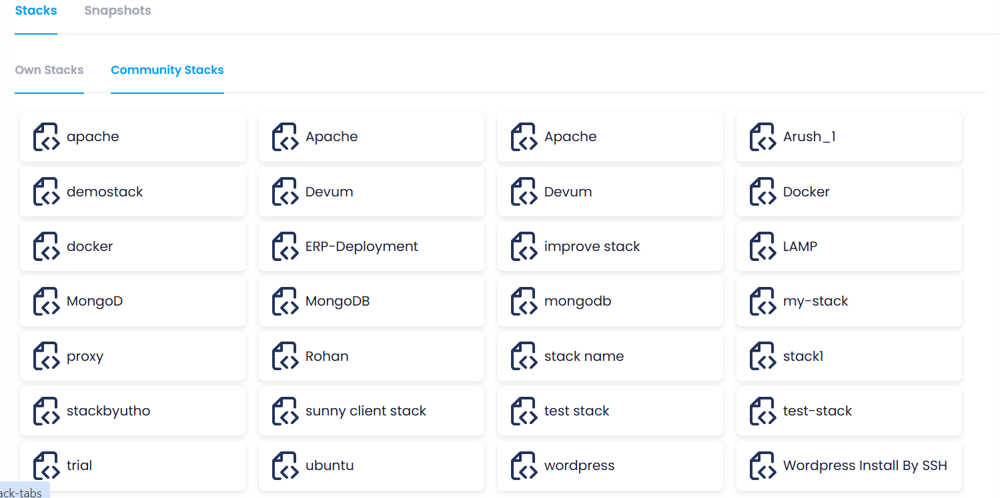

### **3. Choose a Plan**

A table of available plans is displayed. Each plan varies based on:

* **RAM size**: Determines how much memory is available to your application.
* **Number of vCPUs**: Impacts the processing power and ability to handle concurrent requests.
* **SSD disk size (GB)**: Defines the storage space available for applications and data.
* **Bandwidth (GB)**: Determines how much network traffic your instance can handle before incurring extra costs.

Selecting an appropriate plan ensures your instance has enough resources for smooth operation while staying cost-effective.

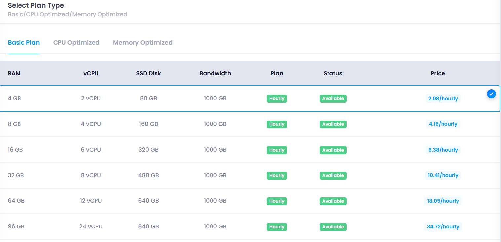

### **4. Select VPC and Subnet**

Choose a **VPC (Virtual Private Cloud)** and a **subnet** (if available for the selected VPC).

* VPC provides network isolation, ensuring secure communication between resources.
* Subnets allow you to organize and manage different instances within the VPC.

Choosing the right VPC and subnet helps with security and efficient resource allocation.

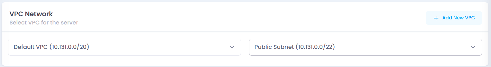

### **5. Choose CPU Model**

Select the CPU model for your instance:

* **AMD**: Generally offers better price-to-performance ratio for standard workloads.
* **Intel**: Preferred for high-performance computing, AI, and specialized workloads.

Choosing the right CPU model ensures that your instance is optimized for your application's processing requirements.

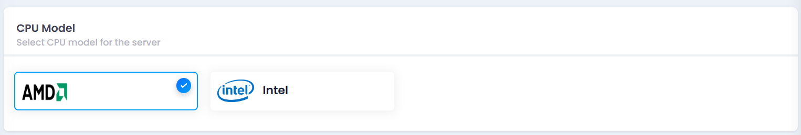

### **6. Configure Firewall** (Optional)

Select a **firewall** from the available options. Firewalls control inbound and outbound network traffic to protect your instance from unauthorized access and cyber threats.

Choosing a firewall enhances security by restricting unwanted connections while allowing necessary traffic.

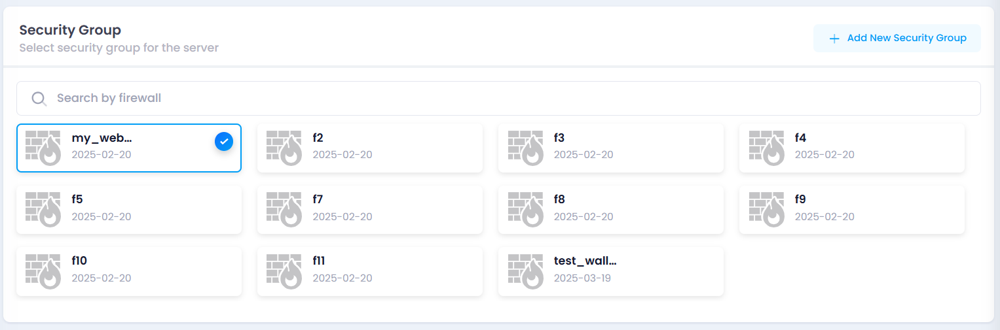

### **7. Attach Load Balancer/Target Group***(Optional)*

If you want to distribute traffic efficiently across multiple instances, attach a **Load Balancer** or assign the instance to a **Target Group**.

* Load balancers help prevent overloading a single instance.
* Target groups allow you to manage groups of instances for better traffic control.

This step is useful for applications requiring high availability and fault tolerance.

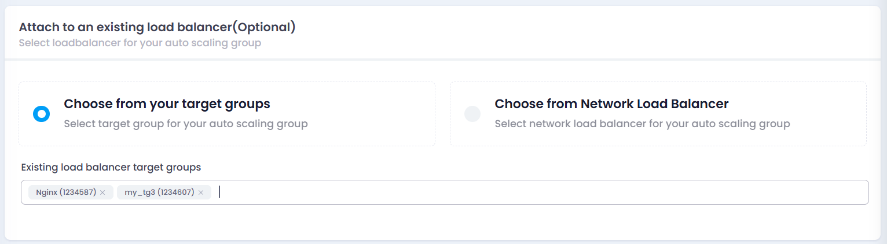

### **8. Set Instance Scaling Parameters

**

When configuring an Auto Scaling instance, three crucial parameters **Max Size, Min Size, and Desired Size** play a significant role in determining how the system scales. Understanding their impact is essential for ensuring optimal performance, cost efficiency, and system reliability.

Setting these parameters ensures that your application can scale dynamically to handle load changes without unnecessary resource wastage.

### **8.1 Max Size (Maximum Number of Instances)**

* **Definition** : The maximum number of instances the auto-scaling system can launch.
* **Impact** :
* Prevents excessive resource allocation, keeping cloud costs under control.
* Ensures that the system does not scale beyond a predefined threshold, which is useful to avoid overloading infrastructure.
* If traffic spikes beyond what Max Size allows, requests may get dropped, leading to performance degradation.

### **8.2 Min Size (Minimum Number of Instances)**

* **Definition** : The lowest number of instances that must always be running, even during low-demand periods.
* **Impact** :
* Ensures baseline availability and avoids complete shutdown during idle hours.
* Keeps critical services running to maintain responsiveness for sudden demand spikes.
* Setting a **high Min Size** may result in unnecessary costs during periods of low activity.

### **8.3 Desired Size (Initial Number of Instances Deployed)**

* **Definition** : The preferred number of instances that should ideally run under normal conditions.
* **Impact** :
* Serves as the starting point for scaling decisions.
* If demand increases, auto-scaling adds instances up to  **Max Size** ; if demand decreases, it reduces instances but not below  **Min Size** .
* Incorrectly setting this value too low can lead to performance issues, while too high a value may result in unnecessary costs.

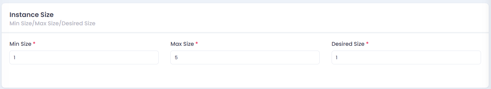

### **9. Configure Scaling Policy**

A **Scaling Policy** defines the conditions under which an auto-scaling instance should scale up (increase instances) or scale down (decrease instances). These parameters ensure that scaling is efficient, prevents unnecessary costs, and maintains application performance.

### **9.1 Policy Name**

* **Definition** : A unique identifier for the scaling policy.
* **Impact** :
* Helps distinguish multiple policies if different conditions are applied (e.g., one for CPU-based scaling, another for RAM-based scaling).
* Makes it easier to manage, modify, or troubleshoot specific policies in the future.

### **9.2 Type (CPU-Based or RAM-Based Scaling)**

* **Definition** : Determines whether scaling should be triggered based on **CPU usage** or  **RAM usage** .
* **Impact** :
* **CPU-Based Scaling** : Useful for compute-heavy applications like web servers, APIs, or data processing tasks.
* **RAM-Based Scaling** : Ideal for applications with high memory usage, such as databases or caching servers.
* Choosing the wrong type can lead to  **inefficient scaling** , where resources might be wasted or performance could suffer.

### **9.3 Comparison Condition (Above/Below a Threshold)**

* **Definition** : Specifies whether the scaling action should trigger when resource usage is **above** or **below** a certain threshold.
* **Impact** :
* If  **above a threshold** , new instances are added to prevent performance degradation.
* If  **below a threshold** , instances are removed to reduce costs.
* Setting an incorrect condition can lead to **under-scaling** (causing slow performance) or **over-scaling** (leading to unnecessary expenses).

### **9.4 Value (Threshold for Scaling Action)**

* **Definition** : The specific percentage (%) of CPU or RAM usage that triggers the scaling action.
* **Impact** :
* A **low threshold** (e.g., 50%) may cause frequent scaling, leading to unnecessary instance creation.
* A **high threshold** (e.g., 90%) might delay scaling, affecting application performance.

### **9.5 Period (Monitoring Duration Before Action Triggers)**

* **Definition** : The time window (in minutes or hours) over which the system checks the scaling condition before taking action.
* **Impact** :
* A **short period** (e.g., 1 minute) can cause frequent scaling, leading to instability.
* A **long period** (e.g., 30 minutes) may delay response to traffic spikes, affecting user experience.

### **9.6 Cooldown Time (Delay Between Consecutive Scaling Actions)**

* **Definition** : The minimum time (in seconds) the system waits before executing another scaling action after one has already taken place.
* **Impact** :
* Prevents excessive scaling actions, avoiding cost spikes and unnecessary instance churn.
* If set too  **low** , multiple instances might be created or removed too quickly, causing instability.
* If set too  **high** , scaling may be delayed, affecting performance during sudden traffic surges.

### **How These Parameters Work Together in Auto Scaling**

1. The **Type** (CPU or RAM) is monitored continuously.
2. If the **Comparison Condition** (above/below) is met for a  **specified Period** , scaling is triggered.
3. The scaling action happens **only after the Cooldown Time** to prevent frequent fluctuations.
4. The system adjusts the number of instances within the **Min Size** and **Max Size** constraints.

These configurations ensure that instances scale up or down at the right time, balancing performance and cost.

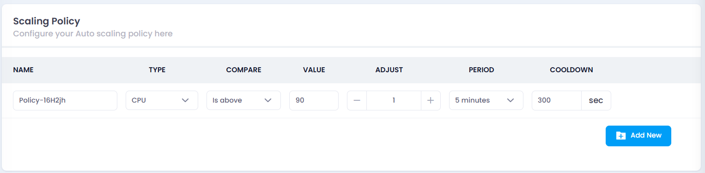

### **10. Set a Scaling Schedule***(Optional)*

A **Scaling Schedule** allows users to predefine scaling actions based on specific times instead of relying solely on real-time metrics. This is useful when traffic patterns are predictable, such as during business hours, nightly backups, or periodic high-demand events.

Users can configure the following parameters when setting up a scaling schedule:

1. **Name** – A unique identifier for the schedule.
2. **Time Zone** – Ensures the schedule aligns with the correct time zone.
3. **Recurrence** – Determines how often the scaling action should repeat. Options include:
   * **Once**
   * **Every 5 minutes**
   * **Every 30 minutes**
   * **Every 1 hour**
   * **Every day**
   * **Every week**
4. **Day & Time** – Specifies when the schedule should execute.
5. **Start At** – The exact date and time the schedule should begin.
6. **Desired Size** – Defines the target number of instances at the scheduled time.

#### **Impact on Auto Scaling Instance:**

1. **Improved Cost Efficiency** – Ensures instances are only scaled when needed, preventing unnecessary resource allocation.
2. **Enhanced Performance** – Helps preemptively scale instances before peak load periods, preventing slowdowns or failures.
3. **Predictable Scaling** – Ideal for applications with known traffic surges, ensuring stable performance without unexpected auto-scaling triggers.
4. **Avoids Unnecessary Scaling Events** – Reduces reliance on reactive scaling policies that may cause frequent fluctuations in instance count.

By strategically setting up scaling schedules, users can balance cost and performance while maintaining optimal resource utilization.

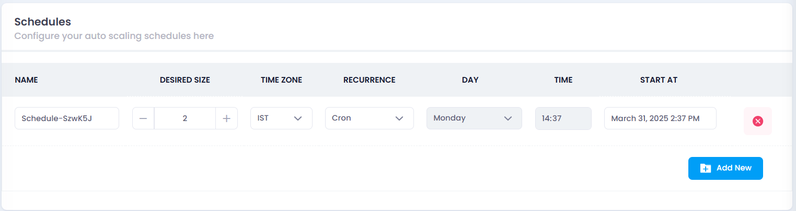

### **11. Name Your Auto Scaling Instance**

Provide a unique **name** for your instance in a text input field.

* This helps you easily identify and manage the instance later.
* A meaningful name is useful when handling multiple instances.

  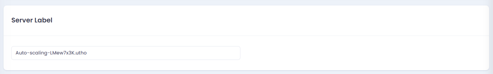

### **12. Deploy Auto Scaling Instance**

Click the **Deploy AutoScaling** button. The system will initiate the deployment, and upon success, you will be redirected to the **Manage Page** of the deployed instance.

* Once deployed, your instance will start automatically based on the scaling policies you have defined.
* Any scheduled scaling or dynamic scaling rules will be applied as per configuration.

  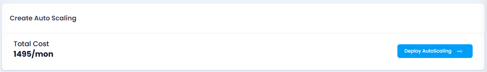

---

## Step 3: Managing Your Deployed Auto Scaling Instance

Once deployed, the instance can be monitored and managed from the **Manage Page**. Here, you can:

* View instance performance metrics (CPU, RAM, network usage).
* Modify scaling policies if necessary.
* Attach additional resources, such as firewalls or load balancers.

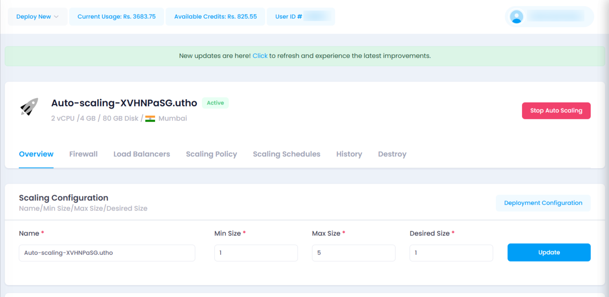

## Conclusion

You have successfully deployed an Auto Scaling instance on Utho Cloud! This guide covered the essential steps, from selecting configurations to defining scaling rules and deploying your instance.
