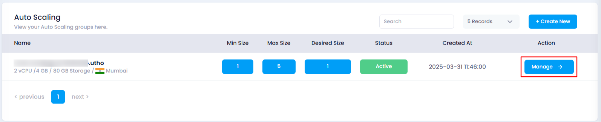
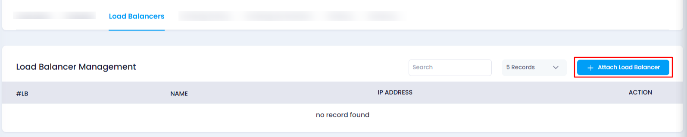
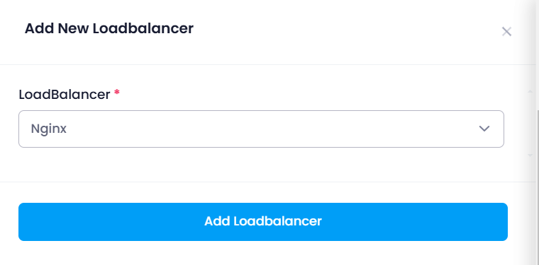
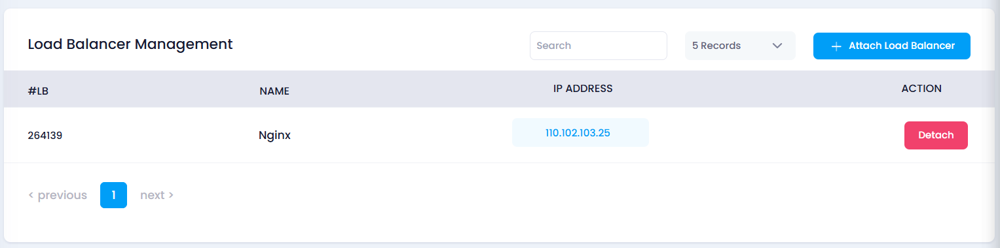

# **How to Attach a Load Balancer to Auto Scaling**

## **Overview**

This guide explains how to attach a load balancer to an existing Auto Scaling instance. This allows you to distribute incoming traffic across multiple instances for better performance and high availability.

---

## **Login or Sign Up**

1. Visit the **Utho Cloud Platform** [login](https://console.utho.com/login) page.
2. Enter your credentials and click  **Login** .
3. If you're not registered, sign up [here](https://console.utho.com/signup).

---

## **Steps to Attach a Load Balancer to Auto Scaling**

1. **Go to the Auto Scaling Listing Page**
   * Navigate to the Auto Scaling section from the dashboard to see the list of all Auto Scaling instances.
2. **Select the Desired Auto Scaling Instance**
   * Click on the **Manage** button next to the instance you wish to modify. This will redirect you to the **Manage Page** of the selected Auto Scaling instance.
     
3. **Locate the Load Balancers Section**
   * Locate the **Load Balancers** section. This section will display a list of the currently attached load balancers.
4. **Click on the "Attach Load Balancer" Button**
   * In the **Load Balancer Management** subsection, click on the **Attach Load Balancer** button to begin the process of attaching a new load balancer.

     
5. **Select the Desired Load Balancer**
   * A drawer will appear showing a list of load balancers previously deployed by you.
   * Choose the load balancer you want to attach from the list.

     
6. **Attach the Load Balancer**
   * Click on the **Add Load Balancer** button after selecting your desired load balancer. This will attach the load balancer to your Auto Scaling instance.
7. **Verify the Load Balancer Attachment**
   * To confirm the load balancer has been successfully attached, scroll down to the **Load Balancer Management** section, where you will see the newly attached load balancer listed.

     

---

## **Impact of Attaching a Load Balancer**

* **Traffic Distribution** : Attaching a load balancer allows traffic to be evenly distributed across multiple Auto Scaling instances, improving performance and availability.
* **Increased Availability** : With the load balancer, your Auto Scaling instances can handle more traffic while ensuring high availability during peak demand.
