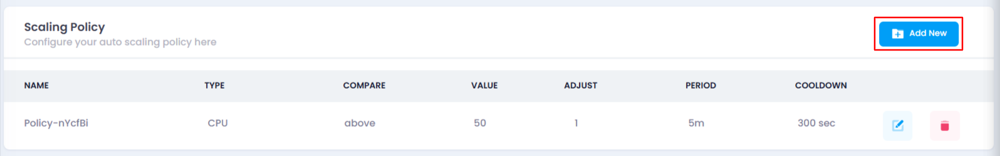
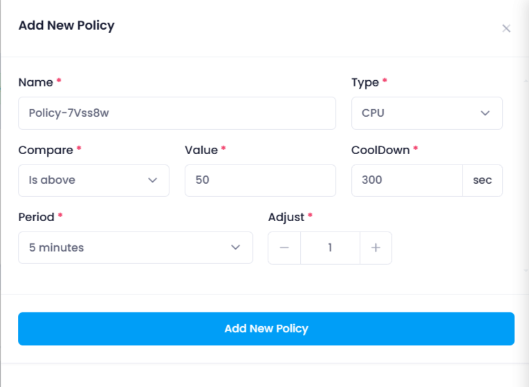
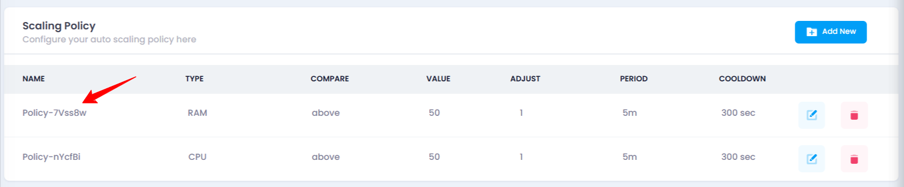

## **How to Add New Scaling Policy**

### **Overview**

Managing scaling policies allows you to define rules for auto-scaling based on resource usage, such as CPU or RAM. This ensures your auto-scaling instance dynamically adjusts according to demand, improving performance and cost efficiency.

### **Login or Sign Up**

1. Visit the **Utho Cloud Platform** [login](https://console.utho.com/login) page.
2. Enter your credentials and click  **Login** .
3. If you’re not registered, sign up [here](https://console.utho.com/signup).

### **Steps to Manage Scaling Policy**

1. **Go to the Auto Scaling Listing Page**
   * Navigate to the **Auto Scaling** listing page in your account, or click [here ](https://console.utho.com/auto-scaling "Auto Scaling Listing Page")to directly access it.
2. **Select the Desired Auto Scaling Instance**
   * Locate the auto scaling instance you wish to manage in the list and click the **Manage** button associated with that instance.

     
3. **Locate the “Scaling Policy” Section**
   * On the manage page of your selected auto scaling instance, look for **Scaling Policy** section. Here, you'll see a list of all the current scaling policies.

     
4. **Add a New Scaling Policy**
   * To create a new scaling policy, click the **Add New** button located right above the list of current scaling policies.
   * This will open a drawer where you can configure the new scaling policy with the following options:
   * **Name** : Enter a unique name for the scaling policy.
   * **Type** : Choose between **CPU** or **RAM** based scaling. This determines the resource usage that will trigger scaling.
   * **Compare** : Select whether scaling should occur when usage is **above** or **below** the specified threshold.
   * **Value** : Set the specific resource usage percentage that triggers scaling (e.g., 70% CPU or RAM usage).
   * **Adjust** : Set the number of instances to add or remove (minimum is 1 instance).
   * **Period** : Choose the time window (e.g., 5 minutes, 1 hour) to monitor usage before triggering scaling.
   * **Cooldown** : Set the cooldown period in seconds to prevent excessive scaling actions within a short time.

     
5. **Create the Scaling Policy**
   * After filling in the required information, click the **Add New Policy** button to save and create the scaling policy.
6. **Verify the Scaling Policy**
   * Once the scaling policy has been created, check the list of scaling policies in the **Scaling Policy** section to confirm that your newly created policy is listed. If it's visible, the scaling policy has been successfully created.

     

### **Impact of Managing Scaling Policy**

* **Dynamic Scaling** : A scaling policy automatically adjusts the number of instances based on real-time resource usage, ensuring your auto-scaling instance can handle varying loads without manual intervention.
* **Optimized Resource Management** : By setting appropriate thresholds for CPU or RAM usage, you can optimize resource utilization, avoid over-provisioning, and keep costs under control.
