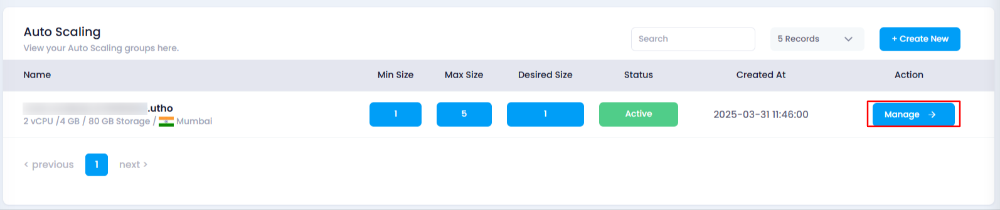
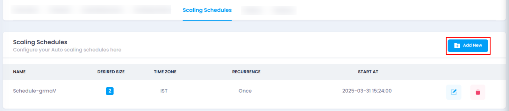
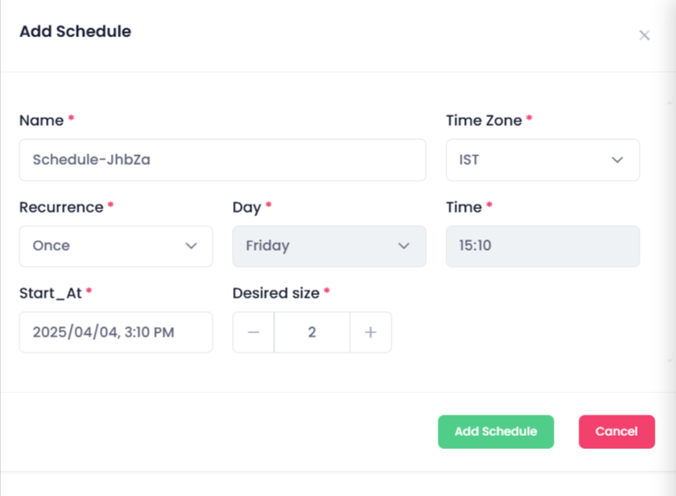
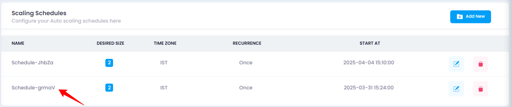

# **How to Add Scaling Schedule**

## **Overview**

The **Scaling Schedule** feature allows you to define a recurring schedule to scale your auto scaling instance based on your desired configuration. This helps you automate scaling actions at specific times, improving cost-efficiency and performance.

## **Login or Sign Up**

1. Visit the **Utho Cloud Platform** [login](https://console.utho.com/login) page.
2. Enter your credentials and click  **Login**.
3. If you’re not registered, sign up [here](https://console.utho.com/signup).

## **Steps to Add a Scaling Schedule**

1. **Navigate to the Auto Scaling Listing Page**
   * Navigate to the **Auto Scaling** listing page in your account, or click [here ](https://console.utho.com/auto-scaling "Auto Scaling Listing Page")to directly access it.
2. **Select the Desired Auto Scaling Instance**
   * Find the auto scaling instance you want to configure and click the **Manage** button next to it.
3. **Locate the Scaling Schedules Section**
   * In the **Manage** page, scroll down and look for the **Scaling Schedules** section, where you can see a list of all scaling schedules that have been added to the selected auto scaling instance.

     
4. **Click on the "Add New" Button**
   * At the top of the scaling schedules list, click on the **Add New** button to create a new scaling schedule.

     
5. **Configure the New Scaling Schedule**
   * A drawer will open where you need to fill in the following details:
     * **Name** : Provide a unique name for the scaling schedule.
     * **Desired Size** : Enter the number of instances you want to maintain during the scheduled time (minimum 1).
     * **Time Zone** : Select the time zone for the scaling schedule (e.g., IST, UTC).
     * **Recurrence** : Choose how often the scaling action should repeat (e.g., Every 5 minutes, Every 30 minutes, Every 1 hour).
     * **Day** : Select the specific day for the scaling action (fixed to today’s date). If the recurrence is set to weekly, you can select a different day.
     * **Time** : Set the exact time for the scaling action to trigger (fixed to the current time). If recurrence is changed to every day or week, you can modify this.
     * **Start At** : Define the exact start date and time for the schedule.

       
6. **Click on the "Add Schedule" Button**
   * After entering the information, click on the **Add Schedule** button to finalize the scaling schedule.
7. **Verify the New Scaling Schedule**
   * Once the scaling schedule is added, a success message will appear. You can verify the new schedule by checking the list of scaling schedules in the **Scaling Schedules** section. If your schedule is reflected, it has been successfully added.

     

---

### **Impact of Adding a Scaling Schedule**

* **Automated Scaling** : The scaling schedule automates scaling actions based on a predefined time, ensuring that resources are adjusted according to traffic patterns.
* **Cost Optimization** : You can avoid running unnecessary resources during low-traffic hours, thus optimizing your costs.
