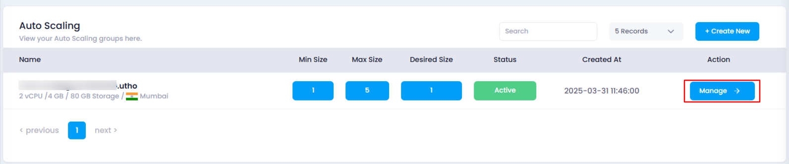
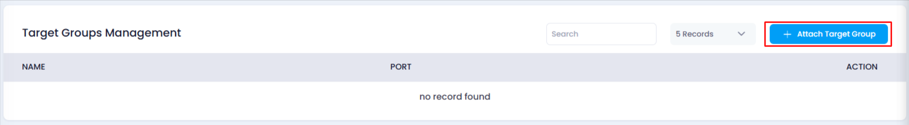
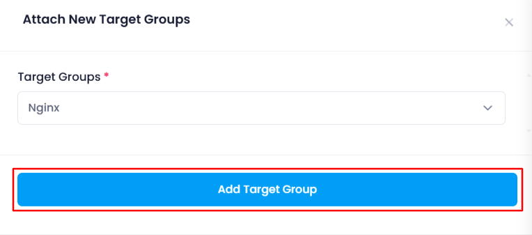
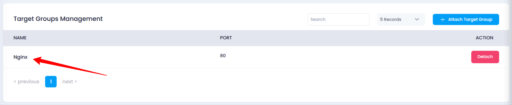

# **How to Attach a Target Group to Auto Scaling**

## **Overview**

Attaching a **Target Group** to an auto scaling instance helps distribute incoming traffic efficiently across your instances. This feature is essential for load balancing and improving application performance.

## **Login or Sign Up**

1. Visit the **Utho Cloud Platform** [login](https://console.utho.com/login) page.
2. Enter your credentials and click  **Login** .
3. If you’re not registered, sign up [here](https://console.utho.com/signup).

## **Steps to Attach a Target Group to Auto Scaling**

1. **Go to the Auto Scaling Listing Page**
   * Navigate to the auto scaling listing page in your account, or click [here ](https://console.utho.com/auto-scaling "Auto Scaling Listing Page")to directly access it.
2. **Select Your Auto Scaling Instance**
   * Choose the auto scaling instance you want to manage.
   * Click on the **Manage** button to navigate to the instance's management page.

     
3. **Navigate to the "Load Balancers" Section**
   * Look for the **Load Balancers** section on the management page, click on it.

     
4. **Find the "Target Groups Management" Sub-section**
   * In this section, all the **currently attached target groups** will be listed.
5. **Click on "Attach Target Group"**
   * Find and click on the **Attach Target Group** button.

     
6. **Select a Target Group**
   * A drawer will appear, showing a **dropdown** list of all available target groups for attachment.
   * Choose the desired **target group** from the list.
7. **Click on "Add Target Group"**
   * After selecting your target group, click on the **Add Target Group** button to attach it to the auto scaling instance.

     
8. **Verify the Attachment**
   * After successful attachment, check the list of **currently attached target groups** to verify the new target group is now associated with your auto scaling instance.

     

## **Impact of Attaching a Target Group**

* **Traffic Distribution:** Attaching a target group ensures that incoming traffic is distributed evenly among the instances in your auto scaling group, optimizing load balancing.
* **Improved Performance:** With a target group, the system can handle more traffic by directing it to healthy instances, which enhances the performance and availability of your application.
