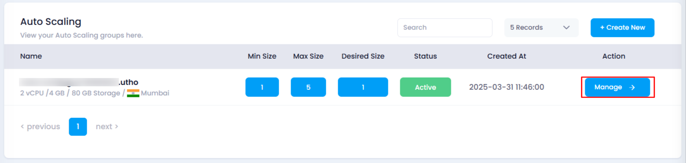
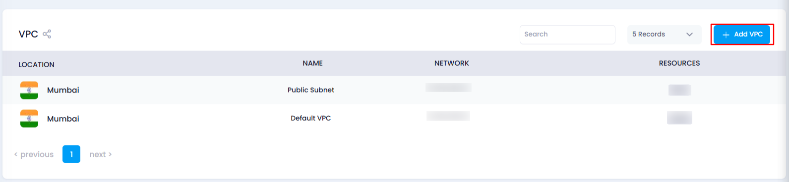
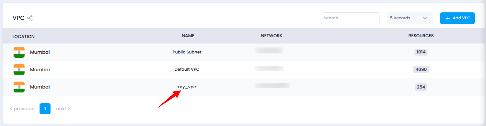

# **How to Add a VPC in Auto Scaling**

## **Overview**

Adding a VPC (Virtual Private Cloud) to your auto scaling instance allows for network isolation and secure communication within your cloud infrastructure, improving the security and management of resources.

## **Login or Sign Up**

1. Visit the **Utho Cloud Platform** [login](https://console.utho.com/login) page.
2. Enter your credentials and click  **Login** .
3. If you’re not registered, sign up [here](https://console.utho.com/signup).

## **Steps to Add a VPC in Auto Scaling**

1. **Access the Auto Scaling Listing Page**

   Navigate to the **Auto Scaling** listing page in your account, or click [here ](https://console.utho.com/auto-scaling "Auto Scaling Listing Page")to directly access it.
2. **Select the Desired Auto Scaling Instance**

   Find the instance where you wish to add a VPC, then click on the **Manage** button associated with that instance.

   
3. **Locate the VPC Section**

   Find **Overview** section and scroll down to the **VPC Listing** section at the bottom of the page, where all VPCs currently associated with the instance are listed.
4. **Click on the "Add VPC" Button**

   At the top of the VPC listing, click the **Add VPC** button to open the VPC selection drawer.

   
5. **Select a VPC**

   In the drawer, choose a VPC from the available options listed in the dropdown. These VPCs are available within the data center location of the auto scaling instance.
6. **Add the VPC**

   After selecting the desired VPC, click on the **Add VPC** button to assign it to the instance.

   
7. **Verify the VPC Addition**

   A success message (toast) will appear confirming that the VPC has been successfully added. You can also verify this by checking the VPC listing to ensure the added VPC appears there.

   

## **Impact of Adding a VPC**

* Adding a VPC ensures secure network isolation, allowing your instances to communicate privately within a specified network. It also helps with efficient resource management and improves security by segregating resources in a controlled environment.
