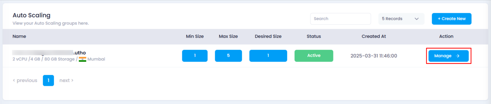
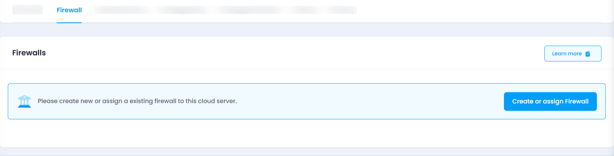
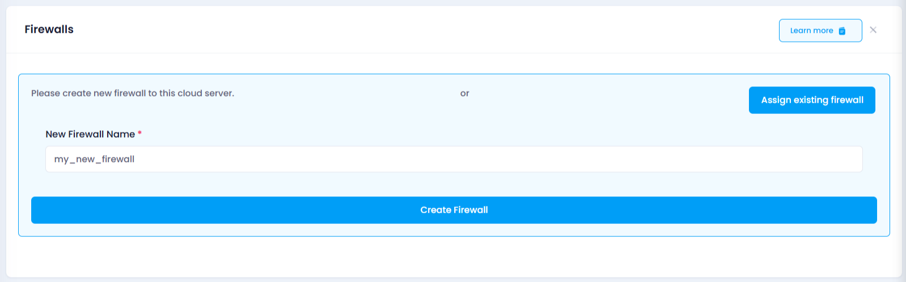
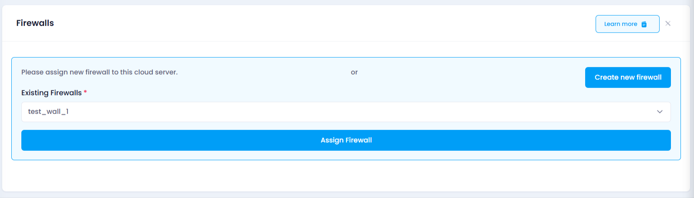
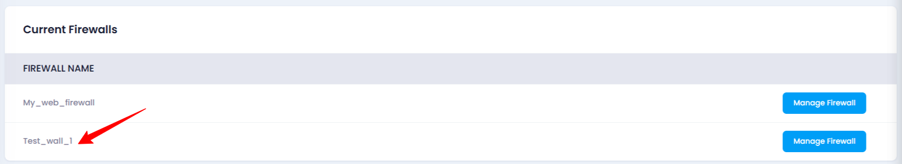

# **How to Assign a New Firewall to Auto Scaling**

## **Login or Sign Up**

1. Visit the **Utho Cloud Platform** [login](https://console.utho.com/login) page.
2. Enter your credentials and click  **Login** .
3. If you’re not registered, sign up [here](https://console.utho.com/signup).

---

## **Overview**

This guide explains how to assign a new firewall to an Auto Scaling instance. A firewall helps secure your instance by controlling inbound and outbound network traffic. You can either create a new firewall or assign an existing one to your instance.

---

## **Steps to Assign a New Firewall to Auto Scaling**

1. **Access the Auto Scaling Listing Page**

   Navigate to the auto scaling listing page in your account, or click [here ](https://console.utho.com/auto-scaling "Auto Scaling Listing Page")to directly access it.Go to the Manage Page
2. Click on the **Manage** button next to the Auto Scaling instance to which you want to assign a firewall. This will take you to the instance's management page.

   
3. **Find the "Firewall" Section**

   Locate the **Firewall** section. This is where you can manage firewalls for the selected Auto Scaling instance.

   
4. **Click on "Create or Assign Firewall"**

   In the **Firewall** section, you will find the **"Create or Assign Firewall"** button. Click on it to open a new section where you can either create a new firewall or assign an existing one.

   * **Create a Firewall:**
     * Click the **"Create New Firewall"** button.
     * A new input box will appear. Enter the desired name for your new firewall.
     * After naming your firewall, click the **"Assign Firewall"** button to assign the new firewall to your Auto Scaling instance.
     * The new firewall will be created and automatically assigned to the instance.

       
   * **Assign an Existing Firewall:**
     * If you want to assign an existing firewall, click the **"Assign Firewall"** button.
     * A dropdown menu will appear with a list of existing firewalls.
     * Select the firewall you wish to assign, then click the **"Assign Firewall"** button.

       
5. **Verify the Firewall Assignment**

   After successfully assigning a firewall, you can verify the assignment by scrolling to the bottom of the **Firewall** section. A list of **current firewalls** will be displayed. Your newly added firewall will appear here, confirming the assignment was successful.

   

---

## **Impact of Assigning a Firewall**

* **Increased Security:** Assigning a firewall restricts unauthorized access to your Auto Scaling instance, enhancing its security by controlling network traffic.
* **Access Control:** Only the traffic allowed by the firewall’s rules will be permitted, ensuring your instance remains protected from unwanted connections.

---

By following these steps, you can successfully assign a firewall to your Auto Scaling instance, improving its security and controlling its network traffic.
