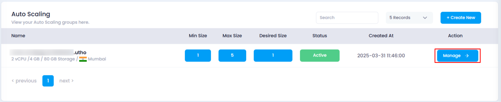
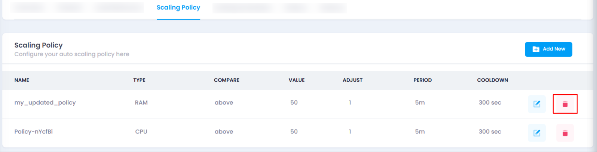
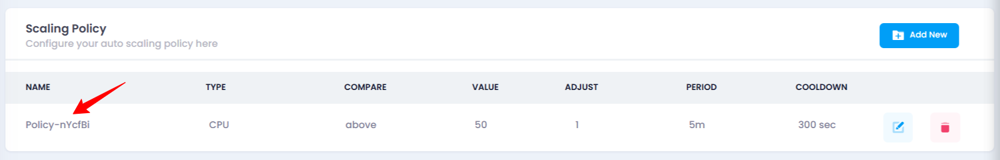

# **How to Delete Scaling Policy**

### **Overview**

Deleting a scaling policy removes a rule governing how the auto-scaling behavior works for your instance. Once deleted, the policy will no longer be applied to your auto-scaling instance. This action is irreversible, so it should be done with caution.

### **Login or Sign Up**

1. Visit the **Utho Cloud Platform** [login](https://console.utho.com/login) page.
2. Enter your credentials and click  **Login** .
3. If you’re not registered, sign up [here](https://console.utho.com/signup).

### **Steps to Delete a Scaling Policy**

1. **Go to the Auto Scaling Listing Page**
   * Navigate to the **Auto Scaling** listing page in your account, or click [here ](https://console.utho.com/auto-scaling "Auto Scaling Listing Page")to directly access it.
2. **Select the Desired Auto Scaling Instance**
   * Locate the auto scaling instance you wish to manage in the list and click the **Manage** button associated with that instance.
     
3. **Locate the “Scaling Policy” Section**
   * On the manage page of your selected auto scaling instance, scroll down to find the **Scaling Policy** section. Here, you will see a list of all the current scaling policies associated with your instance.
4. **Click on the Delete Icon to Remove the Scaling Policy**
   * Find the scaling policy you want to delete in the list.
   * At the end of each scaling policy item, you will see a **Delete** icon. Click on this icon to delete the scaling policy.

     
5. **Confirm the Deletion**
   * After clicking the **Delete** icon, the scaling policy will be removed immediately.
6. **Verify the Deletion**
   * Once the scaling policy has been deleted, check the list of scaling policies in the **Scaling Policy** section. If the deleted policy is no longer visible, it has been successfully removed.

     

### **Impact of Deleting Scaling Policy**

* **Scaling Behavior Change** : Deleting a scaling policy means that auto-scaling for that resource will no longer be triggered based on the deleted rule. This can affect the automatic adjustment of resources based on CPU, RAM, or other metrics.
* **Resource Management** : Deleting unnecessary or outdated scaling policies helps simplify the management of auto-scaling and ensures resources are adjusted according to the most relevant and current criteria.
