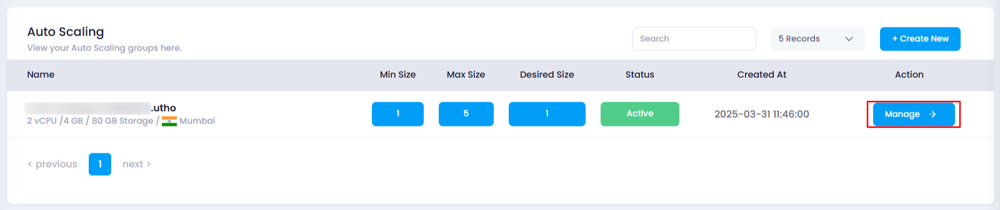
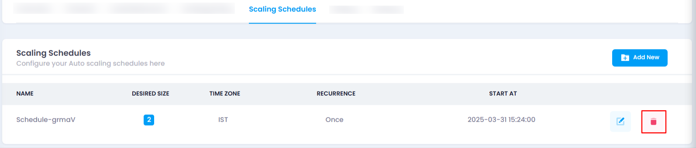

# **How to Delete Scaling Schedule**

### **Overview**

The **Delete** option allows you to remove a scaling schedule that you no longer need. This action will permanently delete the schedule and cannot be undone.

### **Steps to Delete Scaling Schedule**

1. **Login to Your Account**
   * Visit the **Utho Cloud Platform** [login](https://console.utho.com/login) page.
   * Enter your credentials and click  **Login** .
   * If you’re not registered, sign up [here](https://console.utho.com/signup).
2. **Navigate to Auto Scaling Listing Page**
   * Navigate to the **Auto Scaling** listing page in your account, or click [here ](https://console.utho.com/auto-scaling "Auto Scaling Listing Page")to directly access it.
3. **Select the Desired Auto Scaling Instance**
   * Find the auto scaling instance from the list where you want to delete the scaling schedule.
   * Click on the **Manage** button next to the desired instance to navigate to the manage page.

     
4. **Locate the Scaling Schedules Section**
   * On the manage page, look for **Scaling Schedules** section, click on it.
   * Here, you will find a list of all the scaling schedules that are currently configured.
5. **Click on the Delete Icon**
   * In the list of scaling schedules, find the scaling schedule you want to delete.
   * Click on the **Delete Icon** (trash bin icon) next to the schedule you wish to remove.

     
6. **Confirm Deletion**
   * After clicking the delete icon, the scaling schedule will be deleted immediately without any further confirmation.
7. **Verify Deletion**
   * To verify the deletion, check the list of scaling schedules again. If the schedule is no longer listed, it has been successfully deleted.

     

### **Impact of Deleting Scaling Schedule**

* Once a scaling schedule is deleted, it will no longer trigger scaling actions for the selected auto scaling instance based on the defined time and recurrence.
* Deleting a scaling schedule cannot be undone, so ensure the schedule is no longer needed before deletion.
