# **How to Deploy Auto Scaling**

Auto Scaling in Utho Cloud allows users to deploy instances that automatically scale based on predefined conditions. Follow this guide to deploy an auto-scaling instance efficiently.

---

## **Step 0: Login or Sign Up**

* Visit the **Utho Cloud Platform** [login](https://console.utho.com/login) page.
* Enter your credentials and click **Login** .
* If you’re not registered, sign up [here](https://console.utho.com/signup).

---

## **Step 1: Navigate to Auto Scaling**

* Navigate to the auto scaling listing page in your account, or click [here ](https://console.utho.com/auto-scaling "Auto Scaling Listing Page")to directly access it. .
* Click **Create New** to open the Auto Scaling deployment page.

---

## **Step 2: Configure Your Auto Scaling Instance**

### 1. Choose Data Center Location

* Select the data center closest to your users.
  * **Why it’s important** : A **data center** is a physical location where cloud resources are stored. Choosing a nearby data center reduces network latency and improves response time for users.

    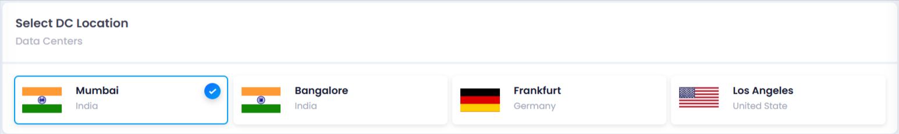

### 2. Select a Stack

* Pick from your created stacks or available community stacks.
  * **Why it’s important** : A **stack** includes the operating system, software configurations, and pre-installed dependencies. It ensures your application runs smoothly with the right environment and avoids compatibility issues.
  * **Select Stack Image** : When selecting a stack, you will be prompted to choose a **stack image** from a dropdown menu.
  * A **stack image** is typically a pre-configured template or image that includes the operating system and the necessary software dependencies (such as web servers, databases, or frameworks) that your application needs to run.
  * **Why it’s required** : The **stack image** ensures your instance has all the necessary components to run your application without needing manual configuration. It saves time and ensures consistency across your instances by providing a predefined environment suited to your needs.

    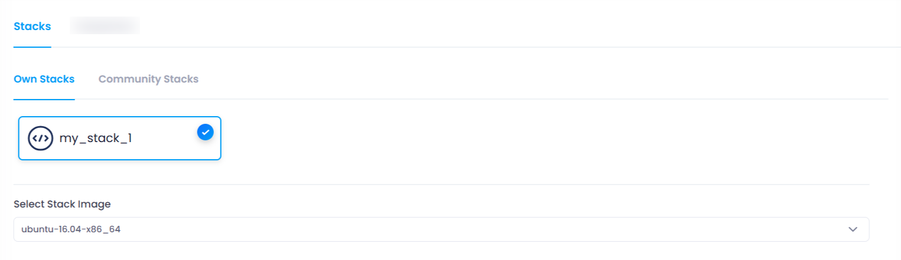

### 3. Choose a Plan

* Select a plan based on:

  * **RAM** : Memory available for your application.
  * **vCPUs** : Processing power to handle concurrent tasks.
  * **SSD disk size** : Storage space for data and applications.
  * **Bandwidth** : Network traffic capacity, determining how much data your instance can send/receive.
* **Why it’s important** : Choosing the right plan ensures your instance has sufficient resources to run efficiently and stay cost-effective.
* There are three types of plans you can choose from:

  1. **Basic Plans** : Suitable for general-purpose applications with moderate resource requirements. These plans provide balanced CPU, memory, and storage resources.
  2. **CPU Optimized Plans** : Designed for compute-intensive tasks such as processing large datasets, running complex algorithms, or handling high-performance applications. These plans offer higher CPU performance.
  3. **Memory Optimized Plans** : Ideal for memory-heavy applications like databases or caching servers, where large amounts of RAM are required. These plans prioritize memory over CPU performance.
* **Why you should choose** : Depending on your application's needs, switching between these plans helps you optimize resources and costs based on whether your workload is more CPU- or memory-intensive.

  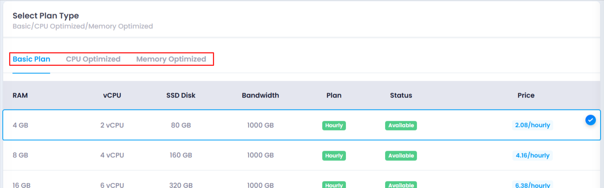

### 4. Select VPC and Subnet

* Choose a **VPC** (Virtual Private Cloud) and  **subnet** .
  * **Why it’s important** : A **VPC** isolates your cloud resources within a secure network, while a **subnet** organizes instances in the VPC, improving traffic management and security.

    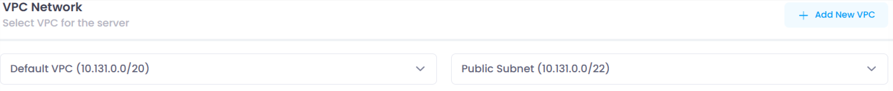

### 5. Choose CPU Model

* Select **AMD** or **Intel** based on your performance needs:
  * **AMD** : Best for cost-effective performance for standard workloads.
  * **Intel** : Ideal for high-performance tasks like AI or specialized computing.
  * **Why it’s important** : The right CPU model ensures your instance has the processing power needed for your application’s requirements.

    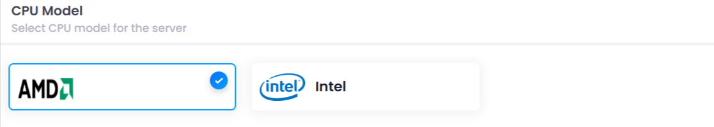

### 6. Configure Firewall (Optional)

* Select a **firewall** to protect your instance.
  * **Why it’s important** : A **firewall** filters inbound and outbound network traffic, helping protect your instance from unauthorized access and threats.

    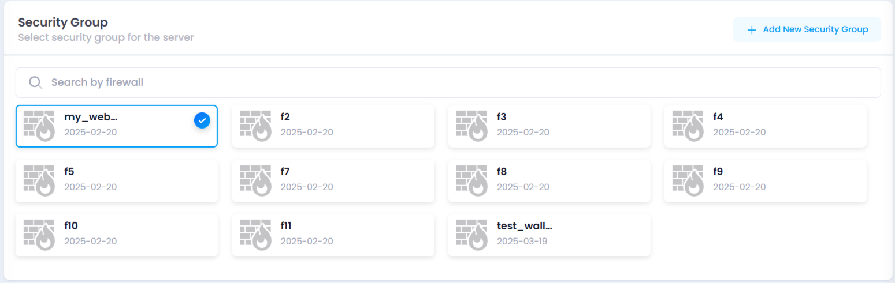

### 7. Attach Load Balancer/Target Group (Optional)

* Attach a **Load Balancer** or assign to a  **Target Group** .
  * **Why it’s important** : **Load balancers** distribute traffic across multiple instances, preventing overloading. **Target groups** help manage traffic for improved availability and fault tolerance.

    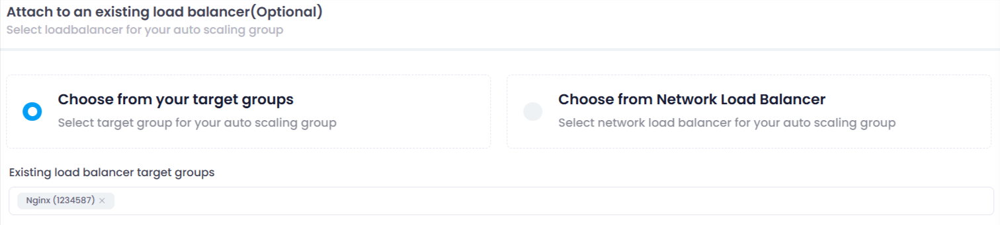

### 8. Set Instance Scaling Parameters

* Define the scaling parameters:
  * **Max Size** : Maximum number of instances allowed.
  * **Min Size** : Minimum number of instances that must always run.
  * **Desired Size** : Ideal number of instances under normal conditions.
  * **Why it’s important** : These parameters ensure your instance scales dynamically based on load, balancing cost and performance.

    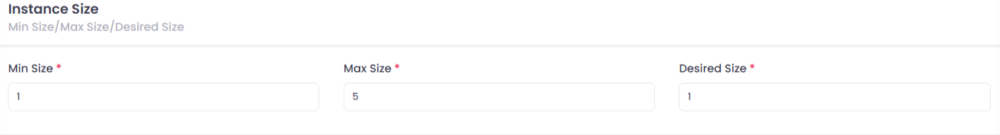

### 9. Configure Scaling Policy

* Create a **scaling policy** to trigger scaling based on resource usage:

  * **Name** : A unique identifier for the scaling policy.
  * **Type** : Choose between **CPU** or **RAM** based scaling depending on the resource that should trigger scaling.
  * **Compare** : Define whether scaling should occur when usage is **above** or **below** the specified threshold.
  * **Value** : Set the specific resource usage percentage that triggers scaling (e.g., 70% CPU or RAM usage).
  * **Adjust** : Set the number of instances to add or remove (minimum is 1 instance).
  * **Period** : Choose the time window for monitoring (e.g., 5 minutes, 1 hour) before triggering scaling.
  * **Cooldown** : Define the minimum time in seconds to wait before executing another scaling action to prevent excessive scaling.
* **Why it’s important** : A **scaling policy** ensures your instance can scale efficiently, maintaining performance while avoiding unnecessary costs

  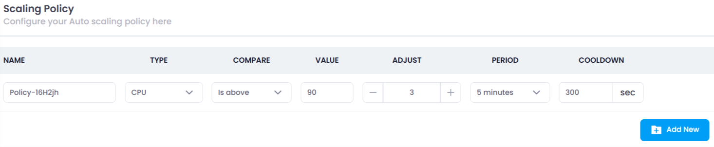

### 10. Set a Scaling Schedule (Optional)

* Predefine scaling actions based on predictable traffic patterns.

  * **Name** : A unique identifier for the scaling schedule.
  * **Desired Size** : The number of instances you want to maintain during the scheduled time (minimum 1).
  * **Time Zone** : Select the time zone for the schedule (e.g., IST, UTC).
  * **Recurrence** : Choose how often the scaling action should repeat (e.g., Every 5 minutes, Every 30 minutes, Every 1 hour).
  * **Day** : Select the specific day (fixed to today’s date) when the scaling action should occur.
  * **Time** : Set the exact time when the scaling action should be triggered (fixed to the current time).
  * **Start At** : Define the exact date and time the schedule should begin (pick a date and time).
* **Why it’s important** : A **scaling schedule** ensures resources are adjusted proactively before traffic surges, improving cost efficiency and performance without relying solely on real-time metrics.

### 11. Name Your Auto Scaling Instance

* Provide a **unique name** for your instance.
  * **Why it’s important** : Naming your instance helps you identify and manage it easily, especially when handling multiple instances.

    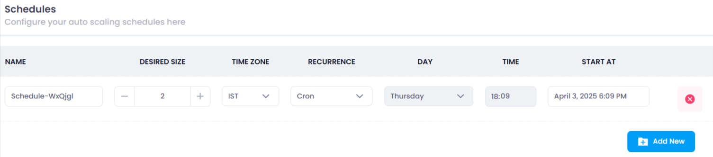

### 12. Deploy Auto Scaling Instance

* Click **Deploy AutoScaling** to initiate deployment after checking the deployment cost.

  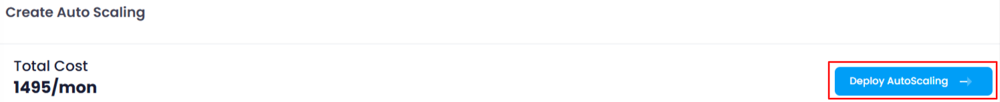

---

## **Step 3: Verifying your deployed auto scaling instance**

* After successful deployment, you will be automatically redirected to the **Manage Page** of your newly deployed instance.
* On the  **Manage Page** , you can verify the status of your deployment.
* The status will be displayed as **"Active"** in green color, indicating that your instance is running smoothly.

  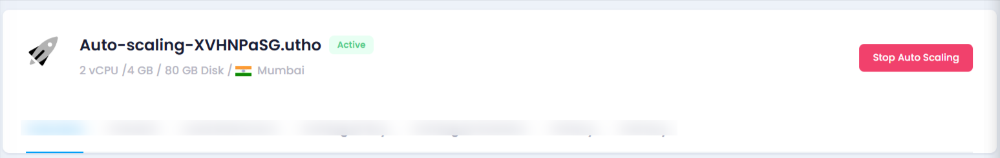

---

## **Conclusion**

You’ve successfully deployed an Auto Scaling instance on Utho Cloud! This guide helped you configure and deploy your instance, set scaling rules, and optimize performance and cost.
