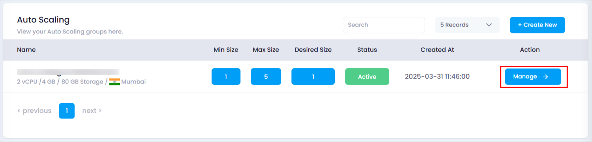
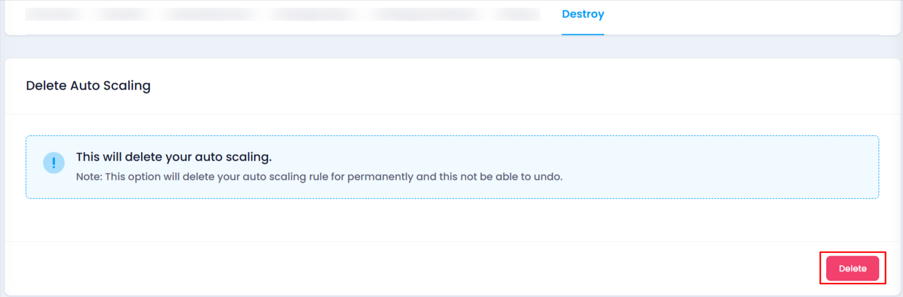
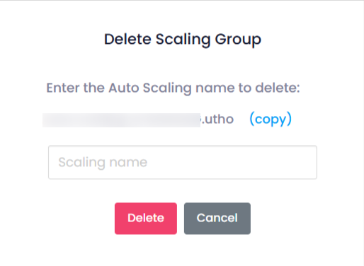

# **How to Destroy Auto Scaling Instance**

## **Overview**

The **Destroy** feature allows you to permanently delete an auto scaling instance and all its associated configurations. This action is irreversible and should be performed with caution.

## **Login or Sign Up**

1. Visit the **Utho Cloud Platform** [login ](https://console.utho.com/login)page.
2. Enter your credentials and click  **Login**.
3. If you’re not registered, sign up [here](https://console.utho.com/signup).

## **Steps to Destroy an Auto Scaling Instance**

1. **Access the Auto Scaling Listing Page**
   * Navigate to the auto scaling listing page in your account, or click [here ](https://console.utho.com/auto-scaling "Auto Scaling Listing Page")to directly access it.
2. **Locate the Desired Auto Scaling Instance**
   * Identify the auto scaling instance you wish to delete from the list.
3. **Open the Management Page**
   * Click on the **Manage** button associated with the instance to navigate to its management page.

     
4. **Find the Destroy Section**
   * Look for the **Destroy** section on the page.
5. **Initiate the Destruction Process**
   * Click the **Delete** button located at the bottom of the page.

     
6. **Confirm the Action**
   * A confirmation popup will appear.
   * In the popup, you will be asked to write the exact name of the instance you wish to delete.
   * After entering the name correctly, click **Delete** to finalize the deletion. This action cannot be undone.
     

## **Impact of Destroying an Auto Scaling Instance**

* **Permanent Deletion:** The instance, along with its configurations and scaling policies, will be permanently removed.
* **Irreversibility:** Once an auto scaling instance is destroyed, it cannot be recovered. Ensure you have backed up any critical data or configurations before proceeding.

Use this feature responsibly to avoid unintended loss of services.
