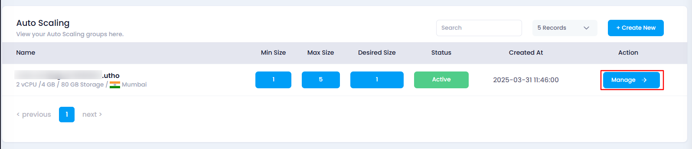
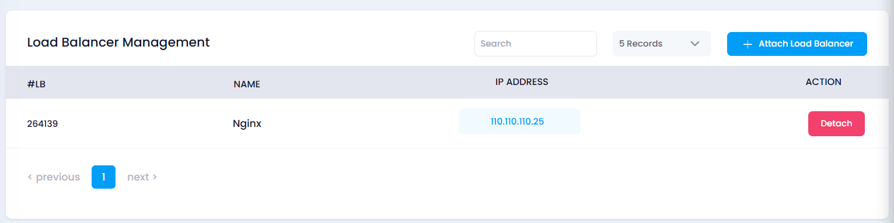
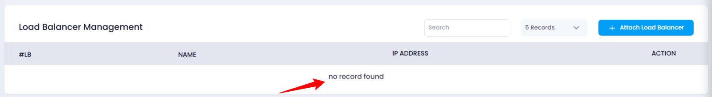

# **How to Detach a Load Balancer from Auto Scaling**

## **Overview**

The **Detach Load Balancer** feature allows you to remove an attached load balancer from your auto scaling instance. This action helps to stop distributing traffic from the load balancer to the auto scaling instance.

## **Steps to Detach a Load Balancer**

1. **Login to Utho Cloud Platform**
   * Visit the **Utho Cloud Platform** [login](https://console.utho.com/login) page.
   * Enter your credentials and click  **Login** .
   * If you’re not registered, sign up [here](https://console.utho.com/signup).
2. **Go to the Auto Scaling Listing Page**
   * Navigate to the auto scaling listing page in your account, or click [here ](https://console.utho.com/auto-scaling "Auto Scaling Listing Page")to directly access it.
3. **Select the Desired Auto Scaling Instance**
   * From the list, find and click on the **Manage** button for the auto scaling instance from which you wish to detach the load balancer.
     
4. **Access the Load Balancers Section**
   * On the manage page, look for **Load Balancers** section, click on it.
5. **Find the Load Balancer to Detach**
   * In the **Load Balancer Management** subsection, locate the list of all currently attached load balancers.
6. **Click on the Detach Button**
   * Find the load balancer you want to detach and click the **Detach** button at the end of the list item.

     
7. **Confirm Detachment**
   * The detachment process will begin. Once successfully detached, a **success toast notification** will appear on your screen.
8. **Verify Detachment**
   * Recheck the list of attached load balancers. If the load balancer no longer appears, it has been successfully detached from the auto scaling instance.

     

## **Impact of Detaching a Load Balancer**

* **Traffic Distribution Stops** : The load balancer will no longer distribute traffic to the auto scaling instance.
* **Instance Becomes Standalone** : The auto scaling instance will operate independently without the load balancer managing traffic.
