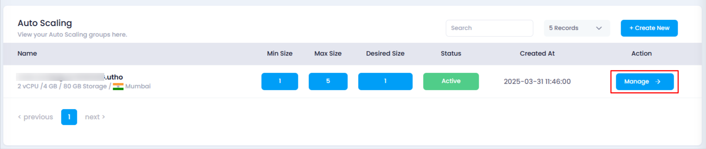
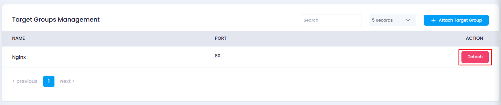
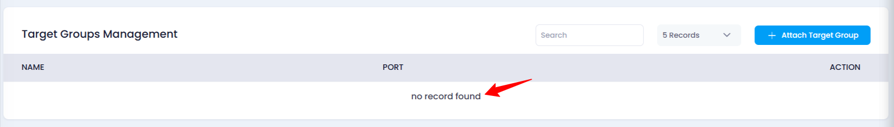

# **How to Detach a Target Group from Auto Scaling**

## **Overview**

The **Detach Target Group** feature allows you to remove an attached target group from your auto scaling instance. This action helps stop routing traffic to the auto scaling instance through the target group.

## **Steps to Detach a Target Group**

1. **Login to Utho Cloud Platform**
   * Visit the **Utho Cloud Platform** [login](https://console.utho.com/login) page.
   * Enter your credentials and click  **Login** .
   * If you’re not registered, sign up [here](https://console.utho.com/signup).
2. **Go to the Auto Scaling Listing Page**
   * Navigate to the **Auto Scaling** listing page in your account, or click [here ](https://console.utho.com/auto-scaling "Auto Scaling Listing Page")to directly access it.
3. **Select the Desired Auto Scaling Instance**
   * From the list, find and click on the **Manage** button for the auto scaling instance from which you wish to detach the target group.

     
4. **Access the Load Balancers Section**
   * On the manage page, look for **Load Balancers** section.
5. **Find the Target Group to Detach**
   * In the **Target Groups Management** subsection, locate the list of all currently attached target groups.
6. **Click on the Detach Button**
   * Find the target group you want to detach and click the **Detach** button at the end of the list item.

     
7. **Confirm Detachment**
   * The detachment process will begin. Once successfully detached, a **success toast notification** will appear on your screen.
8. **Verify Detachment**
   * Recheck the list of attached target groups. If the target group no longer appears, it has been successfully detached from the auto scaling instance.

     

## **Impact of Detaching a Target Group**

* **Traffic Routing Stops** : The target group will no longer route traffic to the auto scaling instance.
* **Instance Becomes Standalone** : The auto scaling instance will no longer be part of the target group for traffic distribution.
