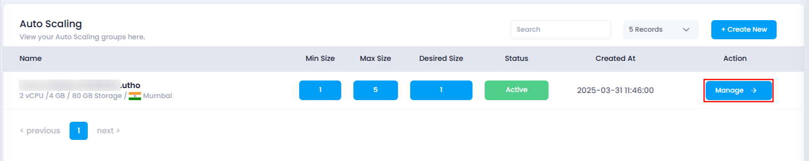
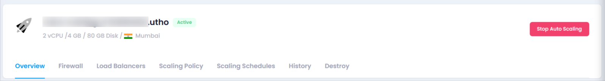

# **Overview of Auto Scaling**

When an Auto Scaling instance is created, users can view its details and configurations on the **Manage** page. This page provides essential information and various sections to manage the Auto Scaling instance effectively.

### **How to Access the Auto Scaling Page**

1. **Navigate to the Auto Scaling Listing Page**
   * Go to the Auto Scaling section in your account.
   * Or, you can click [here](https://console.utho.com/auto-scaling "Auto Scaling Listing Page") to directly access the listing page.
2. **Select the Desired Auto Scaling Instance**
   * Find the Auto Scaling instance whose details you want to view.
   * Click on the **Manage** button to open the Auto Scaling page.

     

### **What You Can See on the Auto Scaling Page**

Once on the **Manage** page, users can view:

* **Auto Scaling Name & Location** – The name of the instance and its data center location.
* **Resource Details** – Information on the current scaling configuration, vCPU, storage.
* **Status Indicator** – Displays whether the Auto Scaling instance is **Active** or inactive.

  

### **Key Sections in the Auto Scaling Page**

1. **Overview**
   * Displays scaling configuration, VPC list, and deployment configuration for the Auto Scaling instance.
2. **Firewall**
   * Allows users to attach a firewall to the Auto Scaling instance for enhanced security.
3. **Load Balancers**
   * Provides options to attach or detach load balancers and target groups to the Auto Scaling instance for traffic management.
4. **Scaling Policy**
   * Contains a list of scaling policies and options to add, edit, or delete scaling policies to control the instance’s scalability.
5. **Scaling Schedules**
   * Displays a list of scaling schedules, with options to add, edit, or delete them for scheduled scaling actions.
6. **History**
   * Provides a log of actions and events related to the Auto Scaling instance, allowing users to track its activity over time.
7. **Destroy**
   * Offers an option to permanently destroy the Auto Scaling instance and all associated configurations. This action is irreversible.

By using these sections, users can efficiently manage their Auto Scaling instances.
