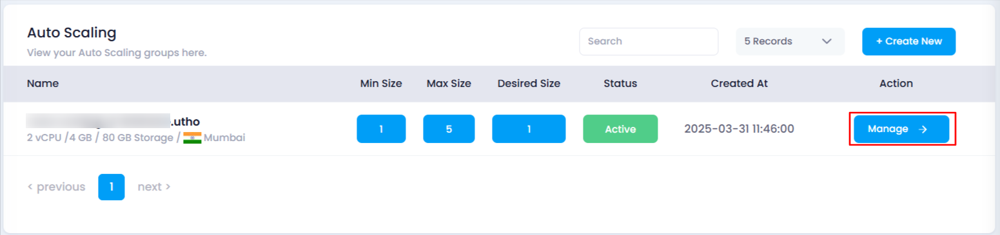
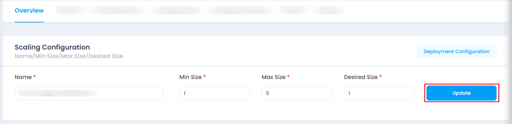
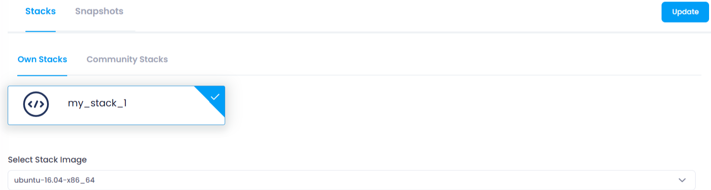
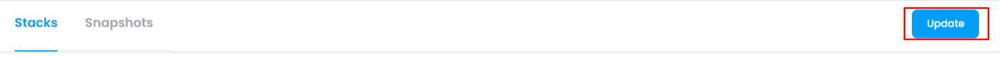

# **How to Update Deployment Configuration**

## **Overview**

The **Update Deployment Configuration** feature allows you to modify the stack, image, and snapshot settings for an existing auto scaling instance. This helps ensure that your application runs with the desired environment and resources.

## **Login or Sign Up**

1. Visit the **Utho Cloud Platform** [login](https://console.utho.com/login) page.
2. Enter your credentials and click  **Login** .
3. If you’re not registered, sign up [here](https://console.utho.com/signup).

## **Steps to Update Deployment Configuration**

1. **Access the Auto Scaling Listing Page**
   * Navigate to the auto scaling listing page in your account, or click [here ](https://console.utho.com/auto-scaling "Auto Scaling Listing Page")to directly access it.
2. **Select the Desired Auto Scaling Instance**
   * Identify the instance you want to update and click on the **Manage** button to go to its management page.
     
3. **Find the Overview Section**
   * In the management page, locate the **Overview** section.
4. **Click on the “Deployment Configuration” Button**
   * In the **Scaling Configuration** card, click on the **Deployment Configuration** button. This will expand a new section with additional configuration options.

     
5. **Update the Stack and Image**
   * **Stack** : Choose between your own deployed stacks or select from available community stacks. This defines the environment for your auto scaling instance.Changing the stack will update the operating system and application dependencies, which may improve performance or compatibility with new software.
   * **Image** : Select an image from the dropdown. This image will be used for deploying the instance, ensuring compatibility with the selected stack. Changing the image may modify the underlying operating system or application settings, affecting the behavior and functionality of your auto scaling instance.

     
6. **Select a Snapshot (Optional)**
   * If you have any snapshots deployed in the same data center location for your auto scaling instance, you can choose one here. This allows you to restore or deploy your auto scaling instance with the selected snapshot. Selecting a snapshot restores the instance to a previous state, preserving configurations and data for consistency and recovery purposes.
7. **Click the Update Button**
   * Once you’ve made the necessary changes, click the **Update** button in the Deployment Configuration section to save the updated configuration

     
