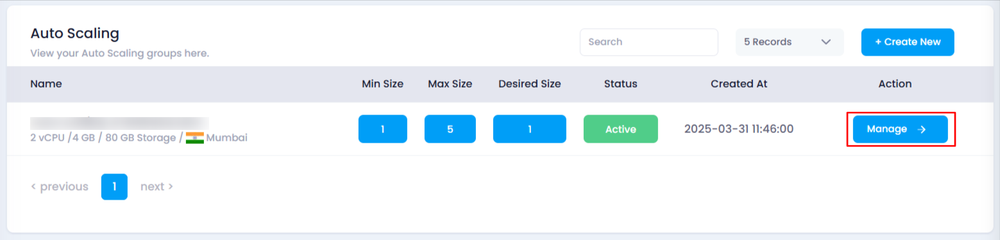
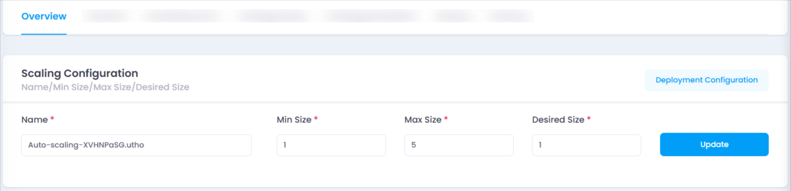
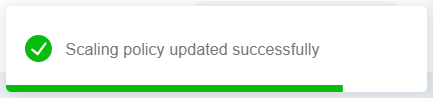

# **How to Update Scaling Configuration**

## **Overview**

The **Update Scaling Configuration** feature allows you to modify the scaling parameters of an existing auto scaling instance. This helps adjust the instance’s scalability based on your evolving requirements.

## **Login or Sign Up**

1. Visit the **Utho Cloud Platform** [login](https://console.utho.com/login) page.
2. Enter your credentials and click  **Login** .
3. If you’re not registered, sign up [here](https://console.utho.com/signup).

## **Steps to Update Scaling Configuration**

1. **Access the Auto Scaling Listing Page**
   * Navigate to the auto scaling listing page in your account, or click [here ](https://console.utho.com/auto-scaling "Auto Scaling Listing Page")to directly access it.
2. **Select the Desired Auto Scaling Instance**
   * Identify the instance you want to update and click on the **Manage** button to go to its management page.

     
3. **Find the Overview Section**
   * In the management page, locate the **Overview** section.
4. **Update Scaling Configuration**
   * In the **Overview** section, click the option to update the scaling configuration and modify the following parameters:
     * **Name** : Change the name of the scaling configuration. This helps you organize and identify instances more easily.
     * **Min Size** : Set the minimum number of instances to run. Increasing this ensures availability during low demand but may incur higher costs; decreasing it may risk performance during sudden traffic spikes.
     * **Max Size** : Set the maximum number of instances. A higher max allows scaling during high demand but could increase costs if demand doesn’t reach expected levels. Reducing it limits scaling potential and helps control costs.
     * **Desired Size** : Set the preferred number of instances. This is the baseline the system tries to maintain. A higher desired size may incur additional costs, while a lower value could result in performance issues during high traffic periods.

       
5. **Click the Update Button**
   * Once you've made the necessary changes, click the **Update** button to apply the updated configuration.
6. **Confirmation**
   * After a successful update, a toast message will appear confirming the changes.

     
