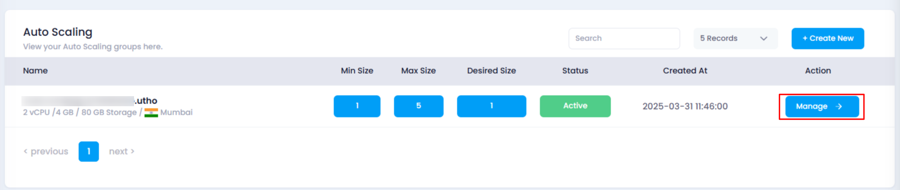
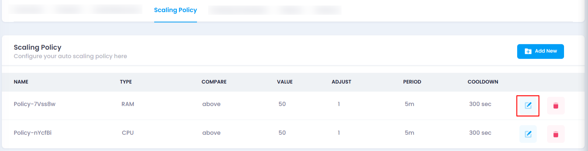
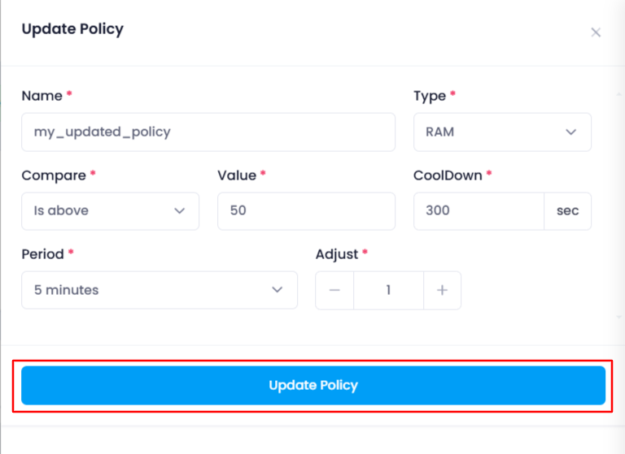
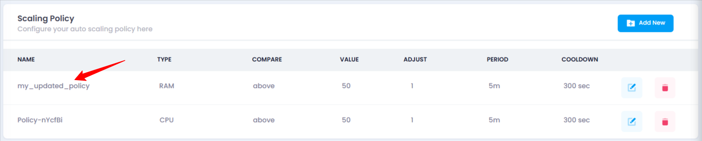

## **How to Update Scaling Policy**

### **Overview**

Updating scaling policies allows you to modify the rules that govern the auto-scaling of your instance based on resource usage. Adjusting these policies helps fine-tune auto-scaling behavior as your needs evolve, ensuring that your instance operates efficiently without unnecessary resource consumption.

### **Login or Sign Up**

1. Visit the **Utho Cloud Platform** [login](https://console.utho.com/login) page.
2. Enter your credentials and click  **Login** .
3. If you’re not registered, sign up [here](https://console.utho.com/signup).

### **Steps to Update Scaling Policy**

1. **Go to the Auto Scaling Listing Page**
   * After logging in, navigate to the **Auto Scaling** listing page to view all your auto scaling instances.
2. **Select the Desired Auto Scaling Instance**
   * Locate the auto scaling instance you wish to manage in the list and click the **Manage** button associated with that instance.

     
3. **Locate the “Scaling Policy” Section**
   * On the manage page of your selected auto scaling instance, scroll down to find the **Scaling Policy** section. Here, you will see a list of all the current scaling policies associated with your instance.
4. **Click on the Edit Icon to Update the Scaling Policy**
   * Find the scaling policy you want to update in the list.
   * At the end of each scaling policy item, you will see an **Edit** icon. Click on this icon to open the drawer with the existing values.

     
5. **Update the Scaling Policy**
   * In the drawer, you will see the following fields, pre-populated with the current values for that scaling policy:
     * **Name** : The unique identifier for the scaling policy.
     * **Type** : Choose between **CPU** or **RAM** based scaling, depending on the resource that should trigger scaling.
     * **Compare** : Select whether scaling should occur when usage is **above** or **below** the specified threshold.
     * **Value** : Set the specific resource usage percentage (e.g., 70% CPU or RAM usage) that triggers scaling.
     * **Adjust** : Set the number of instances to add or remove (minimum is 1 instance).
     * **Period** : Choose the time window (e.g., 5 minutes, 1 hour) for monitoring before triggering scaling.
     * **Cooldown** : Define the cooldown period in seconds to prevent excessive scaling actions within a short time.
6. **Apply Changes**
   * After modifying the values according to your requirements, click on the **Update Policy** button. This will save and apply the new configuration.

     
7. **Verify the Updated Scaling Policy**
   * Once the scaling policy has been updated, check the list of scaling policies in the **Scaling Policy** section. Verify that the updated policy is reflected with the new settings.

     

### **Impact of Updating Scaling Policy**

* **Resource Adjustment** : By updating scaling policies, you can adjust the thresholds at which auto-scaling occurs, ensuring the instance responds appropriately to fluctuations in workload.
* **Performance and Cost Optimization** : Tuning the scaling settings, such as adjust values and cooldown periods, helps balance performance with cost, avoiding unnecessary scaling actions or under-provisioning.
